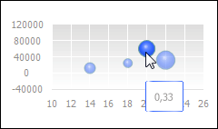
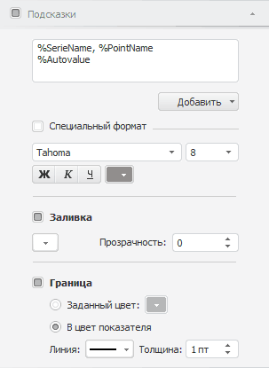

# Всплывающие подсказки

Всплывающие подсказки
-

# Всплывающие подсказки

Всплывающая подсказка отображает
 необходимую информацию о точке ряда данных, линии уровня или ряде данных
 в [легенде](../Property_diagramm/UiDiagrams_PropertyDiagramm_legend.htm)
 при наведении курсора на соответствующий элемент диаграммы.

Примечание.
 Всплывающие подсказки для рядов данных в легенде отображаются для всех
 диаграмм, кроме [кольцевых](../Type_diagrams/Doughnut_chart.htm)
 и [каскадных](../Type_diagrams/WaterFall_chart.htm).

Пример всплывающей подсказки:

Предусмотрены следующие подходы к настройке всплывающих подсказок:

[Быстрая настройка](javascript:TextPopup(this))

	Для быстрой настройки формата всплывающих подсказок используйте
	 вкладку «Подсказки» боковой
	 панели.

	Доступны следующие настройки всплывающих подсказок:

		- настройка отображения всплывающих подсказок;

		- настройка текста всплывающих подсказок;

		- настройки формата всплывающих подсказок;

		- настройки оформления всплывающих подсказок.

[Расширенная
 настройка](javascript:TextPopup(this))

	Для расширенной настройки всплывающих подсказок для точек рядов
	 данных используйте вкладку «[Подсказки](UiDiagrams_promthing.htm)»
	 окна «Параметры диаграммы».

## Быстрая настройка всплывающих подсказок

Для отображения всплывающих подсказок установите флажок «Подсказки»,
 расположенный на вкладке «Подсказки»
 боковой панели.

[Для отображения
 вкладки](javascript:TextPopup(this))

		- Убедитесь, что боковая панель [отображается](GetStarted.chm::/Interface/Interface_Description.htm#side_panel).

		- В рабочей области выделите диаграмму.

		- Установите на боковой панели переключатель «Формат»
		 и перейдите на вкладку «Подсказки».

После включения отображения всплывающих подсказок в области построения
 диаграммы становятся доступными следующие операции:

[Определение
 текста всплывающих подсказок](javascript:TextPopup(this))

	Для определения текста всплывающих подсказок используйте поле ввода
	 на вкладке «Подсказки» боковой
	 панели. Поле ввода текста подсказок - многострочное.

	Для смены или добавления в текст подписи шаблона:

		- Нажмите кнопку «Добавить»,
		 расположенную ниже поля ввода.

		- В раскрывающемся списке выберите один из [шаблонов](../Templates_in_labels.htm)
		 текста всплывающих подсказок.

	Примечание.
	 Текст всплывающих подсказок для [линий
	 уровня](../Tuning_format/Format_Axis/UiDiagrams_FormatAxis_Levels.htm) определяется автоматически.

[Настройка формата
 данных](javascript:TextPopup(this))

	Для настройки формата данных, отображаемых всплывающими подсказками:

		- Установите флажок «Специальный
		 формат».

		- В раскрывающемся списке выберите один из поддерживаемых
		 форматов данных:

			- Общий;

			- Числовой;

			- Денежный;

			- Дата;

			- Время;

			- Процентный;

			- Экспоненциальный;

			- Текстовый;

			- Дополнительный;

			- Пользовательский.

	Подробное описание специальных
	 форматов смотрите в разделе «[Настройка формата данных](UiAnalyticalArea.chm::/TableView/Formatting/Data_format.htm)».

[Настройка шрифта
 подсказок](javascript:TextPopup(this))

	Для настройки шрифта всплывающих подсказок задайте следующие параметры:

		- Шрифт.
		 Выберите один из шрифтов, установленных в операционной системе;

		- Размер
		 шрифта. Установите требуемый размер шрифта. Размер задаётся
		 в пунктах, и его можно выбрать из раскрывающегося списка или ввести
		 вручную. Диапазон допустимых значений: [1, 72];

		- Начертание
		 текста. Нажмите кнопки, задающие начертание шрифта:

			- Ж. Полужирное
			 начертание;

			- К.
			 Курсивное начертание;

			- Ч.
			 Подчеркивание текста.

	При нажатой кнопке будет использоваться
	 соответствующий стиль начертания. Доступно использование нескольких
	 стилей одновременно, например, нажатие кнопок «Ж»
	 и «К»
	 даёт полужирное курсивное начертание;

		- Цвет
		 шрифта. Выберите цвет шрифта в раскрывающейся палитре цветов.

[Настройка заливки
 области подсказки](javascript:TextPopup(this))

	Для настройки заливки области всплывающих подсказок доступны
	 следующие параметры:

		- Цвет заливки.
		 В раскрывающейся палитре выберите цвет заливки. Для установки
		 нового цвета заливки нажмите кнопку «Спектр»,
		 расположенную в стандартной палитре цветов, и выберите цвет в
		 расширенной палитре цветов;

		- Прозрачность. Если
		 необходимо, определите [прозрачность](../Tuning_format/UiDiagrams_tuning_border_and_filling.htm#transparency)
		 области всплывающих подсказок.

[Настройка границы области
 подсказки](javascript:TextPopup(this))

	Для настройки границы области всплывающих подсказок установите флажок
	 «Граница» и задайте следующие
	 параметры:

		- Цвет границы. Установите
		 один из переключателей:

			- Заданный цвет.
			 В раскрывающейся палитре выберите цвет границы. Для установки
			 нового цвета границы нажмите кнопку «Спектр»,
			 расположенную в стандартной палитре цветов, и выберите цвет
			 в расширенной палитре цветов;

			- В цвет показателя.
			 Переключатель установлен по умолчанию. Цвет границы области
			 всплывающих подсказок будет совпадать с цветом заливки точки
			 ряда данных или линии уровня;

		- Линия. В раскрывающемся
		 списке выберите тип линии;

		- Толщина. С помощью
		 редактора чисел или вручную задайте требуемую толщину линий;

Примечание.
 Доступен ввод значения [в разных единицах измерения](UiNav.Chm::/GUI/format/different_units.htm), однако значение в строке
 ввода будет всегда отображаться в единицах point (1/72 дюйма).

См. также:

[Настройка
 всплывающих подсказок](UiDiagrams_promthing.htm) | [Шаблоны](../Templates_in_labels.htm)
 | [Настройка общих параметров диаграммы](UiDiagrams_params_diagram.htm)
 | [Настройка компонентов диаграммы](../UiDiagrams_basic_concept.htm)

		Справочная
		 система на версию 10.9
		 от 18/08/2025,
		 © ООО «ФОРСАЙТ»,
