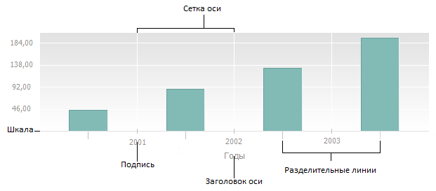
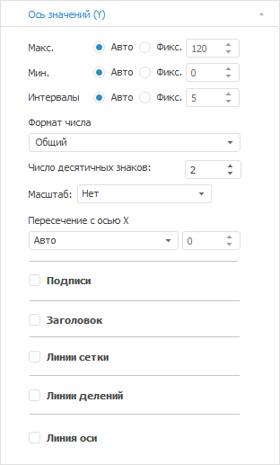
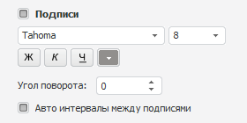
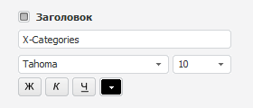
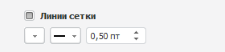
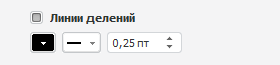

# Оси диаграммы

Оси диаграммы
-

# Оси диаграммы

Оси - [компоненты
 диаграммы](../UiDiagrams_basic_concept.htm), служащие для упорядочивания данных на диаграмме. Заголовки
 столбцов и строк таблицы образуют координатную сетку, позволяющую определить
 адрес каждой ячейки. На диаграмме аналогичную роль играют ось категорий
 (X) и ось значений (Y). Оси присутствуют на всех диаграммах, кроме [круговых](../Type_diagrams/UiDiagrams_round.htm) и [кольцевых](../Type_diagrams/Doughnut_chart.htm)
 диаграмм, [вторичных
 гистограмм](../Type_diagrams/UiDiagrams_secondary_histogram.htm) и [вторичных
 круговых диаграмм](../Type_diagrams/UiDiagrams_round_secondary.htm).

Дополнительная ось - вспомогательная
 ось значений, в которую могут быть помещены:

	- значения рядов данных, значительно отличающиеся от значений
	 других рядов;

	- значения рядов, представленные на диаграмме в различных типах
	 данных (например, цена и объем).

По дополнительной оси можно вывести один или несколько рядов данных.

Ось рядов данных - вспомогательная
 ось категорий, которую также называют осью глубины диаграммы. Ось рядов
 диаграммы присутствует только на [объемной
 гистограмме с группами](../Type_diagrams/3DHistogram_with_Groups.htm).

Ось состоит из нескольких частей:

Предусмотрены следующие подходы к настройке параметров оси диаграммы:

[Быстрая настройка](javascript:TextPopup(this))

	Для быстрой настройки параметров осей диаграммы используйте вкладки
	 «Ось значений (Х)», «Ось значений (Y)», «Ось
	 значений (дополнительная)» боковой панели.

Для быстрой настройки линии уровня используйте вкладку «[Линии
 уровня](../Tuning_format/Format_Axis/UiDiagrams_FormatAxis_Levels.htm)» боковой панели.

	Примечание.
	 Для оси рядов данных не доступна быстрая настройка.

[Расширенная
 настройка](javascript:TextPopup(this))

	Для расширенной настройки параметров оси диаграммы используйте
	 окно «Формат оси».

	В зависимости от [типа
	 диаграммы](../Type_diagrams/UiDiagrams_Type_diagrams.htm) доступны:

		- настройка [шкалы
		 оси](../Tuning_format/UiDiagrams_Scale.htm);

		- настройка [общих
		 параметров оси](../Tuning_format/Format_Axis/FormatAxis_View.htm);

		- настройка [шрифта
		 отображаемых на оси подписей](../Tuning_format/Format_Title/UiDiagrams_FormatTitle_type.htm);

		- настройка [выравнивания
		 оси](../Tuning_format/UiDiagrams_tuning_alignment.htm);

		- настройка [формата
		 числа](UiNav.chm::/GUI/Format/UiReport_Table_Attribute_Format.htm);

		- настройка [линий
		 уровня](../Tuning_format/Format_Axis/UiDiagrams_FormatAxis_Levels.htm).

	Примечание.
	 Для оси рядов данных доступна настройка только [формата
	 оси](../Tuning_format/Format_Axis/FormatAxis_View.htm#axis_format), [шрифта
	 отображаемых на оси подписей](../Tuning_format/Format_Title/UiDiagrams_FormatTitle_type.htm) и [формата
	 числа](UiNav.chm::/GUI/Format/UiReport_Table_Attribute_Format.htm).

## Быстрая настройка

Для настройки параметров осей диаграммы используйте вкладки «Ось
 значений Х», «Ось значений Y»,
 «Ось значений (дополнительная)»
 боковой панели.

Примечание.
 Вкладка «Ось значений (дополнительная)»
 отображается, если для какого-либо из рядов данных диаграммы на вкладке
 «[Ряды данных](../Series.htm)»
 установлен флажок «По дополнительной
 оси».

[Для отображения
 вкладки](javascript:TextPopup(this))

		- Убедитесь, что боковая панель [отображается](GetStarted.chm::/Interface/Interface_Description.htm#side_panel).

		- В рабочей области выделите диаграмму.

		- Установите на боковой панели переключатель «Формат»
		 и перейдите на необходимую вкладку.

Вид вкладки зависит от выбранной оси. Например, вкладка «Ось
 значений (Y)» выглядит следующим образом:

Задайте на вкладке следующие настройки оси
 диаграммы:

[Максимальное
 и минимальное значение оси](javascript:TextPopup(this))

	Задайте максимальное и минимальное значения оси, установив один
	 из переключателей:

		- Авто. Максимальное/минимальное
		 значение будет рассчитано автоматически, исходя из данных источника.
		 Переключатель установлен по умолчанию;

		- Фикс. Задайте максимальное/минимальное
		 значение с помощью редактора чисел или клавиатуры.

	Примечание.
	 Параметр доступен для оси значений Y и дополнительной оси.

[Интервалы
 оси](javascript:TextPopup(this))

	Задайте количество интервалов оси, установив необходимый переключатель:

		- Авто. По умолчанию.
		 Количество интервалов рассчитывается автоматически, исходя из
		 данных источника;

		- Фикс. Количество
		 интервалов задаётся с помощью редактора чисел или клавиатуры.

	Примечание.
	 Параметр доступен для оси значений Y и дополнительной оси.

[Формат](javascript:TextPopup(this))

	В раскрывающемся списке «Формат
	 числа» укажите формат значений оси.

	Примечание.
	 Параметр доступен для оси значений Y и дополнительной оси.

	При выборе формата значений «Числовой»,
	 «Денежный», «Процентный»
	 или «Экспоненциальный» становится
	 доступным задание точности. С помощью редактора чисел или клавиатуры
	 определите число отображаемых знаков после запятой.

[Масштаб](javascript:TextPopup(this))

	Примечание.
	 Параметр доступен для оси значений Y и дополнительной оси.

	Если на оси требуется отобразить большие значения, то их можно масштабировать.
	 Таким образом, они будут занимать меньше пространства. Масштабирование
	 выполняется по формуле: X = A * B, где A
	 - исходное значение, B -
	 коэффициент масштабирования.

	В раскрывающемся списке «Масштаб»
	 выберите коэффициент масштабирования данных:

		- Нет. B
		 = 1;

		- Сотни. B
		 = 0.01;

		- Тысячи. B
		 = 0.001;

		- Миллионы. B = 0.000001;

		- Миллиарды. B = 0.000000001;

		- Триллионы. B = 0.000000000001.

	Например, на оси отображаются значения:
	 45000, 46000 и так далее. После применения масштаба «Тысячи»
	 на оси будут отображаться следующие значения: 45, 46 и так далее.

[Пересечение
 с осью](javascript:TextPopup(this))

	В раскрывающемся списке «Пересечение
	 с осью Y» укажите вариант размещения оси
	 категорий X:

		- Авто.
		 Пересечение с осью Y в минимальном значении. Используется по умолчанию;

		- В заданной точке.
		 Пересечение с осью Y в заданной точке. С помощью редактора чисел
		 укажите значение точки;

		- В максимальном значении.
		 Пересечение с осью Y в максимальном значении. Подписи значений
		 располагаются снаружи области построения.

	Примечание.
	 Параметр «Пересечение с осью Y»
	 доступен только на вкладке «Ось категорий
	 (X)» боковой панели.

	В раскрывающемся списке «Пересечение
	 с осью X» укажите вариант размещения оси
	 значений Y:

		- Авто. Пересечение
		 с осью X в минимальном значении. Используется по умолчанию;

		- В заданной точке.
		 Пересечение с осью X в заданной точке. С помощью редактора чисел
		 укажите значение точки;

		- В максимальном значении.
		 Пересечение с осью X в максимальном значении. Подписи значений
		 располагаются снаружи области построения.

	Примечание.
	 Параметр «Пересечение с осью X»
	 доступен только на вкладках «Ось
	 значений (Y)» и «Ось значений
	 (дополнительная)» боковой панели.

[Подписи](javascript:TextPopup(this))

	Для отображения подписей деления оси установите флажок «Подписи».
	 Станет доступна настройка шрифта подписей:

	

	Задайте в группе следующие параметры:

		- Тип шрифта. В раскрывающемся
		 списке выберите один из шрифтов, доступных в операционной системе;

		- Размер. В раскрывающемся
		 списке выберите размер шрифта или введите его с помощью клавиатуры;

		- Способ начертания шрифта.
		 Нажмите кнопки, задающие начертание шрифта:

			- Ж. Полужирное
			 начертание;

			- К.
			 Курсивное начертание;

			- Ч.
			 Подчеркивание текста.

	При нажатой кнопке начертания будет использоваться
	 соответствующий стиль начертания;

		- Цвет шрифта. В раскрывающейся
		 палитре выберите цвет шрифта. Для установки нового цвета шрифта
		 нажмите кнопку «Спектр»,
		 расположенную в стандартной палитре цветов, и выберите цвет в
		 расширенной палитре цветов;

		- Угол поворота. Задайте
		 угол поворота подписи с помощью клавиатуры или редактора чисел;

		- Авто интервалы между подписями.
		 При установленном флажке интервалы между подписями будут рассчитаны
		 автоматически.

	Примечание.
	 Параметр доступен только для настройки шрифта подписей оси X.

[Заголовок](javascript:TextPopup(this))

	Для отображения заголовка оси установите флажок «Заголовок»:

	

	После установки флажка введите текст, который будет отображаться
	 в области заголовка оси, и задайте настройки шрифта заголовка:

	- Тип шрифта. В раскрывающемся
	 списке выберите один из шрифтов, доступных в операционной системе;

	- Размер. В раскрывающемся
	 списке выберите размер шрифта или введите его с помощью клавиатуры;

	- Способ начертания шрифта.
	 Нажмите кнопки, задающие начертание шрифта:

		- Ж. Полужирное начертание;

		- К.
		 Курсивное начертание;

		- Ч.
		 Подчеркивание текста.

При нажатой кнопке начертания будет использоваться
 соответствующий стиль начертания;

	- Цвет шрифта. В раскрывающейся
	 палитре выберите цвет шрифта. Для установки нового цвета шрифта нажмите
	 кнопку «Спектр», расположенную
	 в стандартной палитре цветов, и выберите цвет в расширенной палитре
	 цветов.

[Линии
 сетки](javascript:TextPopup(this))

	Для отображения линий сетки установите флажок «Линии
	 сетки».

	Сетка - набор линий, перпендикулярных
	 оси. Основные линии сетки
	 проходят от каждого основного деления оси через всю область построения
	 диаграммы, неосновные - от
	 каждого промежуточного деления.

	После установки флажка становится доступной настройка параметров
	 линий сетки:

	

	В соответствующих полях укажите цвет, тип и толщину линии сетки.

	Примечание.
	 В веб-приложении доступны настройки основных и неосновных линий сетки.

[Линии
 делений](javascript:TextPopup(this))

	Для отображения линий делений установите флажок «Линии
	 делений».

	Основные деления - перпендикулярные
	 штрихи на линии оси, содержащие подписи; промежуточные
	 деления - штрихи без подписей, расположенные на линии оси между
	 основными делениями.

	После установки флажка становится доступной настройка параметров
	 линий делений:

	

	В соответствующих полях укажите цвет, тип и толщину линий.

	Примечание.
	 В веб-приложении доступны настройки основных и промежуточных линий
	 делений.

[Линия
 оси](javascript:TextPopup(this))

	Для отображения линий оси установите флажок «Линия
	 оси».

	После установки флажка становится доступной настройка линии оси:

	

	В соответствующих полях укажите цвет, тип и толщину линии.

См. также:

[Настройка
 общих параметров оси](../Tuning_format/Format_Axis/FormatAxis_View.htm) | [Настройка
 общих параметров диаграммы](UiDiagrams_params_diagram.htm) | [Настройка
 компонентов диаграммы](../UiDiagrams_basic_concept.htm)

		Справочная
		 система на версию 10.9
		 от 18/08/2025,
		 © ООО «ФОРСАЙТ»,
