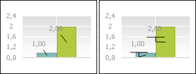
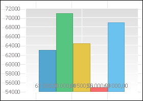
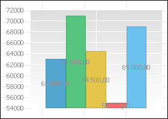

# Настройка подписей данных

Настройка подписей данных
-

# Настройка подписей данных

Настройка подписей данных доступна для различных [компонентов
 диаграммы](../UiDiagrams_basic_concept.htm):

[Ряды данных
 всей диаграммы](javascript:TextPopup(this))

	Для настройки подписи данных рядов
	 диаграммы используйте вкладку «Подписи
	 данных» окна «Параметры
	 диаграммы». Для вызова окна выполните команду «Параметры
	 диаграммы» контекстного меню [выделенной
	 диаграммы](../UiDiagrams_basic_concept.htm#select_component).

	Примечание.
	 В инструменте «Аналитические панели»
	 выполните команду «Диаграмма >
	 Параметры диаграммы» в контекстном меню диаграммы.

	Для быстрой настройки подписей данных диаграммы нажмите кнопку 
	 «Подписи данных», расположенную
	 в группе «Вид» вкладки «Диаграмма» ленты инструментов. В
	 раскрывающемся меню кнопки выберите вариант расположения подписей.
	 При выборе варианта «Дополнительные
	 параметры» откроется окно «Параметры
	 диаграммы» на вкладке «Подписи
	 данных».

	Примечание.
	 В веб-приложении пункт меню «Дополнительные
	 параметры» отсутствует. Для настройки подписей выберите пункт
	 «Настройки подписей данных»,
	 при нажатии на который открывается вкладка «[Ряды](../Series.htm)» [боковой
	 панели](GetStarted.chm::/Interface/Interface_Description.htm#side_panel).

[Отдельный ряд
 данных](javascript:TextPopup(this))

	Для настройки подписи данных ряда используйте вкладку «Подписи
	 данных» окна «Формат
	 ряда данных». Для вызова окна:

		- выполните команду «Формат
		 ряда данных» в контекстном меню выбранного ряда;

	Примечание.
	 В инструменте «Аналитические панели»
	 выполните команду «Диаграмма >
	 Формат ряда данных» в контекстном меню ряда.

		- дважды щелкните кнопкой мыши по ряду.

	В регламентном отчете для
	 настройки формата ряда диаграммы [выделите
	 ряд данных](../UiDiagrams_basic_concept.htm#select_component). В раскрывающемся списке
	 «Выбор элемента
	 диаграммы для форматирования»,
	 расположенном на вкладке «Диаграмма» ленты инструментов, выберите пункт,
	 соответствующий наименованию ряда данных, и
	 нажмите кнопку «Стиль
	 фрагмента». Откроется окно «Формат ряда данных».

	Для быстрой настройки подписей данных ряда используйте вкладку «[Ряды данных](../Series.htm)»
	 боковой панели.

[Одна точка ряда
 данных](javascript:TextPopup(this))

	Для настройки подписи данных одной точки ряда используйте вкладку
	 «Подписи данных» окна
	 «Формат точки ряда данных».
	 Для вызова окна:

		- выделите точку ряда данных и выполните одно из действий:

			- выполните команду «Формат
			 точки ряда данных» в контекстном меню точки ряда данных;

	Примечание.
	 В инструменте «Аналитические панели»
	 выполните команду «Диаграмма >
	 Формат точки ряда данных» или «Диаграмма
	 > Формат подписи данных» в контекстном меню точки ряда данных.

			- дважды щелкните по ней кнопкой мыши;

		- выделите подпись точки ряда данных и выполните команду «Формат подписи данных» в контекстном
		 меню подписи точки ряда данных. Команда доступна, если отображаются
		 подписи ряда данных;

	Для [каскадных диаграмм](../Type_diagrams/WaterFall_chart.htm)
	 для настройки подписей данных одной точки используйте вкладку «[Точки](../Tuning_format/Format_line/Data_Series_Point.htm#point)»
	 боковой панели.

[Линия уровня](javascript:TextPopup(this))

	Для настройки подписей линии уровня используйте вкладку «[Уровни](../Tuning_format/Format_Axis/LevelLines_Property.htm)»
	 окна «Формат оси». Для вызова
	 окна:

		- выделите [ось
		 диаграммы](../UiDiagrams_basic_concept.htm#select_component) и выполните команду «Формат
		 оси» в контекстном меню оси диаграммы;

	Примечание.
	 В инструменте «Аналитические панели»
	 выполните команду «Диаграмма >
	 Формат оси» в контекстном меню оси.

		- дважды щелкните кнопкой мыши по заголовку выбранной оси.

	В регламентном отчете для настройки параметров осей диаграммы [выделите ось
	 диаграммы](../UiDiagrams_basic_concept.htm#select_component). В раскрывающемся списке
	 «Выбор элемента
	 диаграммы для форматирования»,
	 расположенном на вкладке «Диаграмма» ленты инструментов, выберите пункт «Ось X»
	 («Ось Y», «Дополнительная
	 ось») и нажмите кнопку «Стиль фрагмента». Откроется окно «Формат оси».

Примечание.
 Настройка подписей данных с помощью окон доступна только в настольном
 приложении.

Набор параметров на вкладке может отличаться в зависимости от [типа
 диаграмм](../Type_diagrams/UiDiagrams_Type_diagrams.htm) и от того, откуда было вызвано окно.

Для подписей данных доступны следующие операции:

[Отображение/скрытие
 подписи](javascript:TextPopup(this))

	Для отображения подписей:

		- нажмите кнопку 
		 «Подписи данных», расположенную
		 в группе «Вид» вкладки
		 «Диаграмма» ленты инструментов,
		 и выберите необходимый вариант расположения подписи;

		- на вкладке «Подписи данных»
		 установите флажок «Отображать
		 подписи данных»;

		- установите флажок «Отображать
		 подписи данных» в окне «[Типы диаграмм](../Type_diagrams/ChangingChartType.htm)».

	Для скрытия подписей:

		- нажмите кнопку 
		 «Подписи данных», расположенную
		 в группе «Вид» вкладки
		 «Диаграмма» ленты инструментов,
		 и выберите вариант «Нет»;

		- на вкладке «Подписи данных»
		 снимите флажок «Отображать подписи
		 данных»;

		- снимите флажок «Отображать
		 подписи данных» в окне «[Типы диаграмм](../Type_diagrams/ChangingChartType.htm)».

[Определение
 текста подписи](javascript:TextPopup(this))

	Для определения текста подписей данных диаграммы, ряда или точки
	 ряда используйте поле «Текст»
	 на вкладке «Подписи данных»
	 окон «Параметры диаграммы»,
	 «[Формат ряда данных](../Series.htm)»
	 и «[Формат
	 точки ряда данных](../Tuning_format/Format_line/Data_Series_Point.htm)» соответственно.

	Поле «Текст» - многострочное.

	Для смены или добавления в текст подписи [шаблона](../Templates_in_labels.htm):

		- Нажмите кнопку «Шаблоны»,
		 расположенную рядом с полем «Текст».

		- В раскрывающемся списке выберите один из шаблонов текста
		 подписи данных.

	Для настройки формата:

		- части текста подписи
		 выделите часть текста и выполните пункт «Формат»
		 контекстного меню;

		- всей подписи данных
		 нажмите кнопку «Формат».

	После выполнения одного из действий появится окно «[Формат
	 подписей](../Property_diagramm/UiDiagrams_PropertyDiagramm_Label.htm)». Настройка формата подписей аналогична настройке [формата заголовков](UiDiagrams_titles.htm#captions_format).

	Примечание.
	 [Шаблоны](../Templates_in_labels.htm) выделяйте полностью.
	 Если в поле «Текст» часть
	 текста не выделена, настройки формата будут использованы для всего
	 текста подписи.

[Настройка
 формата подписи](javascript:TextPopup(this))

	Для настройки формата подписи задайте параметры в окне «[Формат подписей](Label_Format.htm)».

[Изменение
 типа подписи](javascript:TextPopup(this))

	Для определения типа подписей данных диаграммы, ряда или точки ряда
	 используйте раскрывающийся список «Тип
	 подписи» на вкладке «Подписи
	 данных» окон «Параметры диаграммы»,
	 «[Формат ряда данных](../Series.htm)»
	 и «[Формат
	 точки ряда данных](../Tuning_format/Format_line/Data_Series_Point.htm)» соответственно.

	В списке «Тип подписи» выберите
	 необходимый тип отображения подписей данных:

		- Простая. Подпись
		 отображается в виде метки, не соединенной линией с рядом (установлен
		 по умолчанию);

		- Выноска. Подпись
		 отображается в виде выноски, соединенной линией с рядом;

		- Указатель. Подпись
		 отображается в виде указателя, соединенного линией с рядом.

	Ниже приведен пример использования указателя (слева) и выноски (справа)
	 для подписи рядов диаграммы:

	

	Линия, соединяющая подпись с рядом данных, называется линией
	 выноски/указателя и становится видна, когда подпись смещена
	 относительно ряда.

	Для настройки формата линии, соединяющей ряд с подписью данных,
	 нажмите на кнопку «Формат».
	 Появится окно «[Формат
	 линии выноски/указателя](Callout_Pointer_Line_Format.htm)».

[Настройка
 положения подписи](javascript:TextPopup(this))

	В зависимости от выбранного [типа
	 диаграммы](../Type_diagrams/UiDiagrams_Type_diagrams.htm) в раскрывающемся списке «Положение»
	 доступны различные варианты расположения подписей данных:

		- для всех типов рядов доступны варианты «Автоматически»,
		 «В центре» и «Другие
		 настройки»;

		- для столбика и сектора доступны варианты «У
		 вершины, внутри», «У вершины,
		 снаружи» и «У основания,
		 внутри»;

		- для линии, области и точки доступны варианты «Справа»,
		 «Слева», «Сверху»
		 и «Снизу».

	Для настройки смещения подписи данных при заданном положении подписи
	 «Другие настройки» нажмите
	 кнопку «Настроить». Будет
	 открыто окно «[Настройка
	 положения подписи](Label_Position_Setup.htm)».

	Для предотвращения пересечения подписей данных диаграммы, ряда или
	 точки ряда используйте кнопку «Убрать
	 пересечения», расположенную на вкладке «Подписи
	 данных» окон «Параметры диаграммы»,
	 «[Формат ряда данных](../Series.htm)»
	 и «[Формат
	 точки ряда данных](../Tuning_format/Format_line/Data_Series_Point.htm)» соответственно.

	Примечание.
	 Предотвращение пересечения подписей данных применяется один раз после
	 нажатия кнопки «Убрать пересечения».
	 При изменении настроек диаграммы подписи могут снова накладываться
	 друг на друга. Для избежания наложения подписей данных друг на друга
	 повторно нажмите кнопку «Убрать пересечения»
	 или используйте автоматический вариант размещения подписей данных.

## Особенности автоматического варианта расположения подписей данных

	При автоматическом размещении подписи будут расположены таким образом,
	 чтобы избежать наложения друг на друга. Автоматическое размещение
	 подписей сохраняется вместе с другими параметрами отчёта. При автоматическом
	 размещении будет сброшено ручное размещение подписей данных (заданных
	 с помощью мыши), в случае их пересечения.

	Примечание.
	 Автоматическое размещение убирает наложение подписей данных, идущих
	 только друг за другом. Например, после автоматического размещения
	 первая и вторая подписи гарантировано не будут накладываться, но может
	 возникнуть наложение первой и третьей подписи.

	При использовании [гистограммы](../Type_diagrams/UiDiagrams_Bar.htm)
	 с абсолютным или процентным [накоплением](UiDiagrams_params_diagram.htm#stacking)
	 подписи данных отображаются только в том случае, если [размер
	 шрифта подписи](../Tuning_format/Format_Title/UiDiagrams_FormatTitle_type.htm#font_size) меньше высоты столбика.

	Ниже приведен пример расположения подписей данных без автоматического
	 размещения (слева) и с использованием автоматического размещения (справа).

	 

	Примечание.
	 Задать расположение подписи данных можно с помощью языка [Fore](Chart.chm::/Interface/IChartLabel/IChartLabel.Position.htm)
	 или вручную. Для ручного изменения положения подписи данных выделите
	 подпись на диаграмме с помощью мыши и переместите ее как отдельный
	 объект в нужное место.

[Настройка
 направления текста подписи](javascript:TextPopup(this))

	Текст подписей по умолчанию располагается горизонтально. При необходимости
	 текст может быть расположен под углом 90 или 270 градусов. Для изменения
	 расположения текста выберите необходимый вариант в списке «Направление».

	Изменение направления текста подписи недоступно, если в качестве
	 [положения](#position) подписей выбран вариант «Другие
	 настройки».

[Отображение
 подписей вторичной диаграммы](javascript:TextPopup(this))

	Для автоматического размещения подписей данных диаграммы, ряда или
	 точки ряда используйте группу «Дополнительно
	 для круговой диаграммы» на вкладке «Подписи
	 данных» окна «Параметры диаграммы».

	В раскрывающемся списке «Отображать
	 подписи» выберите вариант отображения подписей к рядам данных
	 на диаграммах:

		- Для обеих диаграмм.
		 Подписи отображаются для обеих диаграмм;

		- Только для основной.
		 Подписи отображаются только для основной диаграммы;

	Совет.
	 Для быстрого скрытия подписи данных на вторичной диаграмме выполните
	 команду контекстного меню «Способ
	 отображения > Скрыть подписи на вторичной диаграмме» диаграммы.

		- Только для
		 вторичной. Подписи отображаются только для вторичной диаграммы.

См. также:

[Подписи
 данных](../Property_diagramm/UiDiagrams_PropertyDiagramm_Label.htm) | [Настройка общих параметров
 диаграммы](UiDiagrams_params_diagram.htm) | [Настройка компонентов
 диаграммы](../UiDiagrams_basic_concept.htm)

		Справочная
		 система на версию 10.9
		 от 18/08/2025,
		 © ООО «ФОРСАЙТ»,
