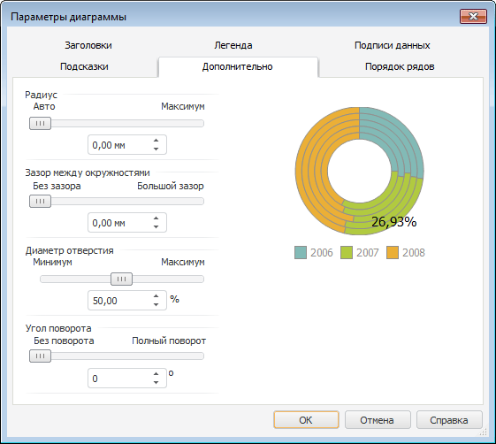
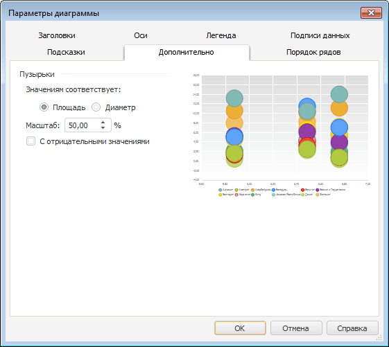

# Настройка дополнительных параметров

Настройка дополнительных параметров
-

# Настройка дополнительных параметров

Для настройки дополнительных параметров [смешанной](#additionally_histo),
 [круговой](#additionally_pie), [кольцевой](#doughnutparam),
 [каскадной](../Type_diagrams/WaterFall_chart.htm) диаграмм,
 [гистограммы](#additionally_histo), [гистограммы
 с интервалами колебаний](#additionally_histo_additional) и [пузырьковой диаграммы](#extra_bubble)
 перейдите на вкладку «Дополнительно»
 окна «Параметры диаграммы».

Для настройки дополнительных параметров [вторичной
 гистограммы](../Type_diagrams/UiDiagrams_secondary_histogram.htm) и [вторичной
 круговой диаграммы](../Type_diagrams/UiDiagrams_round_secondary.htm) перейдите на вкладку «[Вторичная диаграмма](UiDiagrams_secondary_diagram.htm)»
 окна «Параметры диаграммы».

Примечание.
 Настройка дополнительных параметров с помощью окна «Параметры диаграммы» доступна только
 в настольном приложении.

[Для
 вызова окна «Параметры диаграммы»](javascript:TextPopup(this))

	Выполните команду «Параметры
	 диаграммы» в контекстном меню [выделенной
	 диаграммы](../UiDiagrams_basic_concept.htm#select_component).

	Примечание.
	 В инструменте «Аналитические панели»
	 выполните команду «Диаграмма >
	 Параметры диаграммы» в контекстном меню диаграммы.

## Гистограмма, каскадная и смешанная
 диаграммы

Вкладка «Дополнительно» для
 [гистограммы](../Type_diagrams/UiDiagrams_Bar.htm), [каскадной](../Type_diagrams/WaterFall_chart.htm)
 и [смешанной диаграммы](../Type_diagrams/UiDiagrams_mixed_diagram.htm):

Вкладка предназначена для настройки зазоров между рядами. Для получения
 более подробной информации обратитесь к разделу «[Настройка
 зазоров между рядами](Setup_Gaps.htm#adv)». Для [каскадной
 диаграммы](../Type_diagrams/WaterFall_chart.htm) настройка бокового зазора доступна только для основных рядов.

## Круговая диаграмма

Вкладка «Дополнительно» для
 [круговой диаграммы](../Type_diagrams/UiDiagrams_round.htm):

На вкладке доступны следующие операции:

[Настройка
 радиуса диаграммы](javascript:TextPopup(this))

	В группе «Радиус» с помощью
	 бегунка или редактора чисел задайте радиус диаграммы.

Примечание.
 Доступен ввод значения [в
 разных единицах измерения](UiNav.Chm::/GUI/format/different_units.htm). В поле ввода редактора отображаются значения
 в единицах измерения, соответствующих текущим региональным настройкам
 операционной системы.

[Настройка
 зазора между окружностями](javascript:TextPopup(this))

	В группе параметров «Зазор между
	 окружностями» с помощью бегунка или редактора чисел задайте
	 расстояние между рядами диаграммы.

Примечание.
 Доступен ввод значения [в
 разных единицах измерения](UiNav.Chm::/GUI/format/different_units.htm). В поле ввода редактора отображаются значения
 в единицах измерения, соответствующих текущим региональным настройкам
 операционной системы.

[Настройка
 угла поворота](javascript:TextPopup(this))

	В группе «Угол поворота»
	 с помощью бегунка или редактора чисел установите угол поворота центральной
	 оси в градусах.

[Расположение
 рядов против часовой стрелки](javascript:TextPopup(this))

	Для расположения рядов на диаграмме против часовой стрелки установите
	 флажок «Ряды против часовой стрелки».

[Расположение
 рядов в кольцах](javascript:TextPopup(this))

	Для расположения рядов в кольцах установите флажок «Ряды
	 в кольцах».

## Кольцевая диаграмма

Вкладка «Дополнительно» для
 [кольцевой диаграммы](../Type_diagrams/Doughnut_chart.htm):

На вкладке доступны следующие операции:

[Настройка
 радиуса диаграммы](javascript:TextPopup(this))

	В группе «Радиус» с помощью
	 бегунка или редактора чисел задайте радиус диаграммы.

Примечание.
 Доступен ввод значения [в
 разных единицах измерения](UiNav.Chm::/GUI/format/different_units.htm). В поле ввода редактора отображаются значения
 в единицах измерения, соответствующих текущим региональным настройкам
 операционной системы.

[Настройка
 зазора между окружностями](javascript:TextPopup(this))

	В группе параметров «Зазор между
	 окружностями» с помощью бегунка или редактора чисел задайте
	 расстояние между рядами диаграммы.

Примечание.
 Доступен ввод значения [в
 разных единицах измерения](UiNav.Chm::/GUI/format/different_units.htm). В поле ввода редактора отображаются значения
 в единицах измерения, соответствующих текущим региональным настройкам
 операционной системы.

[Настройка диаметра
 отверстия](javascript:TextPopup(this))

	В группе параметров «Диаметр отверстия»
	 с помощью бегунка или редактора чисел укажите процент диаметра отверстия
	 от всего диаметра кольцевой диаграммы. Допустимые значения находятся
	 в интервале [10 %;90 %]. По умолчанию установлено значение
	 «50%».

[Настройка
 угла поворота](javascript:TextPopup(this))

	В группе «Угол поворота»
	 с помощью бегунка или редактора чисел установите угол поворота центральной
	 оси в градусах.

## Гистограмма с интервалами
 колебаний

Вкладка «Дополнительно» для
 [гистограммы с интервалами
 колебаний](../Type_diagrams/UiDiagrams_BarVibration.htm):

На вкладке доступна операция:

[Настройка смещения
 интервала колебаний](javascript:TextPopup(this))

	В группе «Смещение интервала колебаний»
	 с помощью бегунка или редактора чисел задайте смещение маркеров интервала
	 колебаний относительно центра столбика, указав процент смещения маркеров (допустимые
	 значения находятся в интервале [-50; 50]).

## Пузырьковая диаграмма

Вкладка «Дополнительно» для
 [пузырьковой диаграммы](../Type_diagrams/Bubble_Chart.htm):

На вкладке доступны операции:

[Настройка значений
 размера пузырьков](javascript:TextPopup(this))

	Для настройки параметра, определяющего размер пузырьков, установите
	 переключатель в группе «Значениям
	 соответствует»:

		- Площадь;

		- Диаметр.

[Настройка масштаба
 отображения пузырьков](javascript:TextPopup(this))

	С помощью редактора чисел или клавиатуры установите масштаб отображения
	 пузырьков.

[Отображение
 пузырьков с отрицательными значениями](javascript:TextPopup(this))

	Для отображения пузырьков с отрицательными значениями установите
	 флажок «С отрицательными значениями».

См. также:

[Типы диаграмм](../Type_diagrams/UiDiagrams_Type_diagrams.htm) |
 [Настройка вторичной диаграммы](UiDiagrams_secondary_diagram.htm)
 | [Настройка общих параметров
 диаграммы](UiDiagrams_params_diagram.htm) | [Настройка компонентов
 диаграммы](../UiDiagrams_basic_concept.htm)

		Справочная
		 система на версию 10.9
		 от 18/08/2025,
		 © ООО «ФОРСАЙТ»,
