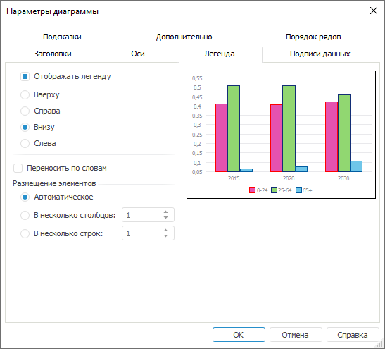
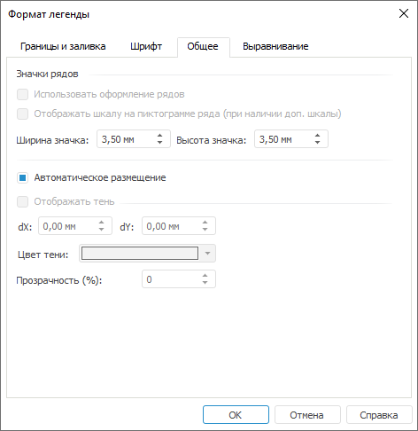

# Настройка легенды

Настройка легенды
-

# Настройка легенды

Для настройки легенды используйте:

[вкладку
 «Легенда» окна «Параметры
 диаграммы»](javascript:TextPopup(this))

	

[вкладку
 «Общее» окна «Формат
 легенды»](javascript:TextPopup(this))

	

Настройка доступна в настольном приложении.

Совет. Для быстрой
 настройки формата легенды используйте вкладку «[Легенда](../Property_diagramm/UiDiagrams_PropertyDiagramm_legend.htm)»
 боковой панели.

[Для вызова окна
 «Формат легенды»](javascript:TextPopup(this))

		- Выполните команду «Формат
		 легенды» в контекстном меню легенды.

	Примечание.
	 В инструменте «Аналитические панели»
	 выполните команду «Диаграмма >
	 Формат легенды» в контекстном меню легенды.

		- Дважды щелкните кнопкой мыши по легенде.

	Для настройки формата легенды в регламентном
	 отчете [выделите легенду](../UiDiagrams_basic_concept.htm#select_component). Затем нажмите кнопку
	 «Стиль фрагмента», расположенную
	 в группе «Текущий фрагмент»
	 на вкладке «Диаграмма» ленты
	 инструментов.

[Для
 вызова окна «Параметры диаграммы»](javascript:TextPopup(this))

	Выполните команду «Параметры
	 диаграммы» в контекстном меню [выделенной
	 диаграммы](../UiDiagrams_basic_concept.htm#select_component).

	Примечание.
	 В инструменте «Аналитические панели»
	 выполните команду «Диаграмма >
	 Параметры диаграммы» в контекстном меню диаграммы.

На вкладках «Легенда» окна «Параметры диаграммы» и «Общее» окна
 «Формат легенды» задайте следующие
 настройки легенды:

[Отображение
 легенды](javascript:TextPopup(this))

	Для отображения легенды:

		- выберите вариант размещения легенды в раскрывающемся меню
		 кнопки «Легенда», расположенной
		 в группе «Вид» вкладки
		 «Диаграмма» ленты инструментов;

		- установите флажок «Отображать
		 легенду» на вкладке «Легенда»
		 окна «Параметры диаграммы».

[Скрытие
 легенды](javascript:TextPopup(this))

	Для скрытия легенды:

		- выберите значок 
		 в раскрывающемся меню кнопки «Легенда»,
		 расположенной в группе «Вид»
		 вкладки «Диаграмма» ленты
		 инструментов;

		- снимите флажок «Отображать
		 легенду» на вкладке «Легенда»
		 окна «Параметры диаграммы».

[Изменение
 размещения легенды](javascript:TextPopup(this))

	Для изменения положения легенды:

		- установите нужный переключатель на вкладке «Легенда»
		 окна «Параметры диаграммы»;

		- нажмите кнопку «Легенда»,
		 расположенную в группе «Вид»
		 вкладки «Диаграмма» ленты
		 инструментов, и выберите вариант расположения: над областью, под
		 областью, слева, справа, слева снизу, слева сверху, справа снизу,
		 справа сверху или легенда скрыта (обозначается значком ).

	Для автоматического размещения легенды установите флажок «Автоматическое размещение», расположенный
	 на вкладке «Общее» окна «Формат легенды». При установленном
	 флажке легенда будет автоматически размещаться внизу области диаграммы.

[Перенос
 слов в легенде](javascript:TextPopup(this))

	Для переноса слов в легенде установите флажок:

		- «Переносить по словам»
		 на вкладке «Легенда» окна
		 «Параметры диаграммы»;

		- «Текст в несколько строк»
		 на вкладке «[Выравнивание](UiNav.chm::/GUI/Format/UiReport_Table_Attribute_Arrange.htm)»
		 окна «Формат легенды».

	Примечание.
	 Для китайского языка перенос текста осуществляется по иероглифам.

[Размещение элементов](javascript:TextPopup(this))

	Определите настройки размещения элементов в легенде. Для этого выберите
	 вариант размещения элементов, установив нужный переключатель, на вкладке
	 «Легенда» окна «Параметры
	 диаграммы»:

		- Автоматическое.
		 По умолчанию. Количество строк и столбцов подбирается в зависимости
		 от количества элементов легенды и её размеров;

		- В несколько столбцов.
		 Укажите количество столбцов для размещения элементов легенды.
		 При любом размере легенды будет использоваться заданное количество
		 столбцов;

		- В несколько строк.
		 Укажите количество строк для размещения элементов легенды. При
		 любом размере легенды будет использоваться заданное количество
		 строк.

[Настройка
 формата легенды](javascript:TextPopup(this))

	Для легенды диаграммы можно настроить:

		- [границы
		 и заливку](../Tuning_format/UiDiagrams_tuning_border_and_filling.htm) области легенды;

		- [шрифт](../Tuning_format/Format_Title/UiDiagrams_FormatTitle_type.htm)
		 текста легенды;

		- [выравнивание](../Tuning_format/UiDiagrams_tuning_alignment.htm)
		 текста в легенде.

	Для настройки формата легенды используйте окно «Формат
	 легенды».

См. также:

[Легенда](../Property_diagramm/UiDiagrams_PropertyDiagramm_legend.htm)
 | [Настройка общих параметров диаграммы](UiDiagrams_params_diagram.htm)
 | [Настройка компонентов диаграммы](../UiDiagrams_basic_concept.htm)

		Справочная
		 система на версию 10.9
		 от 18/08/2025,
		 © ООО «ФОРСАЙТ»,
