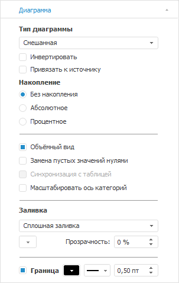
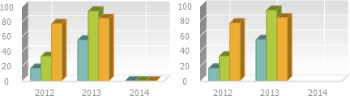
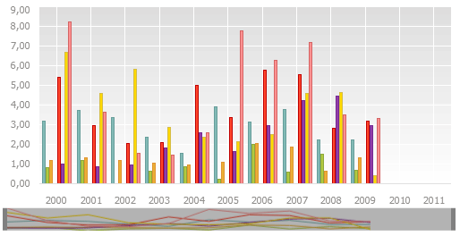
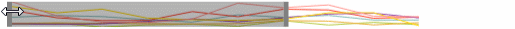
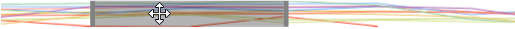
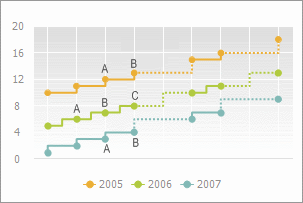

# Настройка общих параметров диаграммы

Настройка общих параметров диаграммы
-

# Настройка общих параметров диаграммы

Для настройки общих параметров диаграммы предусмотрены следующие подходы:

[Быстрая настройка](javascript:TextPopup(this))

	Для быстрой настройки формата ряда данных используйте вкладку «Диаграмма» боковой панели.

	Доступны следующие настройки рядов диаграммы:

		- настройки типа диаграммы;

		- настройки границ и заливки и другие настройки.

[Расширенная
 настройка](javascript:TextPopup(this))

	При работе с диаграммами доступно:

		- [изменение
		 типа диаграммы](../Type_diagrams/ChangingChartType.htm);

		- [настройка стиля диаграммы](../UiDiagram_Style.htm);

		- [настройка ориентации
		 шкалы](../UiDiagrams_OrietationScale.htm);

		- [настройка
		 границы и заливки диаграммы](../Tuning_format/UiDiagrams_tuning_border_and_filling.htm);

		- настройка [шрифта](../Tuning_format/Format_Title/UiDiagrams_FormatTitle_type.htm)
		 и [выравнивания](../Tuning_format/UiDiagrams_tuning_alignment.htm)
		 подписей, подсказок и заголовков.

	Для расширенной настройки формата ряда данных используйте окно «Параметры диаграммы».

	В зависимости от [типа
	 диаграммы](../Type_diagrams/UiDiagrams_Type_diagrams.htm) доступны:

		- [настройка осей](UiDiagrams_Axis.htm);

		- [настройка
		 легенды;](../Property_diagramm/UiDiagrams_PropertyDiagramm_legend.htm)

		- [настройка заголовков](UiDiagrams_titles.htm);

		- [настройка
		 подписей данных](../Property_diagramm/UiDiagrams_PropertyDiagramm_Label.htm);

		- [настройка всплывающих
		 подсказок](UiDiagrams_promthing.htm);

		- [настройка
		 объемного вида диаграммы](../Property_diagramm/UiDiagrams_PropertyDiagramm_Volume.htm);

		- [настройка вторичной
		 диаграммы](UiDiagrams_secondary_diagram.htm);

		- [настройка дополнительных
		 параметров](UiDiagrams_extra.htm).

## Быстрая настройка параметров диаграммы

Вкладка «Диаграмма» расположена
 на боковой панели и предназначена для настройки общих параметров диаграммы.

[Для отображения
 вкладки](javascript:TextPopup(this))

		- Убедитесь, что боковая панель [отображается](GetStarted.chm::/Interface/Interface_Description.htm#side_panel).

		- В рабочей области выделите диаграмму.

		- Установите на боковой панели переключатель «Формат»
		 и перейдите на вкладку «Диаграмма».

Для всех типов диаграмм доступно:

[Изменение
 типа диаграммы](javascript:TextPopup(this))

	Для [изменения типа
	 диаграммы](../Type_diagrams/ChangingChartType.htm):

		- используйте ленту инструментов. Нажмите кнопку 
		 «Тип», расположенную на
		 вкладке «Диаграмма» ленты
		 инструментов;

		- используйте вкладку «[Диаграмма](UiDiagrams_params_diagram.htm)»
		 боковой панели;

		- используйте окно «[Тип диаграммы](../Type_diagrams/ChangingChartType.htm)».

[Сохранение
 оформления рядов данных](javascript:TextPopup(this))

	Настройка доступна в [экспресс-отчётах](UiExpress.chm::/purpose/UiExpress_Purpose.htm),
	 а также в [регламентных отчётах](UiReport.chm::/UiReport_purpose.htm)
	 при условии, что источником данных является [срез
	 данных](UiReport.chm::/desktop/Source/Window/UiReport_Source_Window_AreaSource.htm).

	Для сохранения оформления [рядов данных](../Series.htm)
	 диаграммы установите флажок «Привязать
	 к источнику». После установки флажка оформление рядов данных
	 не будет меняться при изменении отметки в измерении.

	Примечание.
	 При работе со [смешанной
	 диаграммой](../Type_diagrams/UiDiagrams_mixed_diagram.htm) ряды линейного типа будут отображаться на переднем
	 плане относительно других типов рядов.

[Замена пустых
 значений нулями](javascript:TextPopup(this))

	Для отображения пустых значений на диаграмме в виде нулевых установите
	 флажок «Замена пустых значений нулями».
	 По умолчанию флажок снят, то есть пустые значения не заменяются нулями,
	 и отображается разрыв области диаграммы.

	На диаграмме слева пустые значения заменяются нулями, на диаграмме
	 справа - не отображаются:

	

[Изменение заливки
 фона диаграммы](javascript:TextPopup(this))

	Для настройки фона диаграммы в раскрывающемся списке «Заливка»
	 укажите тип заливки фона:

		- Нет. Заливка фона
		 диаграммы не будет использоваться;

		- Сплошная заливка.
		 Для выбора цвета однотонной заливки укажите цвет заливки
		 в раскрывающейся палитре. В настольном приложении также доступна
		 настройка прозрачности фона диаграммы.

		- Градиентная заливка.
		 Для выбора цвета заливки фона диаграммы двухцветным градиентом укажите
		 начальный и конечный цвета градиента в раскрывающихся палитрах.
		 При необходимости укажите угол наклона и процент прозрачности
		 градиента в полях «Угол»
		 и «Прозрачность».

	Примечание.
	 При задании прозрачности сплошной
	 или градиентной заливки
	 учитывайте, что 100% соответствует полной прозрачности (фон диаграммы
	 данных станет невидимым), 0% соответствует полной непрозрачности.

[Изменение границы
 диаграммы](javascript:TextPopup(this))

	Для отображения границы диаграммы установите
	 флажок «Граница» и задайте
	 настройки цвета и толщины линии границы. В настольном приложении также
	 доступна настройка типа линии для границы ряда данных.

Возможности, доступные в зависимости от типа диаграммы:

[Определение
 ориентации шкалы](javascript:TextPopup(this))

	Доступно для рядов [линейной](../Type_diagrams/UiDiagrams_lenear.htm),
	 [точечной](../Type_diagrams/UiDiagrams_scatter.htm), [смешанной](../Type_diagrams/UiDiagrams_mixed_diagram.htm),
	 [коробчатой](../Type_diagrams/Box_chart.htm), [каскадной](../Type_diagrams/WaterFall_chart.htm),
	 [ступенчатой](../Type_diagrams/Stepped_Chart.htm) диаграмм,
	 [гистограммы](../Type_diagrams/UiDiagrams_Bar.htm), [объемной гистограммы
	 с группами](../Type_diagrams/3DHistogram_with_Groups.htm) и [диаграммы
	 с областями](../Type_diagrams/UiDiagrams_Area.htm).

	Для изменения ориентации шкал установите флажок «Инвертировать».
	 При этом ось X будет ориентирована снизу вверх, а ось Y слева направо.
	 Также будет инвертирован порядок отображения рядов в [легенде](../Property_diagramm/UiDiagrams_PropertyDiagramm_legend.htm).
	 При снятом флажке ориентация шкал и порядок рядов в легенде вернутся
	 к исходному виду.

[Изменения
 типа накопления](javascript:TextPopup(this))

	Доступно для рядов [линейной](../Type_diagrams/UiDiagrams_lenear.htm),
	 [смешанной](../Type_diagrams/UiDiagrams_mixed_diagram.htm)
	 диаграмм, [гистограммы](../Type_diagrams/UiDiagrams_Bar.htm)
	 и [диаграммы с областями](../Type_diagrams/UiDiagrams_Area.htm).

	В группе «Накопление» укажите
	 используемый тип накопления, установив один из переключателей:

		- Без накопления.
		 Диаграмма отображает абсолютные значения ряда;

		- Абсолютное. Диаграмма
		 отображает значения с накоплением, позволяя оценить вклад каждого
		 значения в общую сумму;

		- Процентное. Диаграмма
		 отображает значения в процентном стиле, позволяя оценить долю
		 каждого значения в общей сумме.

[Отображение
 диаграммы в объемном виде](javascript:TextPopup(this))

	Доступно для рядов [линейной](../Type_diagrams/UiDiagrams_lenear.htm),
	 [круговой](../Type_diagrams/UiDiagrams_round.htm), [смешанной](../Type_diagrams/UiDiagrams_mixed_diagram.htm)
	 диаграммы, [гистограммы](../Type_diagrams/UiDiagrams_Bar.htm)
	 и [диаграммы с областями](../Type_diagrams/UiDiagrams_Area.htm).

	Для отображения диаграммы в объемном виде установите флажок «Объемный вид».

[Синхронизация
 с таблицей](javascript:TextPopup(this))

	Для синхронизации отображения диаграммы с таблицей данных установите
	 флажок «Синхронизация с таблицей».
	 После установки флажка станет доступно масштабирование диаграммы.

	Примечание.
	 Настройка доступна только в настольном приложении для инструментов
	 «Аналитические запросы (OLAP)» и «Аналитические
	 панели» для [линейной
	 диаграммы](../Type_diagrams/UiDiagrams_lenear.htm), [гистограммы](../Type_diagrams/UiDiagrams_Bar.htm),
	 [диаграммы с областями](../Type_diagrams/UiDiagrams_Area.htm)
	 и [смешанной
	 диаграммы](../Type_diagrams/UiDiagrams_mixed_diagram.htm).

	Масштабирование позволяет
	 изменять размер отображаемого участка диаграммы с сохранением пропорций.

	Для выполнения масштабирования выделите с помощью мыши участок диаграммы,
	 который необходимо увеличить. Диаграмма автоматически перестроится.
	 В области построения будет отображаться тот участок, который был выделен.
	 Для возвращения диаграммы к исходному виду нажмите кнопку  в области построения диаграммы.

	При работе с синхронизацией имеются ограничения:

		- настройка доступна в настольном приложении для рядов [линейной](../Type_diagrams/UiDiagrams_lenear.htm), [смешанной](../Type_diagrams/UiDiagrams_mixed_diagram.htm)
		 диаграммы, [гистограммы](../Type_diagrams/UiDiagrams_Bar.htm)
		 и [диаграммы с областями](../Type_diagrams/UiDiagrams_Area.htm)
		 в двумерном виде;

		- настройка доступна при [расположении
		 представлений данных](UiExpress.chm::/Setup_express_report/UiExpress_control.htm) (диаграммы и таблицы)
		 вертикально или горизонтально;

		- настройка не доступна при работе с диаграммами регламентного
		 отчета.

[Масштабирование
 оси категорий](javascript:TextPopup(this))

	Масштабирование позволяет
	 изменять размер отображаемого участка диаграммы с сохранением пропорций.

	Масштабирование оси категорий применяется для управления отображением
	 области диаграммы.

	Примечание.
	 Настройка доступна только в веб-приложении для инструментов «Аналитические запросы (OLAP)»
	 и «Аналитические панели»
	 для [линейной](../Type_diagrams/UiDiagrams_lenear.htm),
	 [смешанной](../Type_diagrams/UiDiagrams_mixed_diagram.htm),
	 [каскадной](../Type_diagrams/WaterFall_chart.htm), [ступенчатой](../Type_diagrams/Stepped_Chart.htm)
	 диаграмм, [гистограммы](../Type_diagrams/UiDiagrams_Bar.htm),
	 [объемной гистограммы
	 с группами](../Type_diagrams/3DHistogram_with_Groups.htm) и [диаграммы
	 с областями](../Type_diagrams/UiDiagrams_Area.htm).

	Для начала работы с масштабированием оси категорий включите отображение
	 «скроллера». Для этого:

		- установите флажок «Масштабирование
		 оси категорий» на вкладке «Диаграмма»
		 боковой панели;

		- нажмите кнопку  «Масштабировать
		 ось категорий», расположенную на вкладке «Диаграмма»
		 ленты инструментов.

	После установки флажка под областью диаграммы будет отображен «скроллер»,
	 станет доступно масштабирование диаграммы:

	

	Для выполнения масштабирования наведите указатель мыши к границе
	 «скроллера». Указатель примет вид двунаправленной стрелки:

	

	Нажмите кнопку мыши и, удерживая ее, передвиньте границу. Диаграмма
	 автоматически перестроится. В области построения диаграммы будет отображаться
	 участок, соответствующий участку «скроллера»:

	

	Для перемещения «скроллера» наведите на него указатель мыши. Указатель
	 примет вид четырехнаправленной стрелки:

	

	Нажмите кнопку мыши и, удерживая ее, передвиньте участок «скроллера»
	 в необходимую позицию. В области построения отобразится соответствующий
	 участок диаграммы.

	Для быстрого выполнения масштабирования наведите указатель мыши
	 на «скроллер» или на область диаграммы и прокрутите колесико мыши
	 вверх для увеличения масштаба, вниз - для уменьшения масштаба.

	Для возвращения диаграммы к исходному виду:

		- снимите флажок «Масштабирование
		 оси категорий»;

		- передвиньте границы «скроллера» в исходное положение.

	По умолчанию отображение «скроллера» отключено.

[Настройка
 положения ступеньки](javascript:TextPopup(this))

Ступенька представляет собой
 ломаную линию, соединяющую два соседних значения ряда.

Доступно только для [ступенчатой
 диаграммы](../Type_diagrams/Stepped_Chart.htm).

Для изменения положения ступеньки относительно точки ряда данных в раскрывающемся
 списке «Ступенька» выберите необходимый
 вариант расположения: слева, по центру или справа от точки ряда.

	Ниже приведен пример ступенчатой диаграммы, в которой для ряда «2005» установлено положение ступеньки
	 «Слева» (от точки «B» к точке
	 «A»), для ряда «2006» - «По центру» (от точки «B» к
	 точке «A» и к точке «C») и для ряда «2007»
	 - «Справа» (от точки «A» к
	 точке «B»):

	

	Примечание.
	 Настройка положения ступеньки также доступна на вкладке «[Ряды
	 данных](../Series.htm#stepline)» боковой панели.

См. также:

[Типы
 диаграмм](../Type_diagrams/UiDiagrams_Type_diagrams.htm) | [Настройка
 компонентов диаграммы](../UiDiagrams_basic_concept.htm)

		Справочная
		 система на версию 10.9
		 от 18/08/2025,
		 © ООО «ФОРСАЙТ»,
