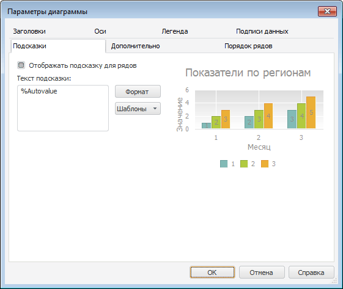

# Настройка всплывающих подсказок

Настройка всплывающих подсказок
-

# Настройка всплывающих подсказок

Для настройки подсказок для точек рядов данных перейдите на вкладку
 «Подсказки» окна «Параметры диаграммы».

Примечание.
 Настройка всплывающих подсказок с помощью окна «Параметры
 диаграммы» доступна только в настольном приложении.

Совет. Для быстрой
 настройки всплывающих подсказок используйте вкладку «[Подсказки](Tooltips.htm)» боковой панели.

[Для
 вызова окна «Параметры диаграммы»](javascript:TextPopup(this))

	Выполните команду «Параметры
	 диаграммы» в контекстном меню [выделенной
	 диаграммы](../UiDiagrams_basic_concept.htm#select_component).

	Примечание.
	 В инструменте «Аналитические панели»
	 выполните команду «Диаграмма >
	 Параметры диаграммы» в контекстном меню диаграммы.

На вкладке доступны следующие операции:

[Отображение
 всплывающих подсказок](javascript:TextPopup(this))

	Для отображения всплывающих подсказок установите флажок «Отображать
	 подсказку для рядов».

	При установленном флажке при наведении указателя мыши на точку ряда
	 будет появляться всплывающая подсказка в формате, указанном в поле «[Текст подсказки](#tooltip_text)».
	 По умолчанию всплывающие подсказки не отображаются.

[Определение
 текста подсказки](javascript:TextPopup(this))

	Текст и формат и подсказки формируется в поле «Текст
	 подсказки». Для создания многострочной подсказки задайте текст
	 в несколько строк.

	Для создания текста подсказки можно использовать готовые шаблоны.
	 Для этого:

		- Нажмите кнопку «Шаблоны»,
		 расположенную рядом с полем.

		- В раскрывающемся списке выберите один из [шаблонов](../Templates_in_labels.htm)
		 текста подсказки.

	Для настройки оформления:

		- части текста подписи выделите часть текста и выполните команду
		 контекстного меню «Формат»;

		- всей подписи данных нажмите кнопку «Формат».

	После выполнения одного из действий появится окно «Формат подписей». Настройка формата
	 подписей аналогична настройке [формата
	 заголовков](UiDiagrams_titles.htm#captions_format).

См. также:

[Всплывающие
 подсказки](Tooltips.htm) | [Шаблоны](../Templates_in_labels.htm) |
 [Настройка общих параметров диаграммы](UiDiagrams_params_diagram.htm)
 | [Настройка компонентов диаграммы](../UiDiagrams_basic_concept.htm)

		Справочная
		 система на версию 10.9
		 от 18/08/2025,
		 © ООО «ФОРСАЙТ»,
