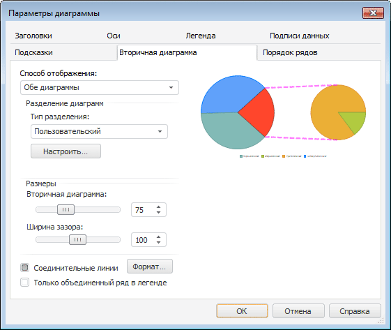
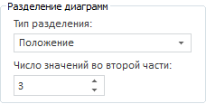
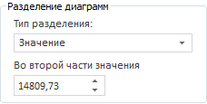
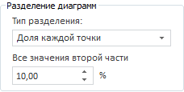
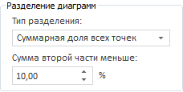
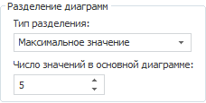
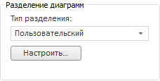

# Настройка вторичной диаграммы

Настройка вторичной диаграммы
-

# Настройка вторичной диаграммы

Вторичная диаграмма - дополнительная
 диаграмма во [вторичной
 гистограмме](../Type_diagrams/UiDiagrams_secondary_histogram.htm) и [вторичной
 круговой диаграмме](../Type_diagrams/UiDiagrams_round_secondary.htm), в которую выведена часть значений из основной
 диаграммы.

Для настройки вторичной диаграммы перейдите на вкладку «Вторичная
 диаграмма» окна «Параметры
 диаграммы».

Примечание.
 Настройка вторичной диаграммы с помощью окна «Параметры
 диаграммы» доступна только в настольном приложении в случае выбора
 типов диаграмм «[Вторичная
 круговая диаграмма](../Type_diagrams/UiDiagrams_round_secondary.htm)» или «[Вторичная
 гистограмма](../Type_diagrams/UiDiagrams_secondary_histogram.htm)».

[Для
 вызова окна «Параметры диаграммы»](javascript:TextPopup(this))

	Выполните команду «Параметры
	 диаграммы» в контекстном меню [выделенной
	 диаграммы](../UiDiagrams_basic_concept.htm#select_component).

	Примечание.
	 В инструменте «Аналитические панели»
	 выполните команду «Диаграмма >
	 Параметры диаграммы» в контекстном меню диаграммы.

На вкладке доступны следующие операции:

[Выбор
 способа отображения](javascript:TextPopup(this))

	Для настройки способа отображения [вторичной
	 гистограммы](../Type_diagrams/UiDiagrams_secondary_histogram.htm) и [вторичной
	 круговой диаграммы](../Type_diagrams/UiDiagrams_round_secondary.htm) в списке «Способ
	 отображения» выберите необходимый вариант:

		- Обе диаграммы;

		- Только основная диаграмма;

		- Только вторичная диаграмма.

[Настройка
 разделения основной и вторичной диаграммы](javascript:TextPopup(this))

	Для настройки разделения основной и вторичной диаграммы используйте
	 группу параметров «Разделение диаграмм»:

		- В списке «Тип разделения»
		 выберите тип разделения основной и вторичной диаграммы.

		- Настройте тип разделения.

	При выборе типа разделения «Положение» с
	 помощью редактора чисел укажите число значений, которые будут отображаться
	 во второй части диаграммы. Минимальное допустимое значение равно 0:

	

	При выборе типа разделения «Значение»
	 задайте пороговое число. Значения, меньше заданного порогового числа,
	 будут помещены во вторичную диаграмму. Редактор значений имеет шаг
	 0,5. По умолчанию установлено среднее значение по всем значениям диаграммы:

	

	При выборе типа разделения «Доля
	 каждой точки» задайте процент от максимального значения диаграммы.
	 Все значения, меньше заданного процента, будут помещены во вторичную
	 диаграмму. Редактор значений имеет шаг 5. По умолчанию установлено
	 значение 10:

	

	При выборе типа разделения «Суммарная
	 доля всех точек» задайте процент от суммы всех значений диаграммы.
	 Во вторичную диаграмму будут помещены все значения, начиная с минимальных,
	 сумма которых меньше заданного процента. Редактор значений имеет шаг
	 5. По умолчанию установлено значение 10:

	

	При выборе типа разделения «Максимальное
	 значение» задайте число значений
	 в основной диаграмме. В основной диаграмме будут ряды с максимальными
	 значениями в количестве, заданном в редакторе чисел. По умолчанию
	 установлено значение 5:

	

	Примечание.
	 В поле «Число значений в основной
	 диаграмме» не учитывается значение объединенного ряда.

	При выборе типа разделения «Пользовательский»
	 появляется возможность настроить состав каждой части вручную в
	 окне «[Состав
	 диаграмм](#composition)», которое вызывается с помощью кнопки «Настроить»:

	

[Определение
 состава диаграмм по рядам](javascript:TextPopup(this))

	Для определения состава диаграмм по рядам в группе параметров «Разделение диаграмм» на вкладке
	 «Вторичная диаграмма»
	 окна «Параметры диаграммы»
	 выберите пользовательский тип разделения диаграмм и нажмите кнопку
	 «Настроить». Будет открыто
	 окно «Состав диаграмм»:

	

	Переместите ряды из одного списка в другой для формирования частей
	 круговой диаграммы. Для этого выделите ряд, который необходимо переместить,
	 и выполните одно из действий:

		- дважды щелкните по ряду. Новый элемент будет добавлен в
		 конец списка;

		- нажмите кнопку  или . Новый элемент будет добавлен
		 в конец списка;

		- выполните команду контекстного меню:

			- «Переместить во вторичную
			 диаграмму», «Переместить
			 в основную диаграмму». Команды доступны, когда в списке
			 выбран только один элемент;

			- «Переместить во вторичную
			 диаграмму». Команда доступна, когда выбранный элемент
			 находится в списке «Первичная
			 диаграмма»;

			- «Переместить в основную
			 диаграмму». Команды доступна, когда выбранный элемент
			 находится в списке «Вторичная
			 диаграмма»;

	Для выделения всех элементов списка выделите
	 один из элементов этого списка и нажмите сочетание клавиш CTRL+A;

		- перетащите ряд, используя механизм Drag&Drop. При перетаскивании
		 новые ряды располагаются на месте элемента, где была отпущена
		 кнопка мыши.

	После выполнения действия будут сформированы списки «Основная
	 диаграмма» и «Вторичная диаграмма».

[Настройка
 размеров диаграмм](javascript:TextPopup(this))

	Настройте размер вторичной диаграммы, а также величину зазора между
	 первичной и вторичной диаграммами в группе параметров «Размеры
	 (%)». Размер вторичной диаграммы может изменяться в пределах
	 от 5% до 200%. Значение определяется в процентах от размера первой
	 части. Величина зазора определяется в процентах от радиуса основной
	 диаграммы, может изменяться в пределах от 0% до 200%.

[Отображение
 и настройка соединительных линий](javascript:TextPopup(this))

	Соединительные линии - линии,
	 отображающие связи между вторичной диаграммой и частью основной диаграммы,
	 значения которой выведены во вторичную диаграмму. По умолчанию соединительные
	 линии отображаются.

	Для скрытия соединительных линий снимите флажок «Соединительные
	 линии».

	Для настройки формата соединительных линий нажмите кнопку «Формат». Будет открыто окно «Формат соединительных
	 линий»:

	

	Задайте настройки соединительных линий:

		- Тип линии. В раскрывающемся
		 списке выберите тип линии;

		- Толщина линии. В
		 раскрывающемся списке выберите необходимую толщину линии. При
		 выборе пункта «Пользовательский»
		 будет открыто окно «Толщина линии»,
		 в котором можно с помощью редактора чисел или вручную задать требуемую
		 толщину линии;

		- Цвет линии. В раскрывающейся
		 палитре выберите цвет линии. Для выбора нового цвета в расширенной палитре цветов нажмите кнопку «Другой»;

		- Прозрачность. Настройте
		 [прозрачность](../Tuning_format/UiDiagrams_tuning_border_and_filling.htm#transparency)
		 линий, используя клавиатуру или редактор чисел.

	Заданные настройки будут применены к оформлению соединительных линий.

[Отображение
 в легенде наименования объединенного ряда](javascript:TextPopup(this))

	Для отображения в легенде наименования объединенного ряда вместо
	 наименований рядов вторичной диаграммы установите флажок «Только
	 объединенный ряд в легенде».

См. также:

[Типы диаграмм](../Type_diagrams/UiDiagrams_Type_diagrams.htm)
 | [Настройка общих параметров диаграммы](UiDiagrams_params_diagram.htm)
 | [Настройка компонентов диаграммы](../UiDiagrams_basic_concept.htm) |
 [Настройка дополнительных параметров](UiDiagrams_extra.htm)

		Справочная
		 система на версию 10.9
		 от 18/08/2025,
		 © ООО «ФОРСАЙТ»,
