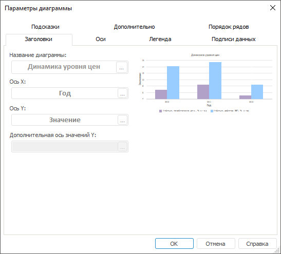

# Заголовки

Заголовки
-

# Заголовки

Заголовки диаграммы - [компоненты](../UiDiagrams_basic_concept.htm),
 содержащие название других компонентов диаграммы.

Заголовки можно задать для диаграммы, осей, цены деления оси значений.

Примечание.
 Текст заголовка для цены делений оси задается на вкладке «[Шкала](../Tuning_format/Format_Axis/UiDiagrams_FormatAxis_scale_Hierarchical.htm)» окна «Формат
 осей».

## Параметры заголовков

Параметры заголовков диаграммы и осей можно настроить на вкладке «Заголовки» окна «Параметры диаграммы».

Примечание.
 Настройка параметров заголовков с помощью окна «Параметры
 диаграммы» доступна только в настольном приложении.

[Для
 вызова окна «Параметры диаграммы»](javascript:TextPopup(this))

	Выполните команду «Параметры
	 диаграммы» в контекстном меню [выделенной
	 диаграммы](../UiDiagrams_basic_concept.htm#select_component).

	Примечание.
	 В инструменте «Аналитические панели»
	 выполните команду «Диаграмма >
	 Параметры диаграммы» в контекстном меню диаграммы.

Введите названия заголовков для диаграммы и осей в поля ввода. Для изменения
 формата заголовка нажмите кнопку , расположенную
 в поле ввода. После нажатия на данную кнопку будет открыто окно «Формат заголовка».

## Формат заголовка

Оформление заголовка диаграммы, заголовков осей и заголовков цены деления
 осей можно настроить в окне «Формат заголовка».

Совет. Для быстрой
 настройки формата [заголовков](UiDiagrams_titles.htm)
 осей диаграммы используйте [вкладки](UiDiagrams_Axis.htm) «Ось категорий (X)» («Ось
 значений (Y)», «Ось значений (дополнительная)»)
 боковой панели.

[Для
 вызова окна «Формат заголовка»](javascript:TextPopup(this))

	Для вызова окна «Формат
	 заголовка» для заголовка диаграммы и заголовков ее осей:

		- выделите заголовок
		 (заголовок оси)
		 диаграммы и выполните команду «Формат
		 заголовка» в контекстном меню заголовка;

	Примечание.
	 Команда «Формат заголовка»
	 доступна только при работе с диаграммами в инструменте «Отчеты».

		- нажмите кнопку 
		 на вкладке «[Заголовки](UiDiagrams_titles.htm)»
		 диалога «Параметры диаграммы».

	Для вызова окна «Формат
	 заголовка» для отображаемых единиц оси нажмите кнопку  напротив поля ввода заголовка
	 на вкладке «[Шкала](../Tuning_format/Format_Axis/UiDiagrams_FormatAxis_scale_Hierarchical.htm)» диалога «Формат осей».

	В регламентном отчете для настройки формата
	 заголовка [выделенного
	 компонента](../UiDiagrams_basic_concept.htm#select_component) диаграммы в раскрывающемся списке «Выбор
	 элемента диаграммы для форматирования», расположенном на вкладке
	 «Диаграмма» ленты инструментов,
	 выберите необходимый пункт («Заголовок
	 оси X», «Заголовок
	 оси Y», «Заголовок дополнительной
	 оси», «Заголовок цены деления»)
	 и нажмите кнопку «Стиль фрагмента».
	 Откроется окно «Формат
	 заголовка».

Из окна «Формат заголовка» доступны
 следующие настройки заголовков:

	- [Настройка
	 границы и заливки](../Tuning_format/UiDiagrams_tuning_border_and_filling.htm);

	- [Настройка
	 выравнивания](../Tuning_format/Chart_Title_Alignment.htm);

	- [Настройка
	 шрифта](../Tuning_format/Format_Title/UiDiagrams_FormatTitle_type.htm);

	- [Дополнительные
	 настройки](../Tuning_format/Format_Title/UiDiagrams_FormatTitle_extra.htm).

См. также:

[Настройка общих параметров диаграммы](UiDiagrams_params_diagram.htm)
 | [Настройка
 компонентов диаграммы](../UiDiagrams_basic_concept.htm)

		Справочная
		 система на версию 10.9
		 от 18/08/2025,
		 © ООО «ФОРСАЙТ»,
