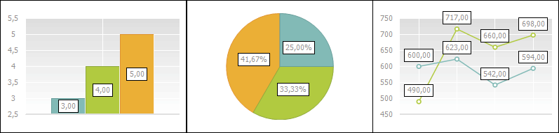
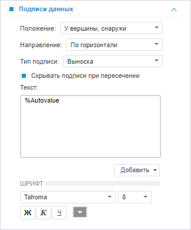
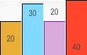
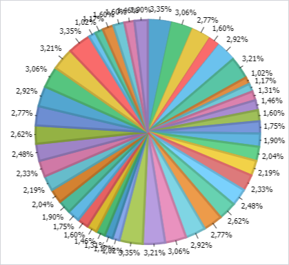
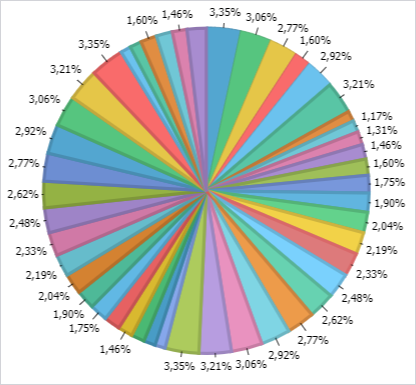
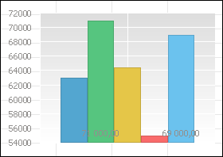
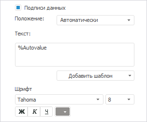
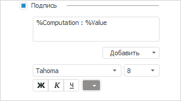

# Подписи данных

Подписи данных
-

# Подписи
 данных

Подписи данных содержат сведения
 о рядах или отдельных точках данных и упрощают понимание диаграммы. В
 зависимости от того, что нужно выделить в диаграмме, подписи можно добавлять:

	- ко всем рядам диаграммы;

	- к одному ряду;

	- к конкретной точке данных;

	- к линии уровня.

Ниже приведен пример отображения диаграмм различных типов с подписями
 данных:

Предусмотрены следующие подходы к настройке подписей данных:

[Быстрая настройка](javascript:TextPopup(this))

	Доступны следующие настройки подписей:

		- положение подписи;

		- направление подписи;

		- тип подписи. Доступно только в веб-приложении инструментов
		 «Аналитические запросы (OLAP)»
		 и «Аналитические панели»;

		- текст подписи;

		- шрифт подписи.

[Расширенная
 настройка](javascript:TextPopup(this))

	Для расширенной настройки подписей данных используйте окно «[Подписи
	 данных](../Params_diagram/UiDiagrams__DataTitle.htm)».

	Примечание.
	 Расширенные настройки, заданные в настольном приложении, передаются
	 в веб-приложение, кроме настроек границ и заливки подписей
	 данных.

## Быстрая настройка подписей данных рядов

Для настройки подписей данных для всех рядов сразу используйте вкладку
 «Подписи данных» на боковой панели.

[Для отображения
 вкладки](javascript:TextPopup(this))

		- Убедитесь, что боковая панель [отображается](GetStarted.chm::/Interface/Interface_Description.htm#side_panel).

		- В рабочей области выделите диаграмму.

		- Установите на боковой панели переключатель «Формат»
		 и перейдите на вкладку «Подписи
		 данных».

Для отображения подписей данных установите флажок «Подписи
 данных» и выполните следующие настройки:

[Настройка
 положения подписи](javascript:TextPopup(this))

	В зависимости от выбранного [типа
	 диаграммы](../Type_diagrams/UiDiagrams_Type_diagrams.htm) в раскрывающемся списке «Положение»
	 доступны различные варианты расположения подписей данных:

		- для всех типов рядов доступны варианты «Автоматически»,
		 «В центре» и «Другие
		 настройки»;

		- для столбика и сектора доступны варианты «У
		 вершины, внутри», «У вершины,
		 снаружи» и «У основания,
		 внутри»;

		- для линии, области и точки доступны варианты «Справа»,
		 «Слева», «Сверху»
		 и «Снизу».

	Ниже приведен пример отображения подписей данных с разными настройками
	 расположения для [гистограммы](../Type_diagrams/UiDiagrams_Bar.htm)
	 («В центре», «У вершины, внутри», «У вершины, снаружи» и «У основания,
	 внутри» соответственно):

	

	Совет. Для быстрой
	 настройки положения подписей данных для диаграммы нажмите кнопку 
	 «Подписи данных», расположенную
	 в группе «Вид» на вкладке
	 «Диаграмма» ленты инструментов.
	 В раскрывающемся меню кнопки выберите вариант расположения подписей.
	 При выборе варианта «Настройки подписей
	 данных» в веб-приложении будет отображена вкладка «Подписи
	 данных» на боковой панели, а в настольном приложении откроется
	 окно «Параметры диаграммы»
	 на вкладке «[Подписи
	 данных](../Params_diagram/UiDiagrams__DataTitle.htm)».

[Настройка
 направления подписи](javascript:TextPopup(this))

	Текст подписей по умолчанию располагается горизонтально. При необходимости
	 текст может быть расположен под углом 90 или 270 градусов. Для изменения
	 расположения текста выберите необходимый вариант в списке «Направление».

	Изменение направления текста подписи недоступно, если в качестве
	 [положения](#position) подписей выбран вариант «Другие
	 настройки».

[Настройка
 текста подписи](javascript:TextPopup(this))

	Для подписи может быть задан произвольный текст, шаблон или использовано
	 сочетание текста с шаблонами. Для ввода текста и шаблонов используйте
	 поле «Текст».

	Для добавления шаблона в текст подписи:

		- Нажмите кнопку «Добавить
		 шаблон».

		- В раскрывающемся списке выберите один из доступных [шаблонов
		 текста](../Templates_in_labels.htm).

	Выбранный шаблон будет вставлен после позиции курсора.

[Настройка
 шрифта подписи](javascript:TextPopup(this))

	Задайте настройки шрифта:

	- Тип шрифта. В раскрывающемся
	 списке выберите один из шрифтов, доступных в операционной системе;

	- Размер. В раскрывающемся
	 списке выберите размер шрифта или введите его с помощью клавиатуры;

	- Способ начертания шрифта.
	 Нажмите кнопки, задающие начертание шрифта:

		- Ж. Полужирное начертание;

		- К.
		 Курсивное начертание;

		- Ч.
		 Подчеркивание текста.

При нажатой кнопке начертания будет использоваться
 соответствующий стиль начертания;

	- Цвет шрифта. В раскрывающейся
	 палитре выберите цвет шрифта. Для установки нового цвета шрифта нажмите
	 кнопку «Спектр», расположенную
	 в стандартной палитре цветов, и выберите цвет в расширенной палитре
	 цветов.

[Настройка
 точности подписи](javascript:TextPopup(this))

	Примечание.
	 Настройка точности подписи доступна только в веб-приложении и только
	 для отдельного ряда данных.

	Для задания точности отображения числовых значений в подписях данных
	 используйте поле «Точность».
	 По умолчанию значения отображаются с точностью до двух знаков после
	 запятой.

[Настройка
 типа подписи](javascript:TextPopup(this))

	Определение типа подписей данных доступно только в веб-приложении
	 инструментов «Аналитические запросы
	 (OLAP)» и «Аналитические
	 панели». Для этого используйте раскрывающийся список «Тип подписи».

	В списке «Тип подписи» выберите
	 необходимый тип отображения подписей данных:

		- Простая. Подпись
		 отображается в виде метки, не соединенной линией с рядом (установлен
		 по умолчанию);

		- Выноска. Подпись
		 отображается в виде выноски, соединенной линией с рядом;

		- Указатель. Подпись
		 отображается в виде указателя, соединенного линией с рядом.

[Скрывать
 подписи при пересечении](javascript:TextPopup(this))

	В веб-приложении флажок «Скрывать
	 подписи при пересечении» доступен для всех типов диаграмм,
	 которые используют тип ряда «[Столбик](../Tuning_format/Format_line/Series_Type.htm)»,
	 а также для [круговых](../Type_diagrams/UiDiagrams_round.htm)
	 и [кольцевых](../Type_diagrams/Doughnut_chart.htm) диаграмм
	 для [варианта расположения](#position) подписи данных «У вершины снаружи» для всех [типов
	 подписей](#tip_type).

	Отображение круговой диаграммы, если флажок «Скрывать
	 подписи при пересечении» снят:

	

	Отображение круговой диаграммы, если флажок «Скрыть
	 подписи при пересечении» установлен:

	

	В результате будет использоваться новый механизм размещения подписей
	 данных, который позволяет предотвратить их пересечение.

	В настольном приложении флажок «Скрыть
	 подписи при пересечении» доступен, если не включено автоматическое
	 размещение подписей и настройка осуществляется для всей диаграммы.
	 Данный флажок позволяет скрыть пересекающиеся подписи данных, при
	 этом скрываются подписи с менее значимыми значениями. Использование
	 настройки актуально в случае, если большое количество данных делает
	 диаграмму нечитаемой, и при этом размеры диаграммы не позволяют расположить
	 подписи данных компактно.

	 

Для настройки подписей данных точек определенного
 ряда данных диаграммы используйте группу «Подписи
 данных», расположенную на вкладке «[Ряды данных](../Series.htm)» боковой панели. Вид группы
 «Подписи данных» вкладки аналогичен
 виду вкладки «Подписи данных» на
 боковой панели.

[Для отображения
 вкладки](javascript:TextPopup(this))

		- Убедитесь, что боковая панель [отображается](GetStarted.chm::/Interface/Interface_Description.htm#side_panel).

		- В рабочей области выделите диаграмму.

		- Установите на боковой панели переключатель «Формат»
		 и перейдите на вкладку «Ряды
		 данных».

		- Выберите требуемый ряд данных.

Для отображения подписей данных установите флажок «Подписи
 данных» и выполните следующие настройки:

	- [настройка
	 положения подписи](UiDiagrams_PropertyDiagramm_Label.htm#position);

	- [настройка
	 текста подписи](UiDiagrams_PropertyDiagramm_Label.htm#text_series);

	- [настройка
	 шрифта подписи](UiDiagrams_PropertyDiagramm_Label.htm#font_series);

	- [настройка
	 точности подписи](UiDiagrams_PropertyDiagramm_Label.htm#accuracy).

## Быстрая настройка подписей данных линии уровня

Для настройки подписей линии уровня используйте
 группу «Подписи», расположенную
 на вкладке «[Линии
 уровня](../Tuning_format/Format_Axis/UiDiagrams_FormatAxis_Levels.htm)» боковой панели.

[Для отображения
 вкладки](javascript:TextPopup(this))

		- Убедитесь, что боковая панель [отображается](GetStarted.chm::/Interface/Interface_Description.htm#side_panel).

		- В рабочей области выделите диаграмму.

		- Установите на боковой панели переключатель «Формат»
		 и перейдите на вкладку «Линии
		 уровня».

Для настройки подписи доступны следующие операции:

[Настройка
 шрифта подписи](javascript:TextPopup(this))

	Задайте настройки шрифта:

	- Тип шрифта. В раскрывающемся
	 списке выберите один из шрифтов, доступных в операционной системе;

	- Размер. В раскрывающемся
	 списке выберите размер шрифта или введите его с помощью клавиатуры;

	- Способ начертания шрифта.
	 Нажмите кнопки, задающие начертание шрифта:

		- Ж. Полужирное начертание;

		- К.
		 Курсивное начертание;

		- Ч.
		 Подчеркивание текста.

При нажатой кнопке начертания будет использоваться
 соответствующий стиль начертания;

	- Цвет шрифта. В раскрывающейся
	 палитре выберите цвет шрифта. Для установки нового цвета шрифта нажмите
	 кнопку «Спектр», расположенную
	 в стандартной палитре цветов, и выберите цвет в расширенной палитре
	 цветов.

[Задание
 текста подписи](javascript:TextPopup(this))

	Для смены или добавления шаблона в текст подписи:

		- Нажмите кнопку «Добавить»,
		 расположенную рядом с многострочным полем ввода.

		- В раскрывающемся списке выберите шаблон текста подписи линии
		 уровня:

			- %Computation.
			 В качестве подписи линии уровня будет использоваться шаблон
			 «Функция».

			В зависимости от выбранного типа подписи в области построения
			 диаграммы подпись линии уровня будет отображаться в виде:

				- Константа;

				- <Наименование
				 функции>;

			- %Value. В качестве
			 подписи линии уровня будет использоваться шаблон «Значение».

См. также:

[Настройка подписей
 данных](../Params_diagram/UiDiagrams__DataTitle.htm) | [Настройка
 общих параметров диаграммы](../Params_diagram/UiDiagrams_params_diagram.htm) | [Настройка
 компонентов диаграммы](../UiDiagrams_basic_concept.htm)

		Справочная
		 система на версию 10.9
		 от 18/08/2025,
		 © ООО «ФОРСАЙТ»,
