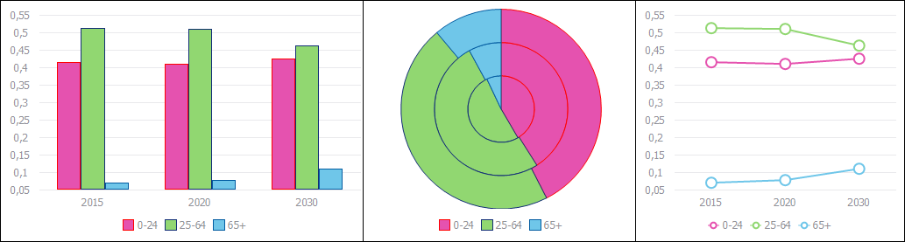
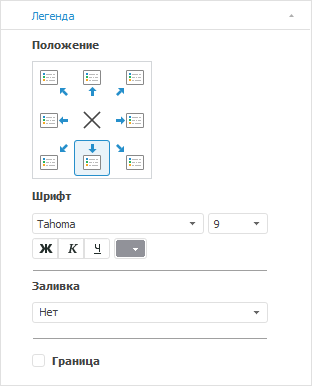
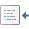

# Легенда

Легенда
-

# Легенда

Легенда содержит названия и
 маркеры рядов данных на диаграмме. Порядок отображения рядов данных в
 легенде соответствует их [порядку
 следования](../Params_diagram/Series_Order.htm) на диаграмме с учётом настроенного [порядка
 рядов при перекрытии](../Params_diagram/Series_Order.htm#series_overlap_order).

Примечание.
 В легенде отображаются только те ряды данных, для которых определено наименование.

Для регламентных отчетов существует
 возможность создания [внешней
 легенды](UiReport.chm::/desktop/Diagrams/UiDiagrams_Legend.htm), которая представляет собой отдельный объект,
 не привязанный к конкретной диаграмме. Внешняя легенда может быть привязана
 к нескольким диаграммам.

Ниже приведен пример отображения легенды для различных [типов
 диаграмм](../Type_diagrams/UiDiagrams_Type_diagrams.htm):

Для настройки легенды предусмотрены следующие подходы:

[Быстрая настройка](javascript:TextPopup(this))

	Для быстрой настройки легенды используйте вкладку «Легенда»
	 на боковой панели.

	Доступны следующие настройки легенды диаграммы:

		- настройка расположения легенды;

		- настройка формата легенды;

		- настройка заливки и границы легенды.

[Расширенная
 настройка](javascript:TextPopup(this))

	Для расширенной настройки легенды используйте вкладку «[Легенда](../Params_diagram/UiDiagrams_legend.htm#legend_tab)»
	 окна «Параметры диаграммы»
	 и окно «[Формат
	 легенды](../Params_diagram/UiDiagrams_legend.htm#formatlegend)».

	Из окна «Формат легенды»
	 доступны следующие настройки:

		- [настройка
		 границы и заливки](../Tuning_format/UiDiagrams_tuning_border_and_filling.htm);

		- [настройка
		 выравнивания](../Tuning_format/UiDiagrams_tuning_alignment.htm);

		- [настройка
		 шрифта](../Tuning_format/Format_Title/UiDiagrams_FormatTitle_type.htm);

		- [общие
		 настройки оформления легенды](../Tuning_format/Format_Legend/UiDiagrams_FormatLegend_common.htm).

## Быстрая настройка

Вкладка «Легенда» расположена
 на боковой панели и предназначена для настройки параметров легенды диаграммы.

[Для отображения
 вкладки](javascript:TextPopup(this))

		- Убедитесь, что боковая панель [отображается](GetStarted.chm::/Interface/Interface_Description.htm#side_panel).

		- В рабочей области выделите диаграмму.

		- Установите на боковой панели переключатель «Формат»
		 и перейдите на вкладку «Легенда».

На вкладке доступны следующие настройки легенды:

[Расположение
 легенды](javascript:TextPopup(this))

	В группе «Положение» выберите
	 вариант расположения легенды относительно [области
	 диаграммы](../Tuning_format/UiDiagrams_tuning_area_digramm.htm):

	

	По умолчанию легенда размещается внизу области диаграммы.

	Варианты расположения легенды:

		- . В левом верхнем углу;

		- . По центру верхней границы;

		- . В правом верхнем углу;

		- . По центру правой границы;

		- . В правом нижнем углу;

		- . По центру нижней границы блока;

		- . В левом нижнему углу;

		- . По центру левой границы;

		- . Легенда не отображается.

[Настройка параметров
 шрифта](javascript:TextPopup(this))

	Настройте параметры шрифта легенды диаграммы:

	- Тип шрифта. В раскрывающемся
	 списке выберите один из шрифтов, доступных в операционной системе;

	- Размер. В раскрывающемся
	 списке выберите размер шрифта или введите его с помощью клавиатуры;

	- Способ начертания шрифта.
	 Нажмите кнопки, задающие начертание шрифта:

		- Ж. Полужирное начертание;

		- К.
		 Курсивное начертание;

		- Ч.
		 Подчеркивание текста.

При нажатой кнопке начертания будет использоваться
 соответствующий стиль начертания;

	- Цвет шрифта. В раскрывающейся
	 палитре выберите цвет шрифта. Для установки нового цвета шрифта нажмите
	 кнопку «Спектр», расположенную
	 в стандартной палитре цветов, и выберите цвет в расширенной палитре
	 цветов.

[Настройка заливки
 легенды](javascript:TextPopup(this))

	В раскрывающемся списке «Заливка»
	 выберите тип заливки фона легенды:

		- Сплошная заливка.
		 Однотонная заливка. В раскрывающейся палитре задайте цвет заливки.
		 При необходимости задайте процент прозрачности заливки;

		- Градиентная заливка.
		 Заливка фона двухцветным градиентом. В раскрывающихся палитрах
		 укажите начальный и конечный цвета градиента. При необходимости
		 укажите угол наклона и процент прозрачности градиента.

	В веб-приложении доступно задание только сплошной заливки.

	В настольном приложении для каждого типа заливки отображается различный
	 набор параметров:

		- Прозрачность. Определите
		 прозрачность заливки фона легенды диаграммы. 100% соответствует
		 полной прозрачности (заливка и граница станут невидимыми), 0%
		 соответствует полной непрозрачности. Значение задается с помощью
		 ползунка или редактора чисел;

		- Угол. Определите
		 угол наклона градиента.

[Настройка границы
 легенды](javascript:TextPopup(this))

	Для отображения границы легенды установите флажок «Граница».
	 В соответствующих полях укажите цвет, тип и толщину линии границы.

	Примечание.
	 Изменение типа линии границы доступно только в настольном приложении.

См. также:

[Настройка легенды](../Params_diagram/UiDiagrams_legend.htm) | [Настройка общих
 параметров диаграммы](../Params_diagram/UiDiagrams_params_diagram.htm) | [Настройка компонентов диаграммы](../UiDiagrams_basic_concept.htm)

		Справочная
		 система на версию 10.9
		 от 18/08/2025,
		 © ООО «ФОРСАЙТ»,
