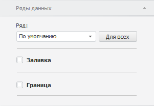
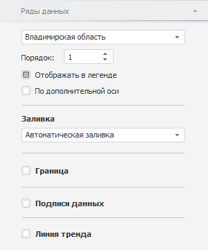
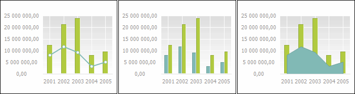
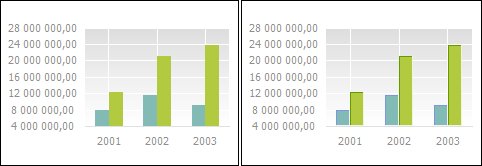
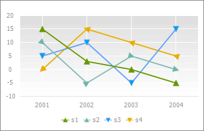

# Ряд данных

Ряд данных
-

# Ряд данных

Ряд данных - [компонент
 диаграммы](UiDiagrams_basic_concept.htm), представляющий массив данных. На основе совокупности рядов
 данных строится диаграмма.

На диаграмме ряды данных отображаются в графической форме, например,
 в форме набора разноцветных столбиков.

Ряд данных диаграммы, для которого определено наименование, обозначается
 отдельным цветом и значком, указанными в [легенде](Property_diagramm/UiDiagrams_PropertyDiagramm_legend.htm).

Примечание.
 По умолчанию на диаграмме может отображаться не более 99 рядов. Если выбрано
 большее число рядов, то будут отображены первые 99, остальные будут скрыты.
 Для изменения максимального количества рядов, отображаемых на диаграмме,
 используйте [настройки
 в реестре](UIExpress.chm::/FAQ/SelectionLimit.htm#diagram_selection_limit).

Примеры рядов для различных [типов
 диаграмм](Type_diagrams/UiDiagrams_Type_diagrams.htm):

Предусмотрены следующие подходы к настройке рядов данных:

[Быстрая настройка](javascript:TextPopup(this))

	Для быстрой настройки формата ряда данных используйте вкладку «Ряды данных» на боковой панели.

	Доступны следующие настройки рядов диаграммы:

		- настройки отображения и порядка следования;

		- настройки границ и заливки;

		- настройки подписей данных и другие настройки.

[Расширенная
 настройка](javascript:TextPopup(this))

	Для расширенной настройки формата ряда данных используйте окно «Формат ряда данных».

	В зависимости от [типа
	 диаграммы](Type_diagrams/UiDiagrams_Type_diagrams.htm) доступны:

		- [общая
		 настройка ряда данных](Tuning_format/Format_line/Settings_DataSeries.htm);

		- [настройка
		 линий графика](Tuning_format/Format_line/Chart_Lines_Setup.htm);

		- [настройка
		 маркеров](Tuning_format/Format_line/Markers_Setup.htm);

		- [настройка
		 типа ряда](Tuning_format/Format_line/Series_Type.htm);

		- [настройка
		 наименования объединенного ряда](Tuning_format/Format_line/Merged_Series_Name.htm);

		- [настройка порядка
		 рядов](Params_diagram/Series_Order.htm);

		- [настройка группы
		 рядов](Params_diagram/Series_Group.htm);

		- [настройка
		 точки ряда данных](Tuning_format/Format_line/Data_Series_Point.htm);

		- [настройка
		 линии тренда](look_and_feel/Report/Trend_Lines.htm);

		- [настройка
		 границы и заливки](Tuning_format/UiDiagrams_tuning_border_and_filling.htm);

		- [настройка
		 подписи данных](Params_diagram/UiDiagrams__DataTitle.htm).

## Быстрая настройка рядов данных

Вкладка «Ряды данных» расположена
 на боковой панели и предназначена для настройки формата ряда данных.

[Для отображения
 вкладки](javascript:TextPopup(this))

		- Убедитесь, что боковая панель [отображается](GetStarted.chm::/Interface/Interface_Description.htm#side_panel).

		- В рабочей области выделите диаграмму.

		- Установите на боковой панели переключатель «Формат»
		 и перейдите на вкладку «Ряды
		 данных».

Примечание.
 Количество отображаемых настроек зависит от типа диаграммы/ряда.

При первоначальной настройке диаграммы на вкладке выбран ряд «По умолчанию». Данный ряд не отображается
 в легенде и позволяет задать настройки, которые применяются для всех существующих
 рядов, а также для вновь добавляемых рядов. В [каскадной
 диаграмме](Type_diagrams/WaterFall_chart.htm) отображается ряд, для которого она была построена.

[Настройки,
 доступные для ряда «По умолчанию»](javascript:TextPopup(this))

		- [Настройка линии ряда](Series.htm#seriesline).

		- [Изменение заливки ряда](Series.htm#fill).

		- [Изменение границы ряда](Series.htm#border).

		- [Отображение маркеров для точек
		 ряда](Series.htm#markers).

		- [Сглаживание линии
		 ряда](Series.htm#series_smoothing).

		- [Настройка положения ступеньки](Series.htm#stepline).

		- [Изменение типа ряда](Series.htm#type).

	Примечание.
	 Набор настроек, доступных для ряда «По
	 умолчанию» зависит от типа диаграммы.

Для настройки определённого ряда выберите его в раскрывающемся списке
 в начале вкладки, а для настройки всех рядов выберите ряд «По
 умолчанию». Следует учитывать, что настройки, заданные для ряда
 «По умолчанию», не перекрывают
 настройки, заданные вручную для конкретного ряда.

Для применения настроек ряда «По умолчанию»
 для всех рядов, включая ряды с пользовательскими настройками, нажмите
 кнопку «Для всех».

Вид вкладки, если выбран конкретный ряд:

Для всех типов диаграмм доступно:

[Отображение
 подписи данных](javascript:TextPopup(this))

	Подписи данных содержат
	 сведения о рядах или отдельных точках данных и упрощают понимание
	 диаграммы.

	Для отображения подписей для выбранного ряда установите флажок «Подписи данных» на боковой панели
	 или через контекстное меню.

	Подробное описание настройки подписи данных приведено в разделе
	 «[Подписи
	 данных](Property_diagramm/UiDiagrams_PropertyDiagramm_Label.htm#series)».

[Сохранение
 настроек формата ряда данных](javascript:TextPopup(this))

	Для сохранения настроек формата конкретного ряда в источник данных
	 используйте язык [Fore](Chart.chm::/Interface/IChart/IChart.IsDataLinkedDecor.htm).

	Например, если удалить с диаграммы ряд с сохраненными в источник
	 данных настройками, а затем добавить его, то к ряду будут применены
	 заданные ранее настройки.

[Настройка
 отображения ряда данных в области построения диаграммы](javascript:TextPopup(this))

	Также отображением рядов данных на диаграмме можно управлять с помощью
	 [легенды
	 диаграммы](Property_diagramm/UiDiagrams_PropertyDiagramm_legend.htm):

		- для скрытия ряда данных в легенде щёлкните по значку ряда.
		 Ряд данных будет удален из области построения диаграммы, значок
		 в легенде будет подсвечен серым цветом;

		- для отображения на диаграмме ранее скрытого ряда данных
		 в легенде щёлкните по значку ряда. Ряд данных будет отображен
		 в области построения диаграммы.

Возможности, доступные в зависимости от типа диаграммы:

[Изменение
 порядка следования ряда на диаграмме](javascript:TextPopup(this))

	Изменение порядка следования рядов на диаграмме доступно при снятом
	 флажке «[Привязать к источнику](Params_diagram/UiDiagrams_params_diagram.htm#source_binding)»
	 для всех типов диаграмм. Для [каскадной](Type_diagrams/WaterFall_chart.htm)
	 диаграммы изменение порядка рядов не доступно.

	В поле «Порядок» укажите
	 порядок следования ряда на диаграмме. Значение задаётся с помощью
	 клавиатуры или с помощью редактора чисел. Нумерация рядов начинается
	 с нуля. Заданный порядок следования рядов устанавливает порядок их
	 отображения в [легенде](Property_diagramm/UiDiagrams_PropertyDiagramm_legend.htm)
	 с учётом настроенного [порядка
	 рядов при перекрытии](Params_diagram/Series_Order.htm#series_overlap_order).

[Отображение/скрытие
 ряда в легенде](javascript:TextPopup(this))

	Отображение/скрытие ряда в легенде доступно для всех типов диаграмм,
	 кроме [каскадной](Type_diagrams/WaterFall_chart.htm).

	Для отображения ряда в [легенде](Property_diagramm/UiDiagrams_PropertyDiagramm_legend.htm)
	 в виде значка с подписью установите флажок «Отображать
	 в легенде». При снятом флажке ряд не будет отображаться в легенде.

[Изменение
 типа ряда](javascript:TextPopup(this))

	Для изменения типа ряда [смешанных](Type_diagrams/UiDiagrams_mixed_diagram.htm)
	 и [лепестковых](Type_diagrams/UiDiagrams_petalous.htm)
	 диаграмм в раскрывающемся списке «Тип
	 ряда» выберите тип из доступных:

		- Линия. Ряд будет
		 отображаться в виде линии;

		- Столбик. Ряд будет
		 отображаться в виде столбика. Доступно только для [смешанных
		 диаграмм](Type_diagrams/UiDiagrams_mixed_diagram.htm);

		- Область. Ряд будет
		 отображаться в виде закрашенной области.

	Ниже приведен пример [смешанной
	 диаграммы](Type_diagrams/UiDiagrams_mixed_diagram.htm) с различными настройками одного из рядов данных («линия»,
	 «столбик» и «область» соответственно):

	

	Для [ступенчатых диаграмм](Type_diagrams/Stepped_Chart.htm)
	 доступны типы рядов:

		- Ступенчатый график.
		 Ряд будет отображаться в виде ломаной линии;

		- Ступенчатый областной.
		 Ряд будет отображаться в виде закрашенной области.

	Ниже приведен пример ступенчатой диаграммы, в которой для рядов
	 «2005» и «2006»
	 установлен тип ряда «Ступенчатый
	 график», для ряда «2007»
	 - «Ступенчатый областной»:

	

[Сглаживание
 линии ряда](javascript:TextPopup(this))

	Сглаживание линии используется для устранения эффекта ломаной линии,
	 возникающего при построении диаграммы ([линейной](Type_diagrams/UiDiagrams_lenear.htm),
	 [точечной](Type_diagrams/UiDiagrams_scatter.htm) с соединительными
	 линиями, [лепестковой](Type_diagrams/UiDiagrams_petalous.htm)
	 и для ряда типа «Линия» в
	 [смешанной](Type_diagrams/UiDiagrams_mixed_diagram.htm)
	 диаграмме).

	Для настройки сглаживания линейных рядов диаграммы установите флажок
	 «Сглаживать линию».

	Более подробное описание работы с настройкой рядов данных приведено
	 в разделе «[Общие
	 настройки ряда данных](Tuning_format/Format_line/Settings_DataSeries.htm)».

[Изменение
 заливки ряда](javascript:TextPopup(this))

	Изменение заливки ряда данных доступно
	 для всех типов диаграмм, кроме [линейных](Type_diagrams/UiDiagrams_lenear.htm):

		- в веб-приложении.
		 Установите флажок «Заливка».
		 В раскрывающемся списке «Тип»
		 выберите тип заливки:

			- Нет. Заливка
			 ряда не используется;

			- Автоматическая.
			 Однотонная заливка. Цвет выбирается автоматически;

			- Сплошная заливка.
			 Однотонная заливка. Для выбора цвета заливки используйте
			 раскрывающуюся палитру;

			- Линейный градиент.
			 Заливка линейным градиентом. Для выбора базового цвета градиента
			 используйте раскрывающуюся палитру;

		- в настольном приложении.
		 Из раскрывающегося списка «Заливка»
		 выберите тип заливки ряда. Если заливка настраивается для ряда
		 «По умолчанию», то сначала
		 установите флажок «Заливка»,
		 а затем приступайте к настройке.

		Для каждого типа заливки отображается различный набор параметров.
		 В зависимости от типа диаграммы доступны типы заливки:

			- Нет. Заливка
			 ряда не используется;

			- Автоматическая.
			 Однотонная заливка. Цвет выбирается автоматически;

			- Сплошная заливка.
			 Однотонная заливка. Для выбора цвета заливки используйте
			 раскрывающуюся палитру. При необходимости задайте процент
			 [прозрачности](Tuning_format/UiDiagrams_tuning_border_and_filling.htm#transparency)
			 заливки в поле «Прозрачность»;

	Примечание.
	 Для [каскадной диаграммы](Type_diagrams/WaterFall_chart.htm)
	 цвет заливки соответствует «[Цветовой
	 схеме](#color_schem)». Раскрывающаяся палитра недоступна.

			- Градиентная заливка.
			 Заливка двухцветным градиентом. Для выбора начального и конечного
			 цветов градиента используйте раскрывающиеся палитры. При необходимости
			 укажите угол наклона и процент [прозрачности](Tuning_format/UiDiagrams_tuning_border_and_filling.htm#transparency)
			 градиента в полях «Угол»
			 и «Прозрачность»;

	Примечание.
	 Для [каскадной диаграммы](Type_diagrams/WaterFall_chart.htm)
	 конечный цвет выбирается из раскрывающейся палитры, а начальный соответствует «[Цветовой схеме](#color_schem)».

			- Неоднородная заливка.
			 Заливка линейным градиентом. Для выбора базового цвета градиента
			 используйте раскрывающуюся палитру. При необходимости задайте
			 процент [прозрачности](Tuning_format/UiDiagrams_tuning_border_and_filling.htm#transparency)
			 заливки в поле «Прозрачность».
			 Для [каскадной
			 диаграммы](Type_diagrams/WaterFall_chart.htm) раскрывающаяся палитра недоступна, базовый цвет
			 градиента соответствует «[Цветовой схеме](#color_schem)».

	Примечание.
	 При задании прозрачности сплошной
	 или неоднородной заливки учитывайте,
	 что 100% соответствует полной прозрачности (ряд данных станет невидимым),
	 0% соответствует полной непрозрачности.

[Изменение
 границы ряда](javascript:TextPopup(this))

	Изменение границы ряда данных доступно
	 для всех типов рядов, кроме [линейных](Type_diagrams/UiDiagrams_lenear.htm).

	Для отображения границы ряда данных
	 установите флажок «Граница»
	 и задайте настройки цвета и толщины линии границы. В настольном приложении
	 также доступна настройка типа линии для границы ряда данных.

	Примечание.
	 В веб-приложении для настройки рядов [лепестковой
	 диаграммы](Type_diagrams/UiDiagrams_petalous.htm), [диаграммы
	 с областями](Type_diagrams/UiDiagrams_Area.htm) и для ряда типа «Область»
	 в [смешанной диаграмме](Type_diagrams/UiDiagrams_mixed_diagram.htm)
	 используйте группу параметров «Линия».

	Ниже приведен пример без использования (слева) и с использованием
	 (справа) границы ряда данных [гистограммы](Type_diagrams/UiDiagrams_Bar.htm):

	

[Настройка
 положения ступеньки](javascript:TextPopup(this))

Ступенька представляет собой
 ломаную линию, соединяющую два соседних значения ряда.

Доступно только для [ступенчатой
 диаграммы](Type_diagrams/Stepped_Chart.htm).

Для изменения положения ступеньки относительно точки ряда данных в раскрывающемся
 списке «Ступенька» выберите необходимый
 вариант расположения: слева, по центру или справа от точки ряда.

	Ниже приведен пример ступенчатой диаграммы, в которой для ряда «2005» установлено положение ступеньки
	 «Слева» (от точки «B» к точке
	 «A»), для ряда «2006» - «По центру» (от точки «B» к
	 точке «A» и к точке «C») и для ряда «2007»
	 - «Справа» (от точки «A» к
	 точке «B»):

	

	Примечание.
	 Настройка положения ступеньки также доступна на вкладке «[Диаграмма](Params_diagram/UiDiagrams_params_diagram.htm#stepline)»
	 боковой панели.

[Настройка
 линии ряда](javascript:TextPopup(this))

	Доступно для рядов [линейной](Type_diagrams/UiDiagrams_lenear.htm),
	 [лепестковой](Type_diagrams/UiDiagrams_petalous.htm), [ступенчатой](Type_diagrams/Stepped_Chart.htm) диаграмм и
	 для ряда типа «Линия» в [смешанной](Type_diagrams/UiDiagrams_mixed_diagram.htm) диаграмме.

	Для отображения линии ряда данных установите
	 флажок «Линия» и задайте настройки
	 цвета и толщины линии ряда. В настольном приложении также доступна
	 настройка типа линии ряда данных.

[Построение
 ряда по дополнительной оси](javascript:TextPopup(this))

	Доступно для всех типов диаграмм, кроме [лепестковой](Type_diagrams/UiDiagrams_petalous.htm),
	 [круговой](Type_diagrams/UiDiagrams_round.htm) и [гистограммы
	 с интервалами колебаний](Type_diagrams/UiDiagrams_BarVibration.htm).

	Дополнительная ось - вспомогательная
	 ось значений, в которую могут быть помещены:

		- значения рядов данных, значительно отличающиеся от значений
		 других рядов;

		- значения рядов, представленные на диаграмме в другом типе
		 данных.

	Для построения ряда в соответствии со шкалой дополнительной оси
	 значений установите флажок «По дополнительной
	 оси». После установки флажка на боковой панели будет отображена
	 вкладка «[Ось
	 значений (дополнительная)](Params_diagram/UiDiagrams_Axis.htm)», предназначенная для настройки
	 дополнительной оси.

[Отображение
 маркеров для точек ряда](javascript:TextPopup(this))

	Маркер - отдельное значение
	 массива данных, отображаемое в виде точки или фигуры. Маркеры, соответствующие
	 одному ряду данных, имеют одинаковые настройки оформления.

	Доступно для рядов [линейной](Type_diagrams/UiDiagrams_lenear.htm),
	 [точечной](Type_diagrams/UiDiagrams_scatter.htm), [лепестковой](Type_diagrams/UiDiagrams_petalous.htm),
	 [биржевой](Type_diagrams/UiDiagrams_birg.htm), [коробчатой](Type_diagrams/Box_chart.htm)
	 диаграмм, [гистограммы
	 с интервалами колебаний](Type_diagrams/UiDiagrams_BarVibration.htm), для ряда типа «Линия»
	 в [смешанной](Type_diagrams/UiDiagrams_mixed_diagram.htm)
	 диаграмме и для ряда типа «Ступенчатый
	 график» в [ступенчатой](Type_diagrams/Stepped_Chart.htm)
	 диаграмме.

	Для изменения типа маркера выбранного ряда:

		- установите флажок «Маркер»,
		 расположенный на вкладке «Ряды
		 данных» боковой панели. В раскрывающемся списке выберите
		 тип маркера и задайте его дополнительные параметры: размер, заливку
		 и границу;

		- нажмите кнопку «Маркеры»,
		 расположенную в группе «Вид»
		 на вкладке «Диаграмма»
		 ленты инструментов, и в раскрывающемся меню выберите тип маркера.

	После выполнения одного из действий все маркеры выбранного ряда
	 изменят свой тип на указанный.

	Доступны следующие типы маркеров:

		- Квадрат. Маркеры
		 отображаются в виде квадратов;

		- Ромб. Маркеры отображаются
		 в виде ромбов;

		- Треугольник. Маркеры
		 отображаются в виде треугольников с вершинами, направленными вверх;

		- Обратный треугольник.
		 Маркеры отображаются в виде треугольников с вершинами, направленными
		 вниз;

		- Круг. Маркеры отображаются
		 в виде кругов;

		- Линия. Маркеры отображаются
		 в виде штриха.

	Для скрытия маркера ряда:

		- снимите флажок «Маркер»,
		 расположенный на вкладке «Ряды
		 данных» боковой панели;

		- нажмите кнопку «Маркеры»,
		 расположенную в группе «Вид»
		 на вкладке «Диаграмма»
		 ленты инструментов, и в раскрывающемся меню выберите .

	После выполнения одного из действий все маркеры выбранного ряда
	 будут скрыты.

	Для изменения наклона маркеров «Треугольник»
	 и «Обратный треугольник» в
	 зависимости от изменения значений ряда установите флажок «Автоматический
	 поворот», расположенный на вкладке «Ряды
	 данных» боковой панели. При снятом флажке маркеры располагаются
	 строго вертикально, при установленном флажке маркеры изменяют свое
	 направление по касательной к линии ряда диаграммы.

	Ниже приведен пример линейной диаграммы, в которой для рядов s1,
	 s2 задан тип маркера «Треугольник»,
	 для рядов s3, s4 - «Обратный треугольник».
	 Для маркеров рядов s2 и s4 включена опция «Автоматический
	 поворот»:

	

	Расширенная [настройка
	 маркера](Tuning_format/Format_line/Markers_Setup.htm) доступна в настольном приложении.

[Создание
 линии тренда](javascript:TextPopup(this))

	Линия тренда позволяет графически
	 отображать тенденции данных и прогнозировать их дальнейшие изменения.

	Доступно для всех типов диаграмм, кроме [лепестковой](Type_diagrams/UiDiagrams_petalous.htm),
	 [круговой](Type_diagrams/UiDiagrams_round.htm), [кольцевой](Type_diagrams/Doughnut_chart.htm),
	 [биржевой](Type_diagrams/UiDiagrams_birg.htm), [коробчатой](Type_diagrams/Box_chart.htm)
	 и [ступенчатой](Type_diagrams/Stepped_Chart.htm).

	Подробное описание операций, доступных при работе с линией тренда,
	 приведено в разделе «[Линия
	 тренда](look_and_feel/Report/Trend_Lines.htm)».

[Изменение
 цветовой схемы](javascript:TextPopup(this))

	Изменение цветовой схемы доступно только для [каскадной
	 диаграммы](Type_diagrams/WaterFall_chart.htm).

	Цветовая схема определяет цвета для столбцов: «Увеличить»,
	 «Уменьшить», «Итог».
	 Для изменения цвета столбца в раскрывающейся палитре выберите необходимый
	 цвет либо выберите новый цвет в расширенной палитре цветов, вызываемой
	 при нажатии на кнопку «Спектр».

[Изменение
 видимости соединительных линий](javascript:TextPopup(this))

	Изменение видимости соединительных линий доступно только для [каскадной диаграммы](Type_diagrams/WaterFall_chart.htm).

	Для отображения соединительных линий установите флажок «Соединительные
	 линии» на боковой панели или через контекстное меню. По умолчанию
	 соединительные линии отображены. Цвет, тип и толщину линии можно
	 изменить, установив флажок «Граница».

	Примечание.
	 Если флажок «Граница» снят,
	 соединительные линии не отображаются даже при установленном флажке
	 «Соединительные линии».

Возможности, доступные только в веб-приложении:

[Отображение
 тени ряда](javascript:TextPopup(this))

	Для отображения тени ряда установите флажок «Тень
	 ряда».

[Анимация
 при отрисовке рядов данных](javascript:TextPopup(this))

	В веб-приложении ряды данных диаграммы могут отрисовываться с использованием
	 анимации.

	Для включения анимации установите значение «true»
	 для атрибута «animation» в
	 разделе <[chart](Setup.chm::/UiWebSetup/03_Setup_Web/PP_config_Java.htm#chart)>
	 файла [PP.xml](Setup.chm::/UiWebSetup/03_Setup_Web/PP_config_Java.htm).

	По умолчанию анимация отключена.

См. также:

[Настройка
 общих параметров диаграммы](Params_diagram/UiDiagrams_params_diagram.htm) | [Настройка
 компонентов диаграммы](UiDiagrams_basic_concept.htm) | [Типы диаграмм](Type_diagrams/UiDiagrams_Type_diagrams.htm)

		Справочная
		 система на версию 10.9
		 от 18/08/2025,
		 © ООО «ФОРСАЙТ»,
