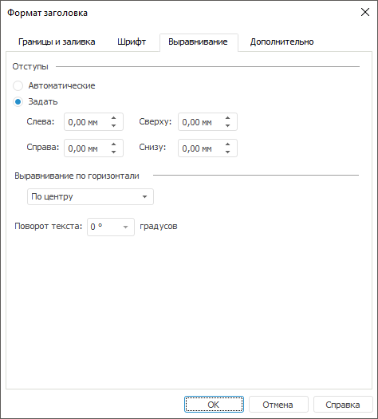

# Настройка выравнивания заголовка

Настройка выравнивания заголовка
-

# Настройка выравнивания заголовка

Для настройки выравнивания заголовка перейдите на вкладку «Выравнивание»
 окна «Формат заголовка».
 Настройка доступна в настольном приложении.

Совет. Для быстрой
 настройки формата [заголовков](../Params_diagram/UiDiagrams_titles.htm)
 осей диаграммы используйте [вкладки](../Params_diagram/UiDiagrams_Axis.htm) «Ось категорий (X)» («Ось
 значений (Y)», «Ось значений (дополнительная)»)
 боковой панели.

[Для
 вызова окна «Формат заголовка»](javascript:TextPopup(this))

	Для вызова окна «Формат
	 заголовка» для заголовка диаграммы и заголовков ее осей:

		- выделите заголовок
		 (заголовок оси)
		 диаграммы и выполните команду «Формат
		 заголовка» в контекстном меню заголовка;

	Примечание.
	 Команда «Формат заголовка»
	 доступна только при работе с диаграммами в инструменте «Отчеты».

		- нажмите кнопку 
		 на вкладке «[Заголовки](../Params_diagram/UiDiagrams_titles.htm)»
		 диалога «Параметры диаграммы».

	Для вызова окна «Формат
	 заголовка» для отображаемых единиц оси нажмите кнопку  напротив поля ввода заголовка
	 на вкладке «[Шкала](Format_Axis/UiDiagrams_FormatAxis_scale_Hierarchical.htm)» диалога «Формат осей».

	В регламентном отчете для настройки формата
	 заголовка [выделенного
	 компонента](../UiDiagrams_basic_concept.htm#select_component) диаграммы в раскрывающемся списке «Выбор
	 элемента диаграммы для форматирования», расположенном на вкладке
	 «Диаграмма» ленты инструментов,
	 выберите необходимый пункт («Заголовок
	 оси X», «Заголовок
	 оси Y», «Заголовок дополнительной
	 оси», «Заголовок цены деления»)
	 и нажмите кнопку «Стиль фрагмента».
	 Откроется окно «Формат
	 заголовка».

При выравнивании заголовка доступны следующие настройки:

	- [настройка
	 отступов](UiDiagrams_tuning_alignment.htm#margins);

	- [настройка
	 выравнивания заголовка по горизонтали](UiDiagrams_tuning_alignment.htm#horizontal_alignment);

	- [настройка
	 поворота текста](UiDiagrams_tuning_alignment.htm#text_orientation).

Примечание.
 Для заголовка диаграммы недоступна настройка поворота текста.

См. также:

[Заголовки](../Params_diagram/UiDiagrams_titles.htm)
 | [Настройка
 общих параметров диаграммы](../Params_diagram/UiDiagrams_params_diagram.htm) | [Настройка
 компонентов диаграммы](../UiDiagrams_basic_concept.htm)

		Справочная
		 система на версию 10.9
		 от 18/08/2025,
		 © ООО «ФОРСАЙТ»,
