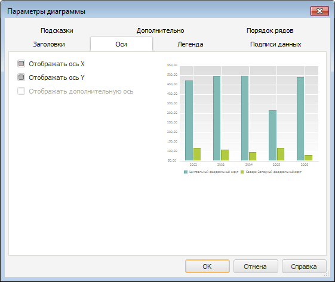

# Настройка общих параметров оси

Настройка общих параметров оси
-

**

# Настройка общих параметров оси

## Настройка параметров оси

Для настройки параметров оси диаграммы используйте окно «Параметры
 диаграммы». Настройка доступна в настольном приложении.

Совет. Для быстрой
 настройки параметров осей диаграммы используйте [вкладки](../../Params_diagram/UiDiagrams_Axis.htm)
 «Ось значений (Х)», «Ось
 значений (Y)», «Ось значений (дополнительная)»
 боковой панели.

[Для
 вызова окна «Параметры диаграммы»](javascript:TextPopup(this))

	Выполните команду контекстного меню «Параметры
	 диаграммы» [выделенной
	 диаграммы](../../UiDiagrams_basic_concept.htm#select_component).

	Примечание.
	 В инструменте «Аналитические панели»
	 выполните команду «Диаграмма >
	 Параметры диаграммы» в контекстном меню диаграммы.

Задайте в окне следующие настройки:

[Отображение/скрытие
 оси](javascript:TextPopup(this))

	Для отображения/скрытия основных
	 осей установите/снимите флажки «Отображать
	 ось X» и/или «Отображать ось
	 Y». По умолчанию флажки установлены.

	Для отображения/скрытия дополнительной
	 оси установите/снимите флажок «Отображать
	 дополнительную ось».

	Примечание.
	 Настройка отображения дополнительной оси доступна только при ее наличии.

[Настройка
 заголовка оси](javascript:TextPopup(this))

	Для настройки заголовка оси используйте вкладку «[Заголовки](../../Params_diagram/UiDiagrams_titles.htm)»
	 окна «Параметры диаграммы».

## Настройка формата оси

Для настройки формата [оси](../../Params_diagram/UiDiagrams_Axis.htm)
 диаграммы используйте окно «Формат
 оси**».

Примечание.
 Настройка формата оси с помощью окна «Формат
 оси» доступна только в настольном приложении для всех типов диаграмм,
 кроме [круговой](../../Type_diagrams/UiDiagrams_round.htm)
 и [кольцевой](../../Type_diagrams/Doughnut_chart.htm) диаграмм,
 [вторичной
 гистограммы](../../Type_diagrams/UiDiagrams_secondary_histogram.htm) и [вторичной
 круговой диаграммы](../../Type_diagrams/UiDiagrams_round_secondary.htm).

Для быстрой настройки:

	- формата оси X используйте
	 [вкладку](../../Params_diagram/UiDiagrams_Axis.htm) «Ось категорий (X)» боковой панели;

	- формата оси Y используйте
	 [вкладку](../../Params_diagram/UiDiagrams_Axis.htm) «Ось значений (Y)» боковой панели;

	- формата дополнительной оси используйте [вкладку](../../Params_diagram/UiDiagrams_Axis.htm)
	 «Ось значений (дополнительная)»
	 боковой панели.

[Для вызова окна «**Формат
 оси**»](javascript:TextPopup(this))

		- выделите [ось
		 диаграммы](../../UiDiagrams_basic_concept.htm#select_component) и выполните команду «Формат
		 оси» в контекстном меню оси диаграммы;

	Примечание.
	 В инструменте «Аналитические панели»
	 выполните команду «Диаграмма >
	 Формат оси» в контекстном меню оси.

		- дважды щёлкните кнопкой мыши по заголовку выбранной оси.

	Для настройки параметров осей диаграммы в регламентном отчёте:

		- Выделите [ось
		 диаграммы](../../UiDiagrams_basic_concept.htm#select_component).

		- Выберите пункт «Ось
		 X» («Ось Y», «Дополнительная ось») в раскрывающемся
		 списке «Выбор элемента диаграммы
		 для форматирования», расположенном на вкладке «Диаграмма»
		 ленты инструментов.

		- Нажмите кнопку «Стиль
		 фрагмента».

	После выполнения действий будет открыто
	 окно «Формат
	 оси».

В зависимости от [типа
 оси](../../Params_diagram/UiDiagrams_Axis.htm) на вкладке доступен набор различных параметров:

Задайте на вкладке следующие настройки отображения оси:

[Настройка
 формата линии шкалы](javascript:TextPopup(this))

	Для настройки формата линии шкалы используйте группу параметров
	 «Линия шкалы». Выполните последовательность
	 действий:

		- В раскрывающемся списке «Тип линии» выберите [тип
		 линии](../UiDiagrams_tuning_border_and_filling.htm#borders).

		- В раскрывающемся списке «Толщина»
		 задайте толщину линии. При выборе пункта «Пользовательский»
		 будет открыто окно «Толщина линии».
		 Задайте в нем требуемую толщину линии вручную или с помощью редактора
		 чисел.

Примечание.
 Доступен ввод значения [в разных единицах измерения](UiNav.Chm::/GUI/format/different_units.htm), однако значение в строке
 ввода будет всегда отображаться в единицах point (1/72 дюйма).

		- В раскрывающейся палитре выберите цвет линии либо выберите
		 новый цвет в расширенной палитре цветов, вызываемой при нажатии
		 на кнопку «Другой».

		- В редакторе «Прозрачность»
		 задайте процент [прозрачности](../UiDiagrams_tuning_border_and_filling.htm#transparency)
		 линии шкалы.

[Настройка
 формата линии деления](javascript:TextPopup(this))

	Для настройки формата линии делений используйте группу параметров
	 «Линии делений»:

		- В раскрывающемся списке «Положение»
		 выберите вариант пересечения линии делений с осью: «Пересекают
		 ось», «Наружу»
		 или «Внутрь».

		- В раскрывающемся списке «Тип линии» выберите [тип
		 линии](../UiDiagrams_tuning_border_and_filling.htm#borders).

		- В раскрывающемся списке «Толщина» задайте толщину линии.
		 При выборе пункта «Пользовательский»
		 будет открыто окно «Толщина линии».
		 Задайте в нем требуемую толщину линии вручную или с помощью редактора
		 чисел.

Примечание.
 Доступен ввод значения [в разных единицах измерения](UiNav.Chm::/GUI/format/different_units.htm), однако значение в строке
 ввода будет всегда отображаться в единицах point (1/72 дюйма).

		- В раскрывающейся палитре выберите цвет линии либо выберите
		 новый цвет в расширенной палитре цветов, вызываемой при нажатии
		 на кнопку «Другой».

		- В редакторе «Прозрачность»
		 задайте процент [прозрачности](../UiDiagrams_tuning_border_and_filling.htm#transparency)
		 линии делений.

[Настройка
 разделительных линий](javascript:TextPopup(this))

	Для отображения разделительных линий на оси Х установите флажок
	 «Разделительные линии».

	Настройка доступна для всех типов диаграмм, кроме [точечной](../../Type_diagrams/UiDiagrams_scatter.htm),
	 [круговой](../../Type_diagrams/UiDiagrams_round.htm), [кольцевой](../../Type_diagrams/Doughnut_chart.htm), [лепестковой](../../Type_diagrams/UiDiagrams_petalous.htm),
	 [пузырьковой](../../Type_diagrams/Bubble_Chart.htm), [вторичной
	 гистограммы](../../Type_diagrams/UiDiagrams_secondary_histogram.htm) и [вторичной
	 круговой диаграммы](../../Type_diagrams/UiDiagrams_round_secondary.htm).

	Ниже приведен пример с использованием разделительных линий (слева)
	 и без использования (справа):

	

	Примечание.
	 Настройка доступна только для оси X.

[Настройка
 сетки](javascript:TextPopup(this))

	Для настройки сетки:

		- Установите флажок «Отображать
		 сетку».

		- В раскрывающемся списке «Вид»
		 выберите вид сетки:

		-

			- Линии. Сетка
			 будет построена на основе [линий
			 уровня оси](UiDiagrams_FormatAxis_Levels.htm);

			- Деления. Сетка
			 будет построена на основе делений.

		- В раскрывающемся списке «Тип
		 линии» выберите [тип
		 линии](../UiDiagrams_tuning_border_and_filling.htm#borders).

		- В раскрывающемся списке «Толщина»
		 задайте толщину линии. При выборе пункта «Пользовательский»
		 будет открыто окно «Толщина линии».
		 Задайте в нем требуемую толщину линии вручную или с помощью редактора
		 чисел.

Примечание.
 Доступен ввод значения [в разных единицах измерения](UiNav.Chm::/GUI/format/different_units.htm), однако значение в строке
 ввода будет всегда отображаться в единицах point (1/72 дюйма).

		- В раскрывающейся палитре выберите цвет линии либо выберите
		 новый цвет в расширенной палитре цветов, вызываемой при нажатии
		 на кнопку «Другой».

		- В редакторе «Прозрачность»
		 задайте процент [прозрачности](../UiDiagrams_tuning_border_and_filling.htm#transparency)
		 сетки.

[Настройка
 отображения подписей оси](javascript:TextPopup(this))

	Для отображения [подписей
	 оси](../../Params_diagram/UiDiagrams_Axis.htm) установите флажок «Отображать
	 подписи».

[Настройка
 отображения нуля на шкале](javascript:TextPopup(this))

	Для отображения на шкале нулевого деления установите флажок «Всегда отображать нуль».

	Отображение нуля на [оси
	 Y](UiDiagrams_FormatAxis_scale_Hierarchical.htm) доступно, если:

		- на вкладке «Шкала»
		 с помощью параметров «Максимальное
		 значение» и «Минимальное
		 значение» установлен фиксированный диапазон значений, включающий
		 нуль. При этом минимальное значение намного больше нуля;

		- параметр «Минимальное значение»
		 в значении «Авто».

	Ниже приведен пример отображения диаграммы без использования настройки
	 для оси Y (слева) и с использованием (справа):

	

[Настройка
 отображения деления на нулевой линии](javascript:TextPopup(this))

	Для отображения делений на нулевой линии установите флажок «Отображать деления на нулевой линии»
	 на вкладке «Вид» окна «Формат оси».

	Настройка доступна только для оси значений Y, и если установлен
	 флажок «Всегда отображать нуль».
	 Если ось значений содержит минимум и максимум, которые заведомо меньше
	 нуля, или заведомо больше нуля, то линии делений отображаются на линии
	 оси категорий X.

См. также:

[Оси
 диаграммы](../../Params_diagram/UiDiagrams_Axis.htm) | [Настройка
 общих параметров диаграммы](../../Params_diagram/UiDiagrams_params_diagram.htm) | [Настройка
 компонентов диаграммы](../../UiDiagrams_basic_concept.htm)

		Справочная
		 система на версию 10.9
		 от 18/08/2025,
		 © ООО «ФОРСАЙТ»,
