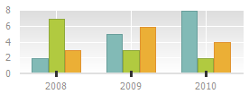
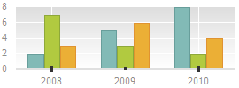
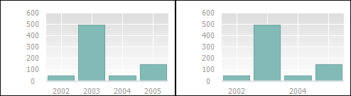
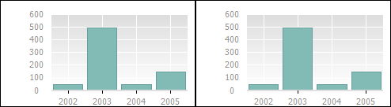

# Настройка шкалы оси X

Настройка шкалы оси X
-

**

# Настройка шкалы оси X

Для настройки шкалы оси X перейдите
 на вкладку «Шкала» окна «Формат
 оси». Настройка доступна в настольном
 приложении.

Совет. Для быстрой
 настройки параметров осей диаграммы используйте [вкладку](../../Params_diagram/UiDiagrams_Axis.htm)
 «Ось значений Х» боковой панели.

[Для вызова окна «Формат
 оси**»](javascript:TextPopup(this))

		- выделите [ось
		 диаграммы](../../UiDiagrams_basic_concept.htm#select_component) и выполните команду «Формат
		 оси» в контекстном меню оси диаграммы;

	Примечание.
	 В инструменте «Аналитические панели»
	 выполните команду «Диаграмма >
	 Формат оси» в контекстном меню оси.

		- дважды щёлкните кнопкой мыши по заголовку выбранной оси.

	Для настройки параметров осей диаграммы в регламентном отчёте:

		- Выделите [ось
		 диаграммы](../../UiDiagrams_basic_concept.htm#select_component).

		- Выберите пункт «Ось
		 X» («Ось Y», «Дополнительная ось») в раскрывающемся
		 списке «Выбор элемента диаграммы
		 для форматирования», расположенном на вкладке «Диаграмма»
		 ленты инструментов.

		- Нажмите кнопку «Стиль
		 фрагмента».

	После выполнения действий будет открыто
	 окно «Формат
	 оси».

Задайте на вкладке следующие настройки шкалы:

[Настройка
 отображения промежуточных линий](javascript:TextPopup(this))

	Для отображения промежуточных делений установите переключатель «Число делений» в группе переключателей
	 «Промежуточные деления» и
	 задайте количество промежуточных делений с помощью клавиатуры или
	 редактора чисел.

	Примечание.
	 Промежуточные деления на оси категорий не добавляются между основными,
	 как на шкале [оси
	 значений](UiDiagrams_FormatAxis_scale_Hierarchical.htm), а отображаются вместо основных.

	По умолчанию у шкалы нет промежуточных делений и установлен переключатель
	 «Нет»:

	

	На рисунке ниже для оси X настроено положение промежуточных делений
	 «По категориям» и задано число
	 промежуточных делений, равное «1»:

	

[Настройка
 положения делений](javascript:TextPopup(this))

	В группе переключателей «Положение
	 делений» выберите вариант положения делений:

		- По категориям;

		- Между категориями.

	Ниже приведен пример диаграммы с заданным положением делений «По категориям» (слева) и «Между категориями» (справа):

	

[Настройка
 положения оси](javascript:TextPopup(this))

	Выберите вариант положения оси при построении диаграммы в группе
	 переключателей «Положение оси»:

		- По категориям. При
		 построении диаграммы ось категорий пересекается с осью значений
		 в середине категории:

	

	Примечание.
	 Если для 3D-диаграммы ось X строится по категориям, то возможно смещение
	 диаграммы за пределы области построения.

		- Между категориями.
		 При построении диаграммы ось категорий пересекается с осью значений
		 в начале категории:

	

[Настройка
 пересечения оси с осью Y](javascript:TextPopup(this))

	В раскрывающемся списке «Пересечение
	 с осью Y» выберите вариант пересечения оси X с осью Y:

		- Авто. Автоматическое
		 размещение оси: пересечение с осью Y в минимальном значении. Используется
		 по умолчанию;

		- В заданной точке.
		 Пересечение с осью Y в заданной точке. При выборе данного варианта
		 появляется поле для указания значения точки.

	Примечание.
	 При использовании пересечения с осью Y и смещения оси, ось X будет
	 находиться на пересечении с осью Y в заданной точке с заданным смещением.

		- В максимальном значении.
		 Пересечение с осью Y в максимальном значении. Подписи оси располагаются
		 снаружи области построения.

[Настройка
 отображения делений скрытых подписей](javascript:TextPopup(this))

	Для отображения делений скрытых подписей установите флажок «Отображать деления для скрытых подписей».

[Настройка
 порядка категорий](javascript:TextPopup(this))

	Для расположения значений оси в обратном порядке установите флажок
	 «Обратный порядок категорий».
	 При этом перпендикулярная ось будет перемещена на противоположный
	 край области построения.

	Ниже приведен пример диаграммы без использования обратного порядка
	 (слева) и с использованием (справа):

	

	Примечание.
	 Расположение значений осей в обратном порядке доступно для всех типов
	 диаграмм, кроме [лепестковой
	 диаграммы](../../Type_diagrams/UiDiagrams_petalous.htm).

[Настройка
 интервала между подписями](javascript:TextPopup(this))

	Для настройки интервала между подписями установите необходимый переключатель:

		- Авто. Интервал между
		 подписями будет рассчитан автоматически;

		- Заданный. Задайте
		 интервал с помощью клавиатуры или редактора чисел.

	Примечание.
	 По умолчанию установлено значение интервала, равное «1». Возможные
	 значения: 1-999.

	Ниже приведен пример диаграммы с установленными интервалами между
	 подписями: по умолчанию - «1» (слева) и «2» (справа):

	

	Примечание.
	 При ручном задании отображаемых подписей в регламентном отчете (т. е.,
	 если в диалоге «[Настроить отображение подписей точек](uireport.chm::/desktop/diagrams/uidiagrams_report_create_source.htm#set_up)»
	 снят флажок хотя бы с одного элемента) элемент управления «Интервал
	 между подписями» становится недоступным.

[Установка
 произвольного интервала между делениями](javascript:TextPopup(this))

	Для изменения интервала между делениями установите интервал с помощью
	 редактора чисел «Интервал между делениями».

	По умолчанию задано значение, равное «1». Допустимые значения: 1-999.

	Ниже приведен пример с установленными интервалами между делениями:
	 по умолчанию - «1» (слева), «2» (справа):

	

## Особенности настройки шкалы оси X

При настройке шкалы оси X имеются следующие особенности:

	- Для оси X [точечной](../../Type_diagrams/UiDiagrams_scatter.htm)
	 и [пузырьковой](../../Type_diagrams/Bubble_Chart.htm) диаграмм
	 вкладка «Шкала» выглядит так
	 же, как вкладка для [оси
	 Y](UiDiagrams_FormatAxis_scale_Hierarchical.htm). Исключением является настройка «Пересечение
	 с осью Y», поскольку обе оси данных типов диаграмм являются
	 осями значений.

	- При работе с иерархической шкалой [оси](../../UiDiagrams_basic_concept.htm)
	 Х вкладка «Шкала» содержит
	 [дополнительные
	 параметры](UiDiagrams_FormatAxis_Hierarchical_scale.htm).

См. также:

[Оси
 диаграммы](../../Params_diagram/UiDiagrams_Axis.htm) | [Настройка шкалы
 отчета](../UiDiagrams_Scale.htm) | [Настройка
 шкалы оси Y](UiDiagrams_FormatAxis_scale_Hierarchical.htm) | [Настройка
 общих параметров диаграммы](../../Params_diagram/UiDiagrams_params_diagram.htm) | [Настройка
 компонентов диаграммы](../../UiDiagrams_basic_concept.htm)

		Справочная
		 система на версию 10.9
		 от 18/08/2025,
		 © ООО «ФОРСАЙТ»,
