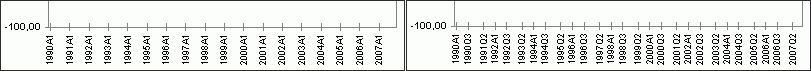

# Настройка шкалы иерархической оси Х

Настройка шкалы иерархической оси Х
-

**

# Настройка шкалы иерархической оси Х

Иерархия
 точек используется для интеллектуального сжатия подписей по уровням.

Примечание.
 Настройка типа шкалы иерархической оси X доступна только в экспресс-отчетах
 в настольном приложении, если точки имеют календарный тип «Дата»
 (календарное измерение должно быть расположено по оси X).

Чтобы сделать ось иерархической, измените тип построения иерархии точек
 диаграммы, используя язык [Fore](KeExpress.chm::/Interface/IEaxChart/IEaxChart.BuildPointNameHierarchy.htm).
 Если в качестве значений шкалы X будет использоваться иерархическое измерение,
 то на вкладке «Шкала»
 окна «Формат оси» будет доступна
 настройка типа шкалы.

Совет. Для быстрой
 настройки параметров осей диаграммы используйте [вкладку](../../Params_diagram/UiDiagrams_Axis.htm)
 «Ось значений Х» боковой панели.

[Для вызова окна «Формат
 оси**»](javascript:TextPopup(this))

		- Выделите [ось
		 диаграммы](../../UiDiagrams_basic_concept.htm#select_component) и выполните команду «Формат
		 оси» в контекстном меню оси диаграммы.

	Примечание.
	 В инструменте «Аналитические панели»
	 выполните команду «Диаграмма >
	 Формат оси» в контекстном меню диаграммы.

		- Дважды щелкните кнопкой мыши по заголовку выбранной оси.

Для выбора типа построения шкалы используйте группу параметров «Тип шкалы».

[Тип
 построения шкалы](javascript:TextPopup(this))

	Определите режим построения шкалы:

		- Автоматический режим построения
		 шкалы. Для выбора данного типа установите переключатель
		 «Автовыбор на основе данных».
		 Данный режим используется по умолчанию.

	Рассмотрим автоматический режим на примере
	 оси, отображающей данные для дневной, квартальной и годовой динамик.
	 Изначально определяется возможность вывести подписи шкалы без пересечений
	 для минимальной динамики (в данном случае - дневной). Если это возможно,
	 то для построения шкалы будет использована данная динамика. Если построение
	 шкалы без пересечений невозможно, то будет определена возможность
	 вывода подписей шкалы без пересечений для следующего уровня (для квартальной
	 динамики). Если отсутствуют пересечения, то шкала будет отстроена
	 по данному уровню. При наличии пересечений производится анализ последующего
	 уровня и так до тех пор, пока не будет достигнута максимальная динамика
	 (в данном случае - годовая). Если при построении шкалы по максимальной
	 динамике пересечения присутствуют, то часть подписей будет сжата или
	 пропущена.

		- Пользовательский режим
		 построения шкалы. Для выбора данного типа установите переключатель
		 «По уровням». Установите
		 флажки напротив наименований тех уровней, по которым будет строиться
		 шкала. Для отметки всех уровней нажмите кнопку «Отметить
		 все». Кнопка «Очистить
		 все» снимает флажки со всех уровней. Данные кнопки дублируются
		 одноименными командами в контекстном меню.

	В пользовательском режиме при построении
	 шкалы будут обязательно использованы уровни, которые задал пользователь.
	 Если построение шкалы без пересечений подписей невозможно, то часть
	 подписей будет сжата или пропущена.

	Ниже приведен пример одной и той же шкалы, отображающей иерархические
	 значения в разных режимах построения. Слева представлена шкала, содержащая
	 данные только годовой динамики. Шкала построена в автоматическом режиме.
	 Справа шкала построена в пользовательском режиме: она отображает годовую
	 и квартальную динамики.

	

Примечание.
 Остальные параметры соответствуют параметрам на вкладке «Шкала»
 для [неиерархической оси Х](FormatAxis_scale.htm).

См. также:

[Оси
 диаграммы](../../Params_diagram/UiDiagrams_Axis.htm) | [Настройка шкалы оси X](FormatAxis_scale.htm)
 | [Настройка шкалы отчета](../UiDiagrams_Scale.htm) | [Настройка
 общих параметров диаграммы](../../Params_diagram/UiDiagrams_params_diagram.htm) | [Настройка
 компонентов диаграммы](../../UiDiagrams_basic_concept.htm)

		Справочная
		 система на версию 10.9
		 от 18/08/2025,
		 © ООО «ФОРСАЙТ»,
