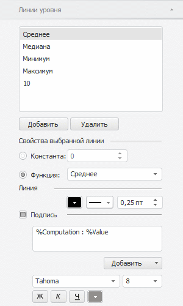

# Линии уровня

Линии уровня
-

# Линии уровня

Линия уровня - линия в области
 построения диаграммы, перпендикулярная заданной оси.

Настройка линий уровня доступна для всех типов диаграмм, кроме
 [круговой](../../Type_diagrams/UiDiagrams_round.htm) и [кольцевой](../../Type_diagrams/Doughnut_chart.htm).

Примечание.
 Сетка [области
 построения диаграммы](../uidiagrams_tuning_construction_area_digramm.htm) также строится из линий уровня. Для настройки
 основных линий уровня в области построения используйте вкладку «[Вид](FormatAxis_View.htm#axis_format)»
 окна «Формат оси» в настольном
 приложении и группу настроек «[Линии
 сетки](../../Params_diagram/UiDiagrams_Axis.htm#gridlines)» на вкладке «Ось значений»
 боковой панели в настольном и веб-приложениях.

Предусмотрены следующие подходы к настройке линии уровня:

[Быстрая настройка](javascript:TextPopup(this))

	Для быстрой настройки линии уровня используйте вкладку «Линии
	 уровня» на боковой панели.

	Доступны следующие операции над линиями уровня:

		- добавление и удаление линии уровня;

		- настройка линии уровня;

		- отображение подписи линии уровня.

[Расширенная
 настройка](javascript:TextPopup(this))

	Для расширенной настройки формата линии уровня используйте вкладку
	 «[Уровни](LevelLines_Property.htm)»
	 окна «Формат оси».

## Быстрая настройка линии уровня

Для настройки линии уровня используйте вкладку «Линии
 уровня» на боковой панели.

[Для отображения
 вкладки](javascript:TextPopup(this))

		- Убедитесь, что боковая панель [отображается](GetStarted.chm::/Interface/Interface_Description.htm#side_panel).

		- В рабочей области выделите диаграмму.

		- Установите на боковой панели переключатель «Формат»
		 и перейдите на вкладку «Линии
		 уровня».

Примечание.
 С помощью вкладки «Линии уровня»
 боковой панели доступна работа только с линиями уровня, перпендикулярными
 оси значений (Y).

На вкладке доступны следующие операции:

[Добавление/удаление
 линии уровня](javascript:TextPopup(this))

	Для добавления линии уровня нажмите кнопку «Добавить»
	 и задайте [настройки](#view_level_lines) в группе параметров
	 «Свойства выбранной линии»
	 и «Линия».

	Для удаления выбранной линии уровня нажмите кнопку «Удалить».

[Настройка
 линии уровня](javascript:TextPopup(this))

	Для настройки типа подписи для линии уровня, выбранной в списке,
	 установите один из переключателей в области «Свойства
	 выбранной линии»:

		- Константа. Задайте
		 значение линии уровня с помощью клавиатуры или редактора чисел;

		- Функция. В раскрывающемся
		 списке выберите функцию, исходя из значения которой будет строиться
		 линия уровня. Доступны следующие виды функций: «Максимум»,
		 «Минимум», «Сумма»,
		 «Медиана» или «Среднее».

	При необходимости настройте параметры линии уровня: цвет, тип и
	 толщину линии уровня.

[Отображение
 подписи линии уровня](javascript:TextPopup(this))

	Для отображения подписи линии уровня установите флажок «Подпись».

	Подробное описание настройки подписи линии уровня приведено в разделе
	 «[Подписи данных](../../Property_diagramm/UiDiagrams_PropertyDiagramm_Label.htm#levelline)».

См. также:

[Оси
 диаграммы](../../Params_diagram/UiDiagrams_Axis.htm) | [Настройка
 общих параметров диаграммы](../../Params_diagram/UiDiagrams_params_diagram.htm) | [Настройка
 компонентов диаграммы](../../UiDiagrams_basic_concept.htm)

		Справочная
		 система на версию 10.9
		 от 18/08/2025,
		 © ООО «ФОРСАЙТ»,
