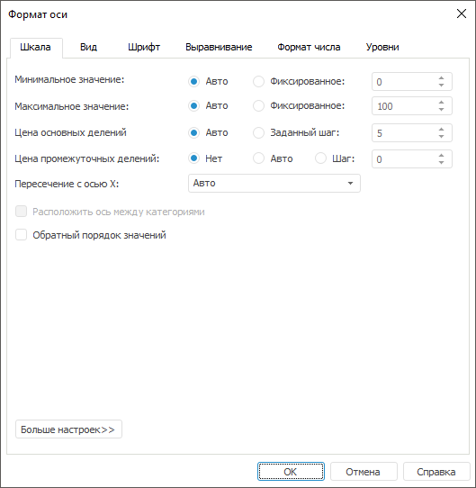
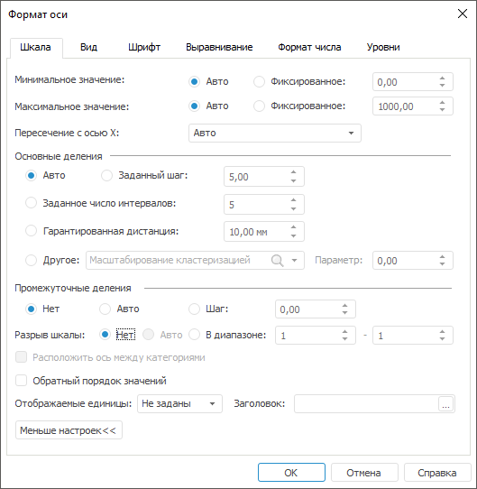
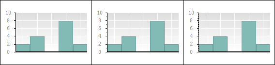

# Настройка шкалы оси Y

Настройка шкалы оси Y
-

**

# Настройка шкалы оси Y

Для настройки шкалы оси Y перейдите на вкладку «Шкала»
 в диалоге «Формат оси». Вкладка
 выглядит так же, как вкладка для дополнительной оси и вкладка для оси
 X [точечной](../../Type_diagrams/UiDiagrams_scatter.htm) и
 [пузырьковой](../../Type_diagrams/Bubble_Chart.htm) диаграмм.

Расширенная настройка шкалы оси Y доступна только в настольном приложении.

Совет. Для быстрой
 настройки параметров оси диаграммы используйте вкладку «[Ось значений Y](../../Params_diagram/UiDiagrams_Axis.htm)»
 на боковой панели.

[Для вызова окна «Формат
 оси**»](javascript:TextPopup(this))

		- выделите [ось
		 диаграммы](../../UiDiagrams_basic_concept.htm#select_component) и выполните команду «Формат
		 оси» в контекстном меню оси диаграммы;

	Примечание.
	 В инструменте «Аналитические панели»
	 выполните команду «Диаграмма >
	 Формат оси» в контекстном меню оси.

		- дважды щёлкните кнопкой мыши по заголовку выбранной оси.

	Для настройки параметров осей диаграммы в регламентном отчёте:

		- Выделите [ось
		 диаграммы](../../UiDiagrams_basic_concept.htm#select_component).

		- Выберите пункт «Ось
		 X» («Ось Y», «Дополнительная ось») в раскрывающемся
		 списке «Выбор элемента диаграммы
		 для форматирования», расположенном на вкладке «Диаграмма»
		 ленты инструментов.

		- Нажмите кнопку «Стиль
		 фрагмента».

	После выполнения действий будет открыто
	 окно «Формат
	 оси».

На вкладке «Шкала» содержатся
 основные и дополнительные настройки шкалы оси Y.

	 Основные настройки Дополнительные настройки

		

		

Для переключения между основными и дополнительными настройками шкалы
 оси Y используйте кнопки «Больше настроек»
 и «Меньше настроек».

## Основные настройки

Задайте следующие настройки шкалы:

[Настройка
 минимального значения](javascript:TextPopup(this))

	Для настройки минимального значения шкалы, которое будет отображаться
	 на месте нулевой отметки, установите один из переключателей:

		- Авто. Автоматический
		 режим отображения оси. Переключатель установлен по умолчанию;

		- Фиксированное. Задайте
		 минимальное значение с помощью редактора чисел или клавиатуры.

	Нулевая отметка - деление
	 шкалы, соответствующее нулевому значению измеряемой величины.

	Ниже приведён пример отображения диаграммы с использованием автоматического
	 режима отображения оси (слева) и с установленным для оси Y минимальным
	 значением, равным 2 (справа):

	

	Примечание.
	 Если для диаграммы задано минимальное значение оси Y, то выполняется
	 отсечение данных, выходящих за область построения.

[Настройка
 максимального значения](javascript:TextPopup(this))

	Для настройки максимального значения шкалы, установите один из переключателей:

		- Авто. Автоматический
		 режим отображения оси. Переключатель установлен по умолчанию;

		- Фиксированное. Задайте
		 максимальное значение с помощью редактора чисел или клавиатуры.

	Ниже приведён пример отображения диаграммы с использованием автоматического
	 режима отображения оси (слева) и с установленным для оси Y максимальным
	 значением, равным 6 (справа):

	

	Примечание.
	 Если для диаграммы задано максимальное значение оси Y, то выполняется
	 отсечение данных, выходящих за область построения.

[Настройка
 цены основных делений](javascript:TextPopup(this))

	Для настройки цены основных делений установите один из переключателей:

		- Авто. Автоматический
		 расчёт цены деления шкалы. Переключатель установлен по умолчанию;

		- Заданный шаг. Задайте
		 значение шага с помощью редактора чисел или клавиатуры.

	Примечание.
	 Переключатели доступны в группе параметров «Цена
	 основных делений» при отображении основных параметров шкалы
	 или в группе параметров «Основные
	 деления» при отображении дополнительных параметров шкалы.

[Настройка
 цены промежуточных делений](javascript:TextPopup(this))

Для настройки цены промежуточных делений установите один из переключателей:

	- Нет. Промежуточные деления
	 не отображаются. Переключатель установлен по умолчанию;

	- Авто. Автоматический
	 режим отображения оси;

	- Шаг. Задайте значение
	 с помощью редактора чисел или клавиатуры.

Примечание.
 Переключатели доступны в группе параметров «Цена
 промежуточных делений» при отображении основных настроек или в
 группе параметров «Промежуточные деления»
 при отображении дополнительных настроек для способов разбиения шкалы:
 «Авто», «Заданный
 шаг», «Заданное число интервалов»,
 «Гарантированная дистанция».

На рисунке слева промежуточные деления не установлены, на рисунке в
 центре установлен переключатель «Авто»,
 на рисунке справа задан шаг, равный 0,5:

[Настройка
 пересечения с осью X](javascript:TextPopup(this))

	Для настройки пересечения с осью X в раскрывающемся списке «Пересечение с осью X» выберите
	 вариант положения оси Y:

		- Авто. Пересечение
		 с осью X в минимальном значении. Используется по умолчанию;

		- В заданной точке.
		 Пересечение с осью Х в заданной точке. При выборе данного значения
		 появляется поле для указания значения точки;

	Примечание.
	 Если заданы смещение оси Y и точка пересечения с осью X, то ось Y
	 будет смещена на заданное значение относительно выбранной точки.

		- В максимальном значении.
		 Пересечение с осью Х в максимальном значении. Подписи оси располагаются
		 снаружи области построения.

	Примечание.
	 Для дополнительной оси Y нет возможности задать положение пересечения
	 с осью X, так как используется автоматическое размещение.

[Настройка
 положения оси](javascript:TextPopup(this))

	Для расположения оси между указанными категориями установите флажок
	 «Расположить ось между категориями».

	Примечание.
	 Расположение оси между категориями доступно, если используется пересечение
	 с осью X «[В заданной
	 точке](#x_cross)».

[Настройка
 порядка значений](javascript:TextPopup(this))

	Для расположения значений оси в обратном порядке установите флажок
	 «Обратный порядок значений».
	 При этом ось значений Y отобразится относительно оси категорий X.

	Ниже приведён пример диаграммы без использования обратного порядка
	 (слева) и с использованием (справа):

	

	Примечание.
	 Расположение значений осей в обратном порядке доступно для всех типов
	 диаграмм, кроме [лепестковой
	 диаграммы](../../Type_diagrams/UiDiagrams_petalous.htm).

## Дополнительные настройки

Для дополнительной настройки основных делений в группе параметров «Основные деления» доступны операции:

[Настройка
 количества интервалов](javascript:TextPopup(this))

	Для настройки количества интервалов (расстояний между делениями)
	 на шкале установите переключатель «Заданное
	 число интервалов» и задайте значение количества интервалов
	 с помощью редактора чисел или клавиатуры.

[Настройка
 расстояния между делениями](javascript:TextPopup(this))

	Для настройки расстояния между делениями на шкале установите переключатель
	 «Гарантированная дистанция»
	 и задайте значение в миллиметрах с помощью редактора чисел или клавиатуры.

	Примечание.
	 Настройка расстояния между делениями доступна только в настольном
	 приложении. Параметры, заданные в настольном приложении, не применяются
	 в веб-приложении.

[Настройка
 режима построения шкалы](javascript:TextPopup(this))

	Для построения шкалы в заданном режиме установите переключатель
	 «Другое», выберите режим
	 построения в раскрывающемся списке и настройте его.

	Примечание.
	 Настройка режима построения шкалы доступна только в настольном приложении.
	 Параметры, заданные в настольном приложении, не применяются в веб-приложении.

	Предусмотрены следующие режимы построения шкалы:

		- Масштабирование кластеризацией.
		 Режим используется при неравномерных данных, например, есть значения,
		 равные 1 и 1000. Позволяет отображать данные с опусканием неинформативных
		 интервалов шкалы. При этом получаемая шкала становится неравномерной,
		 а график нагляднее.

		В поле «Параметр» задайте
		 абсолютный шаг масштабирования, выражаемый в единицах шкалы. Если
		 приращение следующего ряда (ряды рассматриваются по возрастанию)
		 относительно предыдущего больше заданного шага, то приращение
		 на шкале ограничивается этим шагом.

		Ниже приведён пример [гистограммы](../../Type_diagrams/UiDiagrams_Bar.htm)
		 с одинаковыми начальными данными с использованием кластеризации
		 при абсолютном шаге, равным 10 (слева), и без использования кластеризации
		 (справа):

	

	При таком режиме построения шкалы на
	 диаграмме слева отобразится неравномерная шкала, но при этом диаграмма
	 будет более наглядной;

		- Распределенное масштабирование.
		 Данный режим аналогичен кластеризации, только шаг масштабирования
		 в поле «Параметр» задается
		 в процентах разницы между отсортированными двумя соседними рядами;

		- Логарифмическая шкала.
		 Значения шкалы вычисляются десятичным логарифмом в зависимости
		 от имеющихся данных.

	Примечание.
	 Для [точечной](../../Type_diagrams/UiDiagrams_scatter.htm)
	 диаграммы доступен только режим построения шкалы «Логарифмическая
	 шкала».

Для дополнительной настройки промежуточных делений в группе параметров
 «Промежуточные деления» доступны
 операции:

[Настройка
 разрыва шкалы](javascript:TextPopup(this))

	Разрывы шкалы - специальные
	 разрывы по оси Y, которые чаще всего используются для перераспределения
	 данных по диаграмме. Это повышает удобство чтения, если максимальные
	 значения отображаемых данных сильно отличаются от минимальных.

	Примечание.
	 Разрывы шкалы доступны для следующих типов диаграмм: [линейная
	 диаграмма](../../Type_diagrams/UiDiagrams_lenear.htm), [гистограмма](../../Type_diagrams/UiDiagrams_Bar.htm),
	 [диаграмма с областями](../../Type_diagrams/UiDiagrams_Area.htm),
	 [смешанная](../../Type_diagrams/UiDiagrams_mixed_diagram.htm).
	 Диаграмма должна отображаться в плоском виде и без [накопления](../../Params_diagram/UiDiagrams_params_diagram.htm#stacking).

	Для настройки разрыва шкалы установите один из переключателей в
	 группе параметров «Разрыв шкалы»:

		- Нет. Разрыв шкалы
		 не формируется. Переключатель установлен по умолчанию;

		- Авто. Один или несколько
		 разрывов шкалы формируются автоматически в зависимости от выбранного
		 [режима
		 построения шкалы](UiDiagrams_FormatAxis_scale_Hierarchical.htm#scale_plotting_mode): «Масштабирование
		 кластеризацией», «Распределенное
		 масштабирование», «Логарифмическая
		 шкала»;

	Примечание.
	 Автоматическое формирование разрывов шкалы доступно только в настольном
	 приложении. Параметры, заданные в настольном приложении, не применяются
	 в веб-приложении.

		- В диапазоне. Разрыв
		 шкалы формируется в заданном диапазоне. Переключатель доступен
		 для способов разбиения шкалы: «Авто»,
		 «Заданный шаг», «Заданное число интервалов»,
		 «Гарантированная дистанция».

	Ниже приведён пример отображения диаграммы с разными видами разрыва
	 шкалы для оси Y:

	

	На диаграммах отображается разрыв шкалы в диапазоне от 4 до 9 со
	 следующими способами разбиения шкалы:

		- для первой диаграммы - «Заданное
		 число интервалов» со значением 3;

		- для второй диаграммы - «Заданный
		 шаг» со значением 2;

		- для третьей диаграммы - «Гарантированная
		 дистанция» со значением 8.

[Настройка
 отображаемых единиц (масштаба)](javascript:TextPopup(this))

	Примечание.
	 Настройка отображаемых единиц доступна только для шкалы оси Y.

	Для отображения больших значений на оси используется масштабирование.
	 Таким образом, они будут занимать меньше пространства. Масштабирование
	 выполняется по формуле: X = A * B, где A
	 - исходное значение, B -
	 коэффициент масштабирования.

	Для выбора масштаба шкалы в группе параметров «Отображаемые
	 единицы» выполните в произвольном порядке действия:

		- в раскрывающемся списке выберите отображаемую единицу измерения
		 (сотни, тысячи и другие). По умолчанию единицы измерения для шкалы
		 не используются и установлено значение «Не
		 заданы»;

		- введите заголовок для выбранной единицы измерения в поле
		 «Заголовок». Для задания
		 формата заголовка нажмите кнопку . Откроется
		 окно «[Формат
		 заголовка](../../Params_diagram/UiDiagrams_titles.htm#captions_format)».

	Например, на оси отображаются значения: 5000, 10000 и так далее.
	 После применения масштаба «Тысячи»
	 на оси будут отображаться следующие значения: 5, 10 и так далее. Ниже
	 приведён пример [линейной
	 диаграммы](../../Type_diagrams/UiDiagrams_lenear.htm) без использования масштабирования (слева) и с использованием
	 масштаба «Тысячи» (справа):

	

## Особенности задания значений параметров

При настройке некоторых параметров возможно задание значений с точностью
 до 15 знаков. К таким параметрам относятся:

	- [фиксированное минимальное значение](#min_value);

	- [фиксированное максимальное значение](#max_value);

	- [заданный шаг основных делений](#step);

	- [абсолютный шаг масштабирования
	 кластеризацией](#scale_plotting_mode);

	- [цена промежуточных делений](#tm_unit);

	- [диапазон разрыва шкалы](#scale_digging).

См. также:

[Оси
 диаграммы](../../Params_diagram/UiDiagrams_Axis.htm) | [Настройка шкалы
 отчета](../UiDiagrams_Scale.htm) | [Настройка шкалы оси X](FormatAxis_scale.htm)
 | [Настройка
 общих параметров диаграммы](../../Params_diagram/UiDiagrams_params_diagram.htm) | [Настройка
 компонентов диаграммы](../../UiDiagrams_basic_concept.htm)

		Справочная
		 система на версию 10.9
		 от 18/08/2025,
		 © ООО «ФОРСАЙТ»,
