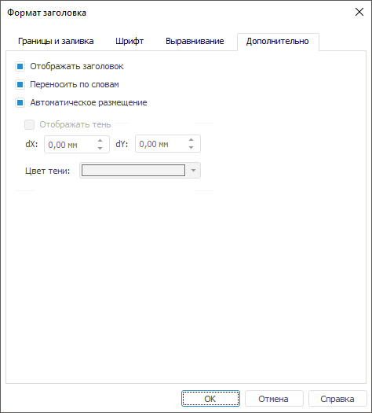

# Дополнительные настройки формата заголовка

Дополнительные настройки формата заголовка
-

# Дополнительные настройки формата заголовка

Для настройки дополнительных параметров формата заголовка перейдите
 на вкладку «Дополнительно» окна
 «[Формат заголовка](../../Params_diagram/UiDiagrams_titles.htm#captions_format)». Настройка доступна
 только в настольном приложении.

Совет. Для быстрой
 настройки формата [заголовков](../../Params_diagram/UiDiagrams_titles.htm)
 осей диаграммы используйте [вкладки](../../Params_diagram/UiDiagrams_Axis.htm) «Ось категорий (X)» («Ось
 значений (Y)», «Ось значений (дополнительная)»)
 боковой панели.

[Для
 вызова окна «Формат заголовка»](javascript:TextPopup(this))

	Для вызова окна «Формат
	 заголовка» для заголовка диаграммы и заголовков ее осей:

		- выделите заголовок
		 (заголовок оси)
		 диаграммы и выполните команду «Формат
		 заголовка» в контекстном меню заголовка;

	Примечание.
	 Команда «Формат заголовка»
	 доступна только при работе с диаграммами в инструменте «Отчеты».

		- нажмите кнопку 
		 на вкладке «[Заголовки](../../Params_diagram/UiDiagrams_titles.htm)»
		 диалога «Параметры диаграммы».

	Для вызова окна «Формат
	 заголовка» для отображаемых единиц оси нажмите кнопку  напротив поля ввода заголовка
	 на вкладке «[Шкала](../Format_Axis/UiDiagrams_FormatAxis_scale_Hierarchical.htm)» диалога «Формат осей».

	В регламентном отчете для настройки формата
	 заголовка [выделенного
	 компонента](../../UiDiagrams_basic_concept.htm#select_component) диаграммы в раскрывающемся списке «Выбор
	 элемента диаграммы для форматирования», расположенном на вкладке
	 «Диаграмма» ленты инструментов,
	 выберите необходимый пункт («Заголовок
	 оси X», «Заголовок
	 оси Y», «Заголовок дополнительной
	 оси», «Заголовок цены деления»)
	 и нажмите кнопку «Стиль фрагмента».
	 Откроется окно «Формат
	 заголовка».

На вкладке доступны следующие операции:

[Отображение
 и скрытие заголовка](javascript:TextPopup(this))

	Для скрытия заголовка с сохранением его форматирования снимите флажок
	 «Отображать заголовок». По
	 умолчанию флажок установлен.

[Перенос
 по словам](javascript:TextPopup(this))

	Для переноса слов в заголовке установите флажок «Переносить
	 по словам». По умолчанию флажок установлен.

	Примечание.
	 Для китайского языка перенос текста осуществляется по иероглифам.

[Автоматическое
 размещение](javascript:TextPopup(this))

	Для автоматического размещения заголовка установите флажок «Автоматическое размещение». По умолчанию
	 флажок установлен. При изменении положения заголовка данный флажок
	 будет автоматически снят.

	Заголовок диаграммы автоматически размещается над областью построения
	 диаграммы, заголовки осей и цены деления - рядом с осью (заголовки
	 по оси Y - в вертикальном положении).

[Отображение
 тени](javascript:TextPopup(this))

	Для отображения тени заголовка установите флажок «Отображать
	 тень».

Далее настройте смещение тени по оси категорий (Х) и смещение тени по
 оси значений (Y) с помощью числовых редакторов «dX»
 и «dY» соответственно. В раскрывающейся
 палитре выберите цвет тени либо выберите новый цвет в расширенной
 палитре цветов, вызываемой при нажатии на кнопку «Другой».

	Примечание.
	 Отображение тени доступно при заданной [заливке](../UiDiagrams_tuning_border_and_filling.htm)
	 области заголовка.

См. также:

[Заголовки](../../Params_diagram/UiDiagrams_titles.htm)
 | [Настройка
 общих параметров диаграммы](../../Params_diagram/UiDiagrams_params_diagram.htm) | [Настройка
 компонентов диаграммы](../../UiDiagrams_basic_concept.htm)

		Справочная
		 система на версию 10.9
		 от 18/08/2025,
		 © ООО «ФОРСАЙТ»,
