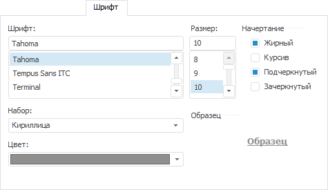

# Настройка шрифта

Настройка шрифта
-

# Настройка шрифта

Шрифт можно настроить на вкладке «Шрифт»
 для следующих [компонентов
 диаграммы](../../UiDiagrams_basic_concept.htm):

	- [заголовка
	 диаграммы](../../Params_diagram/UiDiagrams_titles.htm) в окне «[Формат заголовка](../../Params_diagram/UiDiagrams_titles.htm#captions_format)»;

	- [осей диаграммы](../../Params_diagram/UiDiagrams_Axis.htm)
	 в окне «[Формат
	 осей](../../Params_diagram/UiDiagrams_Axis.htm#axis_format)»;

	- [легенды
	 диаграммы](../../Property_diagramm/UiDiagrams_PropertyDiagramm_legend.htm) в окне «[Формат легенды](../../Property_diagramm/UiDiagrams_PropertyDiagramm_legend.htm)»;

	- [подписей линии
	 уровня](../Format_Axis/LevelLines_Property.htm).

Примечание.
 Настройка шрифта [компонентов
 диаграммы](../../UiDiagrams_basic_concept.htm) с помощью вкладки «Шрифт»
 доступна только в настольном приложении.

Вкладка «Шрифт» выглядит следующим
 образом:

Примечание.
 Для разных [компонентов](../../UiDiagrams_basic_concept.htm)
 набор настроек и их расположение на вкладке могут отличаться.

Для настройки шрифта доступны операции:

[Выбор
 типа шрифта](javascript:TextPopup(this))

	В поле «Шрифт» выберите
	 тип шрифта.

[Выбор
 размера шрифта](javascript:TextPopup(this))

	В поле «Размер» выберите
	 размер шрифта.

[Выбор
 начертания](javascript:TextPopup(this))

	В поле «Начертание» выберите
	 стиль начертания, установив необходимые флажки:

		- Жирный. Пример текста
		 - «жирный»;

		- Курсив. Пример текста
		 - «курсив»;

		- Подчеркнутый. Пример
		 текста - «подчеркнутый»;

		- Зачеркнутый. Пример
		 текста - «зачеркнутый».

[Выбор
 набора символов](javascript:TextPopup(this))

	В раскрывающемся списке «Набор»
	 выберите один из наборов используемых символов, поддерживаемых выбранным
	 шрифтом.

[Выбор
 цвета шрифта](javascript:TextPopup(this))

	В раскрывающейся палитре «Цвет»
	 выберите цвет текста. Для выбора нового цвета в расширенной палитре
	 цветов нажмите кнопку «Другой».

[Просмотр образца
 текста](javascript:TextPopup(this))

	В области «Образец» отображается
	 внешний вид текста, который он примет после применения установленных
	 параметров. Проверьте, соответствует ли внешний вид текста ожидаемому
	 результату.

См. также:

[Заголовки](../../Params_diagram/UiDiagrams_titles.htm)
 | [Оси диаграммы](../../Params_diagram/UiDiagrams_Axis.htm)
 | [Легенда](../../Property_diagramm/UiDiagrams_PropertyDiagramm_legend.htm)
 | [Настройка
 общих параметров диаграммы](../../Params_diagram/UiDiagrams_params_diagram.htm) | [Настройка
 компонентов диаграммы](../../UiDiagrams_basic_concept.htm)

		Справочная
		 система на версию 10.9
		 от 18/08/2025,
		 © ООО «ФОРСАЙТ»,
