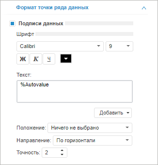
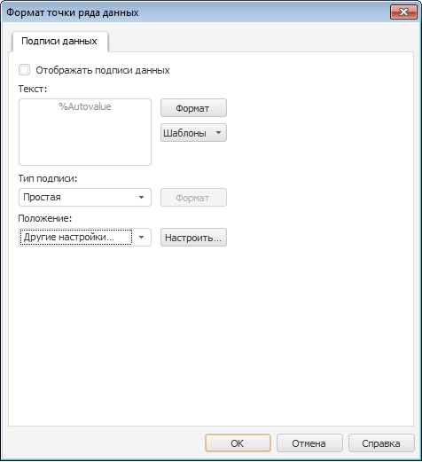
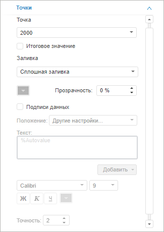
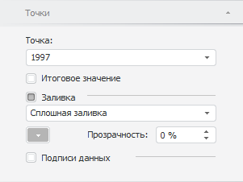

# Настройка точки ряда данных

Настройка точки ряда данных
-

# Настройка точки ряда данных

Точка ряда данных - отдельное
 значение ряда данных, отображающее значение из массива данных, на основе
 которого построен ряд данных.

Для настройки параметров оформления точки ряда данных используйте:

	- вкладку «Точки» на боковой
	 панели для [каскадных
	 диаграмм](../../Type_diagrams/WaterFall_chart.htm);

	- окно «Формат точки ряда данных»
	 для всех типов диаграмм, кроме [каскадной](../../Type_diagrams/WaterFall_chart.htm).

[Для вызова окна
 «Формат точки ряда данных»](javascript:TextPopup(this))

	Выделите точку ряда данных и выполните одно из действий:

		- выполните команду «Формат
		 точки ряда данных» в контекстном меню точки ряда данных;

	Примечание.
	 В инструменте «Аналитические панели»
	 выполните команду «Диаграмма >
	 Формат точки ряда данных» или «Диаграмма
	 > Формат подписи данных» в контекстном меню точки ряда данных.

		- дважды щелкните по ней кнопкой мыши.

	Для быстрого запуска окна «Формат
	 точки ряда данных» активного ряда данных дважды щелкните основной
	 кнопкой мыши по точке, для которой требуется задать настройки.

	 Веб-приложение  Настольное приложение

		

		

В зависимости от типа диаграммы из окна «Формат
 точки ряда данных» доступны следующие настройки точки ряда данных:

	- [настройка
	 подписей данных](../../Params_diagram/UiDiagrams__DataTitle.htm);

	- [настройка
	 границы и заливки](../UiDiagrams_tuning_border_and_filling.htm).

[Для
 отображения вкладки «Точки»](javascript:TextPopup(this))

		- Убедитесь, что боковая панель [отображается](GetStarted.chm::/Interface/Interface_Description.htm#side_panel).

		- В рабочей области выделите диаграмму.

		- Установите на боковой панели переключатель «Формат»
		 и перейдите на вкладку «Точки».

	Для быстрого перехода на вкладку «Точки»
	 дважды щёлкните по активной точке, для которой требуется задать настройки,
	 и выполните команду «Формат
	 точки ряда данных» в контекстном меню.

	 Веб-приложение

	 Настольное
	 приложение

		

		

На вкладке доступны следующие настройки точки:

	- Настройка
	 точки. Для настройки определённой точки выберите её в раскрывающемся
	 списке «Точка» в начале вкладки.
	 Установите флажок «Итоговое значение»
	 для назначения точки итогом. Итогом может быть назначена одна или
	 несколько точек;

Примечание.
 Также флажок «Итоговое значение»
 доступен через контекстное меню активной точки.

	- Настройка
	 заливки. Для отображения заливки для определённой точки установите
	 флажок «Заливка», из раскрывающегося
	 списка выберите тип заливки:

		- Сплошная заливка.
		 Однотонная заливка. Тип установлен по умолчанию. Цвет соответствует
		 «[Цветовой
		 схеме](../../Series.htm#color_schem)». При необходимости задайте процент [прозрачности](../UiDiagrams_tuning_border_and_filling.htm#transparency)
		 заливки в поле «Прозрачность»;

		- Градиентная заливка.
		 Заливка двухцветным градиентом. Для выбора начального цвета градиента
		 используйте раскрывающуюся палитру. При необходимости укажите
		 угол наклона и процент [прозрачности](../UiDiagrams_tuning_border_and_filling.htm#transparency)
		 градиента в полях «Угол»
		 и «Прозрачность». Для
		 установки конечного цвета сначала на вкладке «[Ряд данных](../../Series.htm#fill)» выберите тип
		 заливки «Градиентная»,
		 затем укажите нужный цвет из раскрывающейся палитры;

Примечание.
 Сначала нужно указать конечный цвет.

		- Неоднородная заливка.
		 Заливка линейным градиентом. При необходимости задайте процент
		 [прозрачности](../UiDiagrams_tuning_border_and_filling.htm#transparency)
		 заливки в поле «Прозрачность».
		 Базовый цвет градиента соответствует цвету ряда в «Цветовой
		 схеме»;

Примечание.
 При изменении «[Цветовой
 схемы](../../Series.htm#color_schem)» заливка точки меняется на сплошную. При изменении типа
 [заливки](../../Series.htm#fill) ряда данных заливка для точки
 заменяется на идентичную.

	- [Настройка подписи
	 данных](../../Params_diagram/UiDiagrams__DataTitle.htm).

См. также:

[Ряд данных](../../Series.htm) | [Настройка
 общих параметров диаграммы](../../Params_diagram/UiDiagrams_params_diagram.htm) | [Настройка компонентов диаграммы](../../UiDiagrams_basic_concept.htm)

		Справочная
		 система на версию 10.9
		 от 18/08/2025,
		 © ООО «ФОРСАЙТ»,
