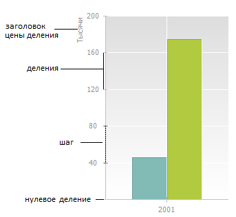

# Настройка шкалы отчета

Настройка шкалы отчета
-

**

# Настройка шкалы отчета

## Структура шкалы

Шкала представляет собой набор
 делений, соответствующих некоторым значениям физической величины:

Деление - знак на шкале, соответствующий
 некоторому значению физической величины.

Основные деления - деления шкалы,
 из которых строятся линии сетки.

Промежуточные деления - дополнительные
 укороченные деления шкалы, расположенные между основными делениями.

Цена деления, шаг - разность
 значений величин, соответствующих двум соседним делениям шкалы.

Нулевое деление - деление шкалы,
 соответствующее нулевому значению измеряемой величины.

## Настройка шкалы оси

Для настройки шкалы оси перейдите на вкладку «Шкала»
 окна «Формат оси».
 Настройка доступна только в настольном приложении для
 всех типов диаграмм, кроме [круговой](../Type_diagrams/UiDiagrams_round.htm)
 и [кольцевой](../Type_diagrams/Doughnut_chart.htm) диаграмм,
 [вторичной
 гистограммы](../Type_diagrams/UiDiagrams_secondary_histogram.htm) и [вторичной
 круговой диаграммы](../Type_diagrams/UiDiagrams_round_secondary.htm).

Совет. Для быстрой
 настройки параметров осей диаграммы используйте [вкладки](../Params_diagram/UiDiagrams_Axis.htm)
 «Ось значений (Х)», «Ось
 значений (Y)», «Ось значений (дополнительная)»
 боковой панели.

[Для вызова окна «Формат
 оси**»](javascript:TextPopup(this))

		- выделите [ось
		 диаграммы](../UiDiagrams_basic_concept.htm#select_component) и выполните команду «Формат
		 оси» в контекстном меню оси диаграммы;

	Примечание.
	 В инструменте «Аналитические панели»
	 выполните команду «Диаграмма >
	 Формат оси» в контекстном меню оси.

		- дважды щёлкните кнопкой мыши по заголовку выбранной оси.

	Для настройки параметров осей диаграммы в регламентном отчёте:

		- Выделите [ось
		 диаграммы](../UiDiagrams_basic_concept.htm#select_component).

		- Выберите пункт «Ось
		 X» («Ось Y», «Дополнительная ось») в раскрывающемся
		 списке «Выбор элемента диаграммы
		 для форматирования», расположенном на вкладке «Диаграмма»
		 ленты инструментов.

		- Нажмите кнопку «Стиль
		 фрагмента».

	После выполнения действий будет открыто
	 окно «Формат
	 оси».

Вид вкладки «Шкала» зависит
 от выбранной оси:

На вкладке доступны следующие настройки:

	- [настройка шкалы оси
	 X](Format_Axis/FormatAxis_scale.htm);

	- [настройка
	 шкалы оси Y](Format_Axis/UiDiagrams_FormatAxis_scale_Hierarchical.htm);

	- [настройка
	 шкалы иерархической оси Х](Format_Axis/UiDiagrams_FormatAxis_Hierarchical_scale.htm).

Примечание.
 Настройки [дополнительной
 оси](Format_line/Settings_DataSeries.htm#other_axis) аналогичны [настройкам
 шкалы оси Y](Format_Axis/UiDiagrams_FormatAxis_scale_Hierarchical.htm).

Для оси X [точечной](../Type_diagrams/UiDiagrams_scatter.htm)
 и [пузырьковой](../Type_diagrams/Bubble_Chart.htm) диаграмм
 вкладка «Шкала» выглядит так же,
 как вкладка для [оси
 Y](Format_Axis/UiDiagrams_FormatAxis_scale_Hierarchical.htm). Исключением является настройка «Пересечение
 с осью Y», поскольку обе оси данных типов диаграмм являются осями
 значений.

Для изменения ориентации шкалы диаграммы:

	- выберите вариант ориентации шкалы в диалоге «[Тип
	 диаграммы](../Type_diagrams/ChangingChartType.htm)»;

	- установите/снимите флажок «Инвертировать»
	 на вкладке «[Диаграмма](../Params_diagram/UiDiagrams_params_diagram.htm)»
	 боковой панели.

См. также:

[Оси
 диаграммы](../Params_diagram/UiDiagrams_Axis.htm) | [Настройка
 общих параметров диаграммы](../Params_diagram/UiDiagrams_params_diagram.htm) | [Настройка
 компонентов диаграммы](../UiDiagrams_basic_concept.htm)

		Справочная
		 система на версию 10.9
		 от 18/08/2025,
		 © ООО «ФОРСАЙТ»,
