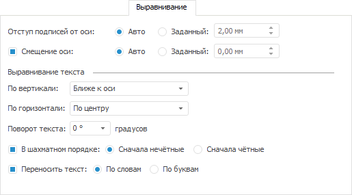
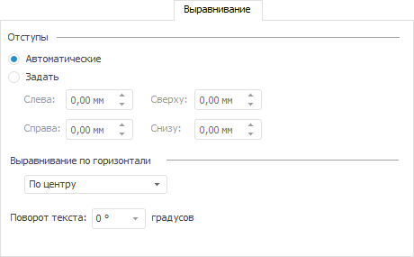
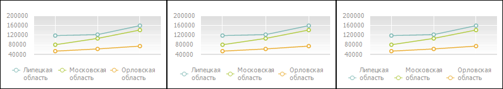

# Настройка выравнивания

Настройка выравнивания
-

# Настройка выравнивания

Выравнивание можно настроить на вкладке «Выравнивание»
 для следующих [компонентов диаграммы](../UiDiagrams_basic_concept.htm):

	- [области диаграммы](UiDiagrams_tuning_area_digramm.htm)
	 в окне «[Формат
	 области диаграммы](UiDiagrams_tuning_area_digramm.htm#chart_area_format)»;

	- [заголовка
	 диаграммы](../Params_diagram/UiDiagrams_titles.htm) в окне «[Формат
	 заголовка](Chart_Title_Alignment.htm)»;

	- [подписей оси
	 диаграммы](../Params_diagram/UiDiagrams_Axis.htm) в окне «[Формат
	 оси](Format_Axis/FormatAxis_View.htm#axis_format)»;

	- [легенды
	 диаграммы](../Property_diagramm/UiDiagrams_PropertyDiagramm_legend.htm) в окне «[Формат
	 легенды](Format_Legend/UiDiagrams_FormatLegend_common.htm)».

Примечание.
 Настройка выравнивания [компонентов
 диаграммы](../UiDiagrams_basic_concept.htm) с помощью вкладки «Выравнивание»
 доступна только в настольном приложении.

Примеры вкладки:

	- для настройки выравнивания подписей осей:

	- для настройки выравнивания заголовков осей и заголовка диаграммы:

В зависимости от [компонента
 диаграммы](../UiDiagrams_basic_concept.htm) для настройки выравнивания доступны операции:

[Настройка
 отступов](javascript:TextPopup(this))

	Настройка позволяет задать отступы:

		- области диаграммы от краев рабочего пространства;

		- заголовка диаграммы от краев рабочего пространства (сверху,
		 слева и справа) и от краев области построения (снизу);

		- легенды от области диаграммы и от краев рабочего пространства.

	Задайте отступы области диаграммы, заголовка диаграммы или ее легенды
	 в группе «Отступы», установив
	 необходимый переключатель:

		- Автоматический.
		 Отступ между компонентами определяется автоматически;

		- Задать. С помощью
		 клавиатуры или редактора чисел задайте значения отступов между
		 компонентами.

Примечание.
 Доступен ввод значения [в
 разных единицах измерения](UiNav.Chm::/GUI/format/different_units.htm). В поле ввода редактора отображаются значения
 в единицах измерения, соответствующих текущим региональным настройкам
 операционной системы.

[Настройка
 выравнивания заголовка диаграммы](javascript:TextPopup(this))

	Определите параметры выравнивания заголовка диаграммы. Для этого
	 выберите тип горизонтального выравнивания текста в раскрывающемся
	 списке «Выравнивание по горизонтали»:

	- По левому краю. Текст
	 размещается по левому краю;

	- По центру. Текст размещается
	 по центру;

	- По правому краю. Текст
	 размещается по правому краю.

[Настройка
 выравнивания текста подписи оси](javascript:TextPopup(this))

	Определите параметры выравнивания текста подписи относительно оси.
	 Для этого выберите тип выравнивания текста по вертикали и по горизонтали в
	 группе «Выравнивание текста»
	 в раскрывающихся списках «По вертикали»
	 и «По горизонтали» соответственно.

	Примечание.
	 Для оси значений доступно только вертикальное выравнивание, для оси
	 категорий и горизонтальное, и вертикальное. Горизонтальное актуально
	 только для многострочных подписей.

	Типы вертикального выравнивания:

		- Ближе к оси. Текст
		 размещается ближе к оси;

		- По центру. Текст
		 размещается по центру;

		- Дальше от оси. Текст
		 размещается дальше от оси.

	Типы горизонтального выравнивания:

	- По левому краю. Текст
	 размещается по левому краю;

	- По центру. Текст размещается
	 по центру;

	- По правому краю. Текст
	 размещается по правому краю.

	Для выравнивания текста в шахматном порядке установите флажок «В шахматном порядке» и определите
	 порядок вывода подписей, установив необходимый переключатель:

		- Сначала нечётные.
		 Подписи нечётных делений шкалы размещаются ближе к оси;

		- Сначала чётные.
		 Подписи чётных делений шкалы размещаются ближе к оси.

	Примечание.
	 Выравнивание текста в шахматном порядке доступно только в настольном
	 приложении. Параметры, заданные в настольном приложении, не применяются
	 в веб-приложении.

	Для переноса текста подписи по словам установите флажок «Переносить
	 текст» выберите один из вариантов переноса текста: «По
	 словам» или «По буквам».
	 При снятом флажке перенос текста подписи осуществляться не будет.

	Примечание.
	 При задании способа переноса текста подписи учитывайте следующие особенности:

	      • если в настольном приложении
	 был установлен флажок «Переносить
	 текст» и выбран любой из вариантов переноса текста, то в веб-приложении
	 перенос текста будет осуществляться по словам;

	      • если в настольном приложении
	 флажок не был установлен, то в веб-приложении перенос текста подписи
	 осуществляться не будет;

	      • для китайского языка перенос
	 текста осуществляется по иероглифам.

[Поворот
 текста подписей](javascript:TextPopup(this))

	Для определения параметров наклона текста подписей осей задайте
	 параметры наклона текста в группе «Поворот
	 текста» с помощью регулятора угла (при этом в числовом поле
	 ниже созданный угол отобразится в градусах) либо с помощью редактора
	 чисел.

	В приведенном ниже примере представлены диаграммы без наклона и
	 с углом наклона подписей оси Y 45 градусов:

	

[Настройка
 отступов подписей оси от шкалы](javascript:TextPopup(this))

	Определите отступы подписей оси от [шкалы](../Params_diagram/UiDiagrams_Axis.htm)
	 и смещение оси.

	Примечание.
	 Настройка отступов подписей оси от шкалы доступна только в настольном
	 приложении. Параметры, заданные в настольном приложении, не применяются
	 в веб-приложении.

	Для задания отступов подписей оси от шкалы установите необходимый
	 переключатель в группе «Отступ подписей
	 от оси»:

		- Авто. Отступ между
		 текстом подписей оси и шкалой определяется автоматически;

		- Заданный. С помощью
		 клавиатуры или редактора чисел задайте значение отступа между
		 текстом подписей оси и шкалой.

Примечание.
 Доступен ввод значения [в
 разных единицах измерения](UiNav.Chm::/GUI/format/different_units.htm). В поле ввода редактора отображаются значения
 в единицах измерения, соответствующих текущим региональным настройкам
 операционной системы.

[Смещение
 оси](javascript:TextPopup(this))

	Определите смещение оси относительно области построения диаграммы.

	Примечание.
	 Настройка смещения оси доступна только в настольном приложении. Параметры,
	 заданные в настольном приложении, не применяются в веб-приложении.

	Для настройки смещения оси установите флажок «Смещение
	 оси» и выберите вариант смещения:

		- Авто. Смещение оси
		 определяется равным длине деления внутри оси;

		- Заданный. С помощью
		 клавиатуры или редактора чисел задайте значение смещения оси.
		 Значение может быть отрицательным.

		При заданном положительном значении ось смещается в противоположенную
		 сторону от области построения. При отрицательном значении ось
		 смещается внутрь области построения.

Примечание.
 Доступен ввод значения [в
 разных единицах измерения](UiNav.Chm::/GUI/format/different_units.htm). В поле ввода редактора отображаются значения
 в единицах измерения, соответствующих текущим региональным настройкам
 операционной системы.

[Настройка
 выравнивания элементов легенды](javascript:TextPopup(this))

	Определите параметры выравнивания текста легенды диаграммы. Для
	 этого установите флажок «Текст в
	 несколько строк» в группе «Выравнивание
	 элементов». Далее в раскрывающемся списке «По
	 вертикали» определите тип выравнивания текста относительно
	 маркера ряда:

	- По верхнему краю. Текст
	 размещается по верхнему краю;

	- По центру. Текст размещается
	 по центру;

	- По нижнему краю. Текст
	 размещается по нижнему краю.

	Пример выравнивания многострочного текста легенды по верхнему краю
	 (изображение слева), по центу (изображение в центре) и по нижнему
	 краю (изображение справа):

	

См. также:

[Настройка
 общих параметров диаграммы](../Params_diagram/UiDiagrams_params_diagram.htm) | [Настройка
 компонентов диаграммы](../UiDiagrams_basic_concept.htm)

		Справочная
		 система на версию 10.9
		 от 18/08/2025,
		 © ООО «ФОРСАЙТ»,
