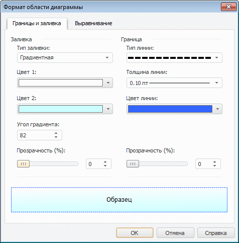
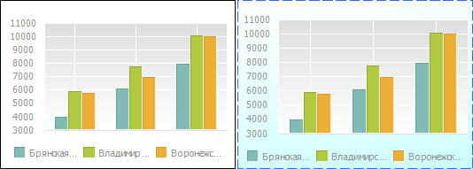

# Область диаграммы

Область диаграммы
-

# Область диаграммы

Область диаграммы - контейнерный
 компонент, который включает в себя все [компоненты
 диаграммы](../UiDiagrams_basic_concept.htm).

Для настройки параметров оформления области диаграммы предусмотрены
 следующие подходы: быстрая и расширенная настройка.

## Быстрая настройка

Для быстрой настройки параметров области диаграммы используйте вкладку
 «[Диаграмма](../Params_diagram/UiDiagrams_params_diagram.htm)»
 боковой панели.

На вкладке доступны настройки границ и заливки области диаграммы.

## Расширенная настройка

Для расширенной настройки параметров оформления области диаграммы используйте
 окно «Формат области диаграммы».

Примечание.
 Настройка области диаграммы с помощью окна «Формат
 области диаграммы» доступна только в настольном приложении.

[Для вызова окна
 «Формат области диаграммы»](javascript:TextPopup(this))

		- Выполните команду «Формат
		 области диаграммы» в контекстном меню области диаграммы.

	Примечание.
	 В инструменте «Аналитические панели»
	 выполните команду «Диаграмма >
	 Формат области диаграммы» в контекстном меню ряда.

		- Дважды щелкните кнопкой мыши по области построения диаграммы.

Из окна «Формат области диаграммы»
 доступны следующие настройки:

	- [Настройка
	 границы и заливки](UiDiagrams_tuning_border_and_filling.htm);

	- [Настройка выравнивания](UiDiagrams_tuning_alignment.htm).

Ниже приведены примеры диаграммы, для которой настроена только граница
 (слева) и для которой задана заливка, изменены граница области и настроены
 отступы (справа):

См. также:

[Настройка
 общих параметров диаграммы](../Params_diagram/UiDiagrams_params_diagram.htm) | [Настройка
 компонентов диаграммы](../UiDiagrams_basic_concept.htm)

		Справочная
		 система на версию 10.9
		 от 18/08/2025,
		 © ООО «ФОРСАЙТ»,
