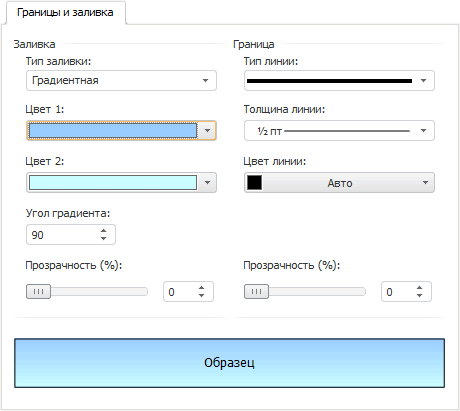
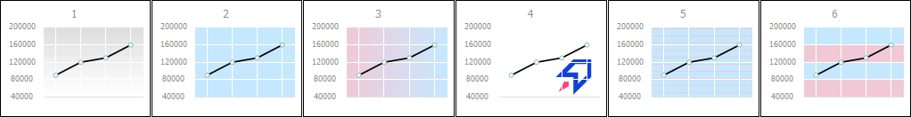
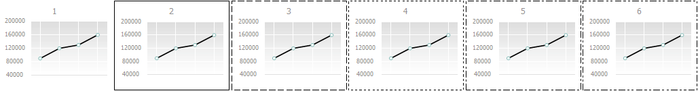
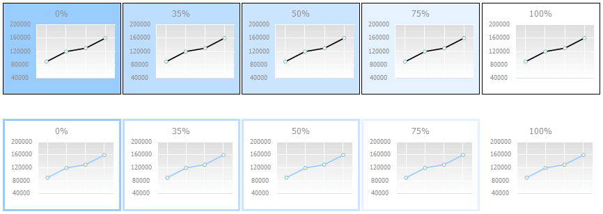

# Настройка границы и заливки

Настройка границы и заливки
-

# Настройка границы и заливки

На вкладке «Границы и заливка»
 можно настроить границы и заливку для следующих [компонентов
 диаграммы](../UiDiagrams_basic_concept.htm):

	- [области диаграммы](UiDiagrams_tuning_area_digramm.htm)
	 в окне «[Формат
	 области диаграммы](UiDiagrams_tuning_area_digramm.htm)»;

	- [области
	 построения](uidiagrams_tuning_construction_area_digramm.htm) в окне «[Формат
	 области построения](uidiagrams_tuning_construction_area_digramm.htm)»;

	- [заголовка
	 диаграммы](../Params_diagram/UiDiagrams_titles.htm) в окне «[Формат заголовка](../Params_diagram/UiDiagrams_titles.htm#captions_format)»;

	- [ряда данных](../Series.htm) в окне «[Формат ряда данных](../Series.htm)»;

	- [подписи
	 данных](../Property_diagramm/UiDiagrams_PropertyDiagramm_Label.htm) в окне «[Формат подписей](../Params_diagram/UiDiagrams__DataTitle.htm#tip_format)»;

	- [легенды
	 диаграммы](../Property_diagramm/UiDiagrams_PropertyDiagramm_legend.htm) в окне «[Формат легенды](../Property_diagramm/UiDiagrams_PropertyDiagramm_legend.htm)».

Примечание.
 Настройка границы и заливки [компонентов
 диаграммы](../UiDiagrams_basic_concept.htm) с помощью окон доступна только в настольном приложении.

Вкладка «Границы и заливка»
 выглядит следующим образом:

Примечание.
 Для разных [компонентов](../UiDiagrams_basic_concept.htm) набор
 опций на вкладке может отличаться.

На вкладке доступны следующие операции по настройке параметров оформления
 компонента:

[Выбор
 типа заливки](javascript:TextPopup(this))

	Для настройки заливки фона компонента диаграммы в раскрывающемся
	 списке «Тип заливки», расположенном
	 в области «Заливка», выберите
	 тип заливки. В зависимости от выбранного [компонента
	 диаграммы](../UiDiagrams_basic_concept.htm) доступны следующие типы заливок:

		- Нет. Заливка ряда
		 не используется;

		- Сплошная заливка.
		 Для выбора цвета однотонной заливки укажите цвет заливки
		 в раскрывающейся палитре. При необходимости задайте процент [прозрачности](UiDiagrams_tuning_border_and_filling.htm#transparency)
		 заливки в поле «Прозрачность»;

		- Градиентная заливка.
		 Для выбора цвета заливки двухцветным градиентом укажите начальный
		 и конечный цвета градиента в раскрывающихся палитрах. При необходимости
		 укажите угол наклона и процент [прозрачности](UiDiagrams_tuning_border_and_filling.htm#transparency)
		 градиента в полях «Угол»
		 и «Прозрачность»;

		- Глянцевая. Для выбора
		 цвета глянцевой заливки укажите базовый цвет в раскрывающейся
		 палитре;

		- С изображением.
		 Данный формат позволяет в качестве заливки использовать указанное
		 изображение;

		- Со штриховкой. Данный
		 формат позволяет применить сплошную заливку и штриховку одновременно;

		- Неоднородная заливка.
		 Для выбора цвета неоднородной заливки укажите цвет заливки
		 в раскрывающейся палитре. При необходимости задайте процент [прозрачности](UiDiagrams_tuning_border_and_filling.htm#transparency)
		 заливки в поле «Прозрачность»;

		- С чередованием цветов.
		 Данный формат позволяет в качестве заливки использовать два цвета
		 заливки. При необходимости задайте процент [прозрачности](UiDiagrams_tuning_border_and_filling.htm#transparency)
		 заливки в поле «Прозрачность»;

		- Автоматическая.
		 Цвет однотонной заливки выбирается автоматически.

	После выбора типа заливки становится доступна операция настройки
	 [дополнительных параметров](#fill).

[Настройка
 заливки](javascript:TextPopup(this))

	В зависимости от выбранного [типа заливки](#typefill)
	 будут доступны следующие параметры:

		- Цвет заливки. В раскрывающейся
		 палитре выберите цвет заливки, либо выберите новый цвет в расширенной
		 палитре цветов, вызываемой при нажатии на кнопку «Другой».
		 Для типов заливки «градиентная»
		 и «с чередованием цветов»
		 отображается две палитры;

		- Угол градиента.
		 Задайте вручную или с помощью редактора чисел угол наклона градиента.
		 Параметр отображается только для типа заливки «градиентная»;

		- Цвет штриховки.
		 В раскрывающейся палитре выберите цвет штриховки, либо выберите
		 новый цвет в расширенной палитре цветов, вызываемой при нажатии
		 на кнопку «Другой»;

		- Штриховка. Из раскрывающегося
		 списка выберите тип штриховки;

		- Прозрачность. Определите
		 [прозрачность](UiDiagrams_tuning_border_and_filling.htm#transparency)
		 фона компонента. Параметр отображается для всех типов заливки,
		 кроме «с изображением»;

		- Файл с изображением.
		 Для использования в качестве фона компонента диаграммы нажмите
		 кнопку . Откроется стандартное
		 окно «Загрузка картинки из файла».
		 Параметр отображается только для типа заливки «с
		 изображением».

	Примечание.
	 Параметры «Цвет штриховки»
	 и «Штриховка» отображаются
	 только для типа заливки «Со штриховкой».

	Для отключения заливки в списке «Тип
	 заливки» выберите «Нет».

	Ниже приведены примеры диаграммы с различными значениями параметра
	 «Тип заливки» (1 - нет заливки,
	 2 - сплошная, 3 - градиентная, 4 - с изображением, 5 - со штриховкой,
	 6 - с чередованием цветов):

	

[Настройка
 границы](javascript:TextPopup(this))

	Для настройки границы компонента диаграммы задайте следующие параметры
	 в области «Границы»:

		- Тип линии. В раскрывающемся
		 списке выберите тип линии;

		- Толщина линии. В
		 раскрывающемся списке выберите необходимую толщину линии. При
		 выборе пункта «Пользовательский»
		 будет открыто окно «Толщина линии»,
		 в котором можно с помощью редактора чисел или вручную задать требуемую
		 толщину линий;

Примечание.
 Доступен ввод значения [в разных единицах измерения](UiNav.Chm::/GUI/format/different_units.htm), однако значение в строке
 ввода будет всегда отображаться в единицах point (1/72 дюйма).

		- Цвет линии. В раскрывающейся
		 палитре выберите цвет линии границы, либо выберите новый цвет
		 в расширенной палитре цветов, вызываемой при нажатии на кнопку
		 «Другой»;

		- Прозрачность. Определите
		 [прозрачность](UiDiagrams_tuning_border_and_filling.htm#transparency)
		 границы компонента.

	Для отключения границ в списке «Тип
	 линии» установите значение «Нет».

	Ниже приведены примеры диаграммы с различными значениями параметра
	 «Тип линии»:

	

[Настройка
 прозрачности заливки и границы](javascript:TextPopup(this))

	Определите прозрачность заливки фона компонента диаграммы и/или
	 границы диаграммы. 100% соответствует полной прозрачности (заливка
	 и граница станут невидимыми), 0% соответствует полной непрозрачности.
	 Значение задается с помощью ползунка или с помощью редактора чисел.

	Примечание.
	 Для типа заливки «С изображением»
	 данный параметр отсутствует.

	Ниже приведены примеры диаграммы с настроенной прозрачностью заливки
	 области диаграммы (верхний ряд) и границы диаграммы (нижний ряд).
	 Для диаграммы установлена сплошная заливка цветом, выбран цвет линии
	 границы и задан параметр «Прозрачность»:
	 0%, 35%, 50%, 75% и 100% соответственно:

	

В области «Образец» отображается
 внешний вид компонента, который он примет после применения установленных
 параметров. Проверьте, соответствует ли внешний вид компонента ожидаемому
 результату.

См. также:

[Область
 диаграммы](UiDiagrams_tuning_area_digramm.htm) | [Заголовки](../Params_diagram/UiDiagrams_titles.htm) |
 [Легенда](../Property_diagramm/UiDiagrams_PropertyDiagramm_legend.htm) |
 [Настройка общих
 параметров диаграммы](../Params_diagram/UiDiagrams_params_diagram.htm) | [Настройка
 компонентов диаграммы](../UiDiagrams_basic_concept.htm)

		Справочная
		 система на версию 10.9
		 от 18/08/2025,
		 © ООО «ФОРСАЙТ»,
