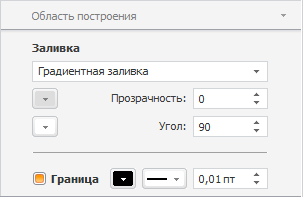
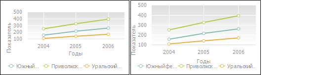

# Область построения

Область построения
-

# Область построения

Область построения - часть [области диаграммы](../UiDiagrams_basic_concept.htm), на которой
 располагаются ряды данных.

Для настройки параметров области построения диаграммы предусмотрены
 следующие подходы: быстрая и расширенная настройка.

## Быстрая настройка параметров диаграммы

Для быстрой настройки параметров области построения диаграммы используйте
 вкладку «Область построения» боковой
 панели.

Настройка доступна для всех типов диаграммы, кроме [круговой](../Type_diagrams/UiDiagrams_round.htm),
 [кольцевой](../Type_diagrams/Doughnut_chart.htm), [лепестковой](../Type_diagrams/UiDiagrams_petalous.htm),
 [вторичной
 гистограммы](../Type_diagrams/UiDiagrams_secondary_histogram.htm) и [вторичной
 круговой диаграммы](../Type_diagrams/UiDiagrams_round_secondary.htm).

[Для отображения
 вкладки](javascript:TextPopup(this))

		- Убедитесь, что боковая панель [отображается](GetStarted.chm::/Interface/Interface_Description.htm#side_panel).

		- В рабочей области выделите диаграмму.

		- Установите на боковой панели переключатель «Формат»
		 и перейдите на вкладку «Область
		 построения».

На вкладке доступны операции:

[Настройка заливки
 области построения](javascript:TextPopup(this))

	В раскрывающемся списке «Заливка»
	 укажите тип заливки:

		- Нет. Заливка области
		 построения диаграммы не будет использоваться;

		- Сплошная заливка.
		 В раскрывающейся палитре задайте цвет, который будет использоваться
		 в качестве заливки области построения. В настольном приложении
		 доступна настройка прозрачности заливки, в поле «[Прозрачность](UiDiagrams_tuning_border_and_filling.htm#transparency)»
		 задайте процент прозрачности заливки;

		- Градиентная заливка.
		 В раскрывающихся палитрах укажите начальный и конечный цвета градиента.
		 В полях «Угол» и «[Прозрачность](UiDiagrams_tuning_border_and_filling.htm#transparency)»
		 укажите угол наклона и процент прозрачности градиента соответственно;

	Примечание.
	 В веб-приложении этот тип заливки называется «Линейный
	 градиент».

		- С чередованием цветов. В
		 раскрывающихся палитрах укажите первый и второй цвета. Цвета чередуются
		 снизу вверх, начиная с первого цвета. В поле «[Прозрачность](UiDiagrams_tuning_border_and_filling.htm#transparency)»
		 задайте процент прозрачности заливки.

[Настройка границы
 области построения](javascript:TextPopup(this))

	Для отображения границы области построения диаграммы установите
	 флажок «Граница».

	После установки флажка становится доступной [настройка
	 границы](UiDiagrams_tuning_border_and_filling.htm#borders). В соответствующих полях укажите цвет, тип и толщину линии
	 границы.

	Примечание.
	 Изменение типа линии границы доступно только в настольном приложении.

## Расширенная настройка

Для расширенной настройки параметров оформления области построения диаграммы
 используйте окно «Формат области построения».

Примечание.
 Настройка области построения диаграммы с помощью окна «Формат
 области построения» доступна только в настольном приложении.

[Для
 вызова окна «Формат области построения»](javascript:TextPopup(this))

		- Выполните команду «Формат
		 области построения» в контекстном меню [выделенной
		 области диаграммы](../UiDiagrams_basic_concept.htm#select_component).

	Примечание.
	 В инструменте «Аналитические панели»
	 выполните команду «Диаграмма >
	 Формат области построения» в контекстном меню области диаграммы.

		- Дважды щелкните кнопкой мыши по области построения диаграммы.

	Для настройки формата области построения в
	 регламентном отчете [выделите область построения диаграммы](../UiDiagrams_basic_concept.htm#select_component).
	 В раскрывающемся списке «Выбор элемента
	 диаграммы для форматирования», расположенном на вкладке «Диаграмма» ленты инструментов, выберите
	 пункт «Область построения»
	 и нажмите кнопку «Стиль фрагмента».
	 Откроется окно «Формат области построения».

Для настройки области построения диаграммы
 доступны следующие операции:

[Настройка границы
 и заливки](javascript:TextPopup(this))

	Для настройки границ и заливки области построения диаграммы используйте
	 вкладку «[Границы
	 и заливка](UiDiagrams_tuning_border_and_filling.htm)» окна «Формат
	 области построения».

[Настройка выравнивания](javascript:TextPopup(this))

	Для настройки выравнивания области построения диаграммы используйте
	 вкладку «[Выравнивание](UiDiagrams_tuning_alignment.htm#margins)»
	 окна «Формат области построения».

[Отображение
 сетки диаграммы](javascript:TextPopup(this))

	Для отображения/скрытия линии сетки установите/снимите флажок:

		- «Отображать сетку диаграммы»,
		 расположенный на вкладке «Общее» окна
		 «Формат области построения»;

		- «Отображать сетку»,
		 расположенный на вкладке «[Вид](Format_Axis/FormatAxis_View.htm#grid_format)»
		 окна «Формат оси».

	Примечание.
	 При установке/снятии флажка «Отображать
	 сетку диаграммы» для всех осей диаграммы устанавливаются/снимаются
	 флажки «Отображать сетку»,
	 расположенные на вкладке «[Вид](Format_Axis/FormatAxis_View.htm#grid_format)»
	 окна «Формат оси». Если установить
	 у осей диаграммы различные состояния флажка «Отображать
	 сетку», флажок «Отображать
	 сетку диаграммы» принимает неопределенное значение.

[Произвольное
 размещение области построения](javascript:TextPopup(this))

	Для произвольного размещения области построения внутри области диаграммы
	 снимите флажок «Автоматическое размещение»
	 на вкладке «Общее». По умолчанию
	 флажок установлен, и область построения автоматически размещается
	 внутри области диаграммы по центру, при изменении ее размеров автоматически
	 изменяются размер области подписей [осей](../Params_diagram/UiDiagrams_Axis.htm).

	Ниже приведен пример диаграммы, область построения которой была
	 увеличена. Слева располагается диаграмма с автоматическим размещением
	 области данных, справа - диаграмма без автоматического размещения
	 области данных:

	

[Отображение
 тени](javascript:TextPopup(this))

	Для отображения тени установите флажок «Отображать
	 тень» на вкладке «Общее»
	 окна «Формат области построения».

[Настройка
 размера области построения](javascript:TextPopup(this))

	Размер области построения изменяется путем перетаскивания ее границ.

См. также:

[Настройка
 общих параметров диаграммы](../Params_diagram/UiDiagrams_params_diagram.htm) | [Настройка
 компонентов диаграммы](../UiDiagrams_basic_concept.htm)

		Справочная
		 система на версию 10.9
		 от 18/08/2025,
		 © ООО «ФОРСАЙТ»,
