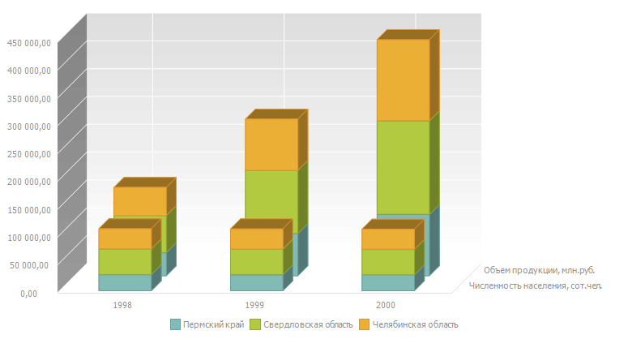

# Объемная гистограмма с группами

Объемная гистограмма с группами
-

# Объемная гистограмма с группами

Объемная гистограмма с группами
 используется для демонстрации изменений данных за определенный период
 времени или для сравнения данных.

На объемной гистограмме значение каждого элемента отображается в виде
 горизонтального (вертикального) столбика, длина которого пропорциональна
 значению элемента. Для каждой из групп данных отображается свой набор
 столбиков, каждый ряд данных обозначается отдельным цветом, указанным
 в [легенде](../Property_diagramm/UiDiagrams_PropertyDiagramm_legend.htm).

Гистограммы такого типа позволяют сравнивать точки данных по горизонтальной
 оси и оси глубины.

При построении гистограммы измерения рядов выводятся на ось глубины.
 Измерений рядов должно быть больше одного, в наименовании ряда данные
 группируются, отображаясь через тире. При построении гистограммы с группами
 с накоплениями, накопления группируются для первых измерений рядов, их
 наименования выводятся на ось глубины через тире, а последнее измерение
 выводится в легенду.

Рассмотрим пример построения объемной гистограммы с группами. Исходными
 данными являются «Социально-экономические
 показатели регионов»:

Пример отображения объемной гистограммы с группами:

Пример отображения объемной гистограммы с группами с накоплением:

Примечание.
 Объемная гистограмма с группами с накоплением не доступна для инструментов
 «Отчеты» и «Анализ
 временных рядов».

В режиме редактирования данного типа диаграммы доступно изменение следующих
 параметров диаграммы:

	- [Формат
	 области диаграммы](../Tuning_format/UiDiagrams_tuning_area_digramm.htm);

	- [Формат
	 области построения](../Tuning_format/uidiagrams_tuning_construction_area_digramm.htm);

	- [Формат осей](../Params_diagram/UiDiagrams_Axis.htm);

	- [Формат ряда данных](../Series.htm);

	- [Формат
	 легенды](../Property_diagramm/UiDiagrams_PropertyDiagramm_legend.htm).

Для данного типа диаграммы доступна [настройка
 дополнительных параметров](../Params_diagram/UiDiagrams_extra.htm#additionally_histo).

См. также:

[Типы диаграмм](UiDiagrams_Type_diagrams.htm)
 | [Настройка
 общих параметров диаграммы](../Params_diagram/UiDiagrams_params_diagram.htm) | [Настройка
 компонентов диаграммы](../UiDiagrams_basic_concept.htm)

		Справочная
		 система на версию 10.9
		 от 18/08/2025,
		 © ООО «ФОРСАЙТ»,
