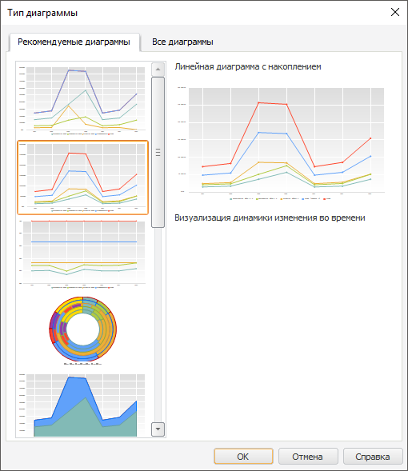

# Изменение типа диаграммы

Изменение типа диаграммы
-

# Изменение типа диаграммы

Для изменения [типа диаграммы](UiDiagrams_Type_diagrams.htm):

	- используйте ленту инструментов. Нажмите кнопку 
	 «Тип», расположенную на вкладке
	 «Диаграмма» ленты инструментов;

	- используйте вкладку «[Диаграмма](../Params_diagram/UiDiagrams_params_diagram.htm)»
	 боковой панели;

	- используйте окно «Тип диаграммы».

[Для вызова окна
 «Тип диаграммы»](javascript:TextPopup(this))

		- Выполните команду «Тип
		 диаграммы» в контекстном меню диаграммы;

	Примечание.
	 В инструменте «Аналитические панели»
	 выполните команду «Диаграмма >
	 Тип диаграммы» в контекстном меню диаграммы.

		- Выберите пункт «Все типы
		 диаграмм» в раскрывающемся меню кнопки «Тип»,
		 расположенной в группе «Вид»
		 на вкладке «Диаграмма»
		 ленты инструментов.

## 
 

## Рекомендуемые диаграммы

На вкладке «Рекомендуемые диаграммы»
 представлены наиболее подходящие [типы
 диаграмм](UiDiagrams_Type_diagrams.htm) для выбранных данных. Подходящие диаграммы подбираются на
 основе анализа исходных данных, имеющихся измерений и отметке в них.

## Все диаграммы

На вкладке «Все диаграммы» представлены
 все [типы диаграмм](UiDiagrams_Type_diagrams.htm) и доступны
 дополнительные настройки.

Примечание.
 При изменении типа диаграммы настроенная ранее привязка рядов к дополнительной
 оси сохраняется для всех видов диаграмм, кроме гистограммы с группировкой
 и биржевой диаграммы с курсом открытия.

В зависимости от типа диаграммы доступны настройки:

[Настройка ориентации
 шкалы](javascript:TextPopup(this))

	Для настройки ориентации шкалы диаграммы выберите вариант ориентации
	 шкалы в окне «[Тип
	 диаграммы](ChangingChartType.htm)».

	Настройка ориентации шкалы диаграммы доступна для любого типа диаграмм,
	 кроме [круговой](UiDiagrams_round.htm), [кольцевой](Doughnut_chart.htm),
	 [лепестковой](UiDiagrams_petalous.htm), [вторичной
	 гистограммы](UiDiagrams_secondary_histogram.htm) и [вторичной
	 круговой диаграммы](UiDiagrams_round_secondary.htm).

	Более подробное описание работы с настройкой приведено в разделе
	 «[Настройка
	 ориентации шкалы](../UiDiagrams_OrietationScale.htm)».

[Отображение
 подписей данных](javascript:TextPopup(this))

	Подписи данных содержат сведения о рядах или отдельных точках данных.

	Для отображения подписей данных на диаграмме установите флажок «Отображать подписи данных».

	Более подробное описание работы с настройкой приведено в разделе
	 «[Настройка
	 подписей данных](../Params_diagram/UiDiagrams__DataTitle.htm)».

[Сглаживание
 рядов](javascript:TextPopup(this))

	Сглаживание ряда используется для устранения эффекта ломаной линии,
	 возникающего при построении диаграммы ([линейной](UiDiagrams_lenear.htm),
	 [точечной](UiDiagrams_scatter.htm) с соединительными линиями
	 и для ряда типа «Линия» в
	 [смешанной](UiDiagrams_mixed_diagram.htm) диаграмме).

	Для настройки сглаживания линейных рядов диаграммы установите флажок
	 «Сглаживать ряды».

	Более подробное описание работы с настройкой рядов данных приведено
	 в разделе «[Общие
	 настройки ряда данных](../Tuning_format/Format_line/Settings_DataSeries.htm)».

[Преобразование
 диаграммы в частотную](javascript:TextPopup(this))

	Для отображения на диаграмме частоты попадания величины в разные
	 интервалы, установите флажок «Частотная
	 диаграмма».

	Настройка доступна для всех типов диаграмм, кроме [объемной
	 гистограммы с группами](3DHistogram_with_Groups.htm), [круговой](UiDiagrams_round.htm),
	 [лепестковой](UiDiagrams_petalous.htm), [биржевой](UiDiagrams_birg.htm)
	 и [гистограммы с интервалами
	 колебаний](UiDiagrams_BarVibration.htm).

	Ниже приведен пример обычной диаграммы (слева) и частотной диаграммы
	 (справа):

	

	Примечание.
	 Настройка параметров частотной диаграммы доступна только через язык
	 [Fore](Chart.chm::/Interface/IChartHistogrammInfo/IChartHistogrammInfo.htm).

См. также:

[Типы диаграмм](UiDiagrams_Type_diagrams.htm)
 | [Настройка
 общих параметров диаграммы](../Params_diagram/UiDiagrams_params_diagram.htm)

		Справочная
		 система на версию 10.9
		 от 18/08/2025,
		 © ООО «ФОРСАЙТ»,
