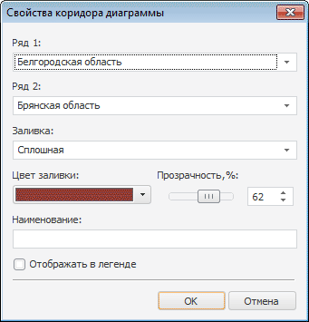
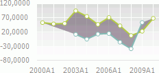

# Настройка коридора диаграммы

Настройка коридора диаграммы
-

# Настройка коридора диаграммы

Для создания и редактирования коридора диаграммы используйте
 окно «Свойства коридора диаграммы».

Примечание.
 Настройка коридора диаграммы доступна только в настольном приложении для
 [линейных диаграмм](Type_diagrams/UiDiagrams_lenear.htm).

[Для вызова окна
 «Свойства коридора диаграммы»](javascript:TextPopup(this))

	- Выберите ряд в списке окна «[Коридоры диаграммы](UiDiagrams_corridors.htm)».

	- Нажмите кнопку «Редактировать».

Для настройки коридора диаграммы:

	- В списках «Ряд 1» и
	 «Ряд 2» выберите ряды, между
	 которыми необходимо установить коридор.

	- В раскрывающемся списке «Заливка»
	 выберите тип заливки коридора диаграммы:

		- Сплошная.
		 Для заливки коридора диаграммы будет использоваться однотонная
		 заливка. В раскрывающейся палитре выберите цвет заливки либо выберите
		 новый цвет в расширенной палитре цветов, вызываемой при нажатии
		 на кнопку «Другой»;

		- Градиентная.
		 Для заливки коридора диаграммы будет использоваться градиентная
		 заливка с плавным переходом от одного цвета к другому (используются
		 цвета рядов данных). Градиентная заливка выполняется, если ряды,
		 между которыми устанавливается коридор, не имеют пропусков в данных.
		 Если ряды содержат пропуски, то для заливки коридора применяется
		 серый цвет. Например:

	- При необходимости задайте [прозрачность](Tuning_format/UiDiagrams_tuning_border_and_filling.htm#transparency)
	 заливки коридора диаграммы.

	- Задайте наименование коридора, которое будет отображаться во
	 внутренней или внешней легендах диаграмм. По умолчанию используется
	 наименование вида: «Наименование
	 ряда 1– Наименование ряда 2».

	- Для отображения коридора диаграммы во внутренней или внешней
	 легендах диаграмм установите флажок «Отображать
	 в легенде».

См. также:

[Коридор диаграммы](UiDiagrams_corridors.htm)
 | [Настройка
 общих параметров диаграммы](Params_diagram/UiDiagrams_params_diagram.htm) | [Настройка компонентов диаграммы](UiDiagrams_basic_concept.htm)

		Справочная
		 система на версию 10.9
		 от 18/08/2025,
		 © ООО «ФОРСАЙТ»,
