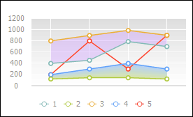
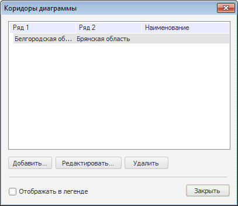

# Коридор диаграммы

Коридор диаграммы
-

# Коридор диаграммы

Коридор диаграммы - выделенная
 часть области построения, находящаяся между двумя рядами линейной диаграммы.
 Доступно создание нескольких коридоров.

Пример коридора со сплошной заливкой (вверху) и коридора с градиентной
 заливкой (внизу):

В инструментах «Анализ временных рядов»
 и «Моделирование и прогнозирование»
 (в веб-приложении) доступно быстрое добавление коридора на диаграмму.
 Для добавления коридора нажмите кнопку  «Коридоры диаграмм» на вкладке «Диаграмма» ленты инструментов. Коридор
 будет добавлен между прогнозным рядом и доверительными границами. Коридор
 будет отображаться, если прогнозный ряд и ряды доверительных границ присутствуют
 на диаграмме. В инструменте «Моделирование
 и прогнозирование» в настольном приложении коридоры на диаграмму
 добавляются автоматически.

## Быстрая настройка коридора диаграммы

Для настройки коридоров диаграммы используйте окно «Коридоры диаграммы».

Примечание.
 Настройка коридора диаграммы доступна только в настольном приложении для
 [линейных диаграмм](Type_diagrams/UiDiagrams_lenear.htm). Коридоры,
 добавленные на диаграмму в настольном приложении, будут отображаться в
 веб-приложении.

[Для вызова окна
 «Коридоры диаграммы»](javascript:TextPopup(this))

	Выполните команду «Коридоры диаграммы»
	 в контекстном меню диаграммы.

	Примечание.
	 В инструменте «Аналитические панели»
	 выполните команду «Диаграмма >
	 Коридоры диаграммы»
	 в контекстном меню диаграммы.

В окне «Коридоры диаграммы»
 доступны следующие операции:

[Добавление
 коридора диаграммы](javascript:TextPopup(this))

	Для добавления коридора диаграммы:

		- нажмите кнопку «Добавить»;

		- нажмите клавишу INSERT;

		- выполните команду контекстного меню «Добавить»;

		- дважды щёлкните по свободному от элементов пространству.

	После
	 выполнения одного из действий будет открыто окно «[Свойства
	 коридора диаграммы](UiDiagrams_CorridorsProperty.htm)». После добавления коридора становятся доступными
	 кнопки «Удалить» и «Редактировать».

[Редактирование
 коридора диаграммы](javascript:TextPopup(this))

	Для изменения свойств выбранного коридора диаграммы:

		- нажмите кнопку «Редактировать»;

		- выполните команду контекстного меню «Редактировать»;

		- дважды щёлкните по выбранному коридору.

	Для редактирования коридора будет открыто окно «[Свойства
	 коридора диаграммы](UiDiagrams_CorridorsProperty.htm)».

	Примечание.
	 Редактирование доступно, только когда выделен один коридор из списка.

[Удаление
 коридора диаграммы](javascript:TextPopup(this))

	Для удаления одного или нескольких
	 выбранных коридоров диаграммы:

		- нажмите кнопку «Удалить»;

		- нажмите клавишу DELETE;

		- выполните команду контекстного меню «Удалить».

	После выполнения действия появится запрос на подтверждение выполняемой
	 операции.

[Отображение
 коридора диаграммы в легенде](javascript:TextPopup(this))

	Для отображения коридора во внешней или внутренней [легенде
	 диаграммы](Property_diagramm/UiDiagrams_PropertyDiagramm_legend.htm):

		- установите флажок «Отображать
		 в легенде» в окне «[Свойства коридора диаграммы](UiDiagrams_CorridorsProperty.htm)»;

		- в окне «Коридоры
		 диаграммы» выделите ряд и установите флажок «Отображать
		 в легенде».

	После выполнения действия выбранный коридор диаграммы будет отображаться
	 в легенде диаграммы.

В списке содержатся все коридоры, определенные на диаграмме. Возможен
 выбор одного или нескольких коридоров (с зажатой клавишей CTRL).

См. также:

[Ряд данных](Series.htm)
 | [Линейная
 диаграмма](Type_diagrams/UiDiagrams_lenear.htm) | [Настройка
 общих параметров диаграммы](Params_diagram/UiDiagrams_params_diagram.htm) | [Настройка
 компонентов диаграммы](UiDiagrams_basic_concept.htm)

		Справочная
		 система на версию 10.9
		 от 18/08/2025,
		 © ООО «ФОРСАЙТ»,
