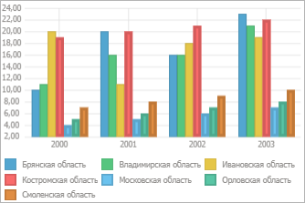
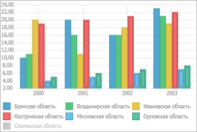

# Исключение рядов из диаграммы

Исключение рядов из диаграммы
-

# Исключение рядов из диаграммы

В инструментах «Отчёты», «Аналитические запросы (OLAP)»,
 «Аналитические панели» и «Анализ временных рядов» при работе
 с диаграммой существует несколько способов исключения рядов из области
 построения диаграммы: со снятием отметки в измерении и с сохранением отметки
 в измерении.

## Исключение рядов из диаграммы со снятием отметки в измерении

В инструментах «Аналитические запросы
 (OLAP)» и «Аналитические панели»
 доступно исключение рядов из диаграммы со снятием отметки в измерении.

Из диаграммы можно исключить:

	- Выделенные ряды. Выполните
	 команду «Исключить» в контекстном
	 меню ряда;

	- Все ряды, кроме выделенных.
	 Выполните команду «Оставить только»
	 в контекстном меню ряда.

Примечание.
 В инструменте «Аналитические панели»
 команды для исключения рядов расположены в группе «Диаграмма»
 в контекстном меню ряда данных.

Диаграмма будет перестроена. Для элементов, соответствующих исключенным
 рядам, будут сняты отметки в измерении.

## Исключение рядов из диаграммы с сохранением отметки в измерении

Для исключения ряда из диаграммы щёлкните по маркеру ряда в легенде
 диаграммы. Выбранный ряд не будет отображаться в области построения диаграммы,
 при этом:

	- ряд будет отображаться в легенде в виде маркера с подписью;

	- для элементов, соответствующих исключенному ряду, будут сохранены
	 отметки в измерении.

## Пример исключения рядов из диаграммы

На диаграммах слева направо:

	- отображаются все ряды;

	- исключён ряд «Смоленская область»
	 со снятием отметки в измерении;

	- исключён ряд «Смоленская область»
	 с сохранением отметки в измерении.

См. также:

[Работа с данными диаграммы](Working_with_data.htm)

		Справочная
		 система на версию 10.9
		 от 18/08/2025,
		 © ООО «ФОРСАЙТ»,
