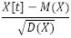
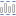
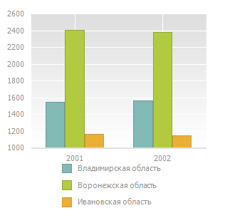
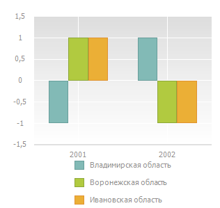

# Нормализация отображаемых данных

Нормализация отображаемых данных
-

# Нормализация отображаемых данных

Нормализация отображаемых данных доступна в инструментах «Аналитические
 запросы (OLAP)», «Аналитические
 панели» и «Анализ временных рядов»
 и используется для оценки нормы ряда.

После применения нормализации данные рядов на диаграмме отображаются
 в виде нормализованных значений.

Нормализованное значение члена ряда X
 вычисляется по формуле:

Где:

	- M.
	 [Среднее
	 значение ряда](Lib.chm::/05_Statistics/UiModelling_Avg.htm);

	- D.
	 [Выборочная
	 дисперсия](Lib.chm::/05_Statistics/UIModelling_dispers.htm).

Для выполнения нормализации данных нажмите кнопку  «Нормализация» на вкладке ленты инструментов
 «Диаграмма». Диаграмма будет перестроена.

Для отображения исходных данных переведите кнопку  «Нормализация» в ненажатое состояние.

## Пример нормализации данных

Внешний вид диаграммы до (слева) и после (справа) нормализации данных:

См. также:

[Работа с данными диаграммы](Working_with_data.htm)

		Справочная
		 система на версию 10.9
		 от 18/08/2025,
		 © ООО «ФОРСАЙТ»,
