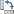
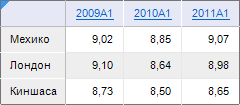
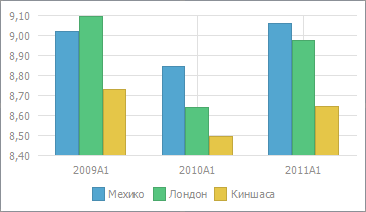
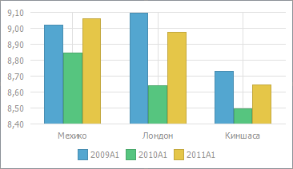

# Изменение способа передачи данных в диаграмму

Изменение способа передачи данных в диаграмму
-

# Изменение способа передачи данных в диаграмму

В инструментах «Аналитические запросы
 (OLAP)», «Аналитические панели»,
 «Отчёты» и «Анализ
 временных рядов» доступно изменение способа передачи данных в диаграмму.

По умолчанию данные передаются по строкам и ряды формируются из данных
 в строках.

Для передачи данных в диаграмму по столбцам нажмите кнопку  «Повернуть
 строки/столбцы» на вкладке ленты инструментов «Диаграмма».
 В результате ряды будут формироваться из данных в столбцах.

Для возврата к передаче данных по строкам ещё раз нажмите кнопку
  «Повернуть строки/столбцы».

## Пример изменения способа передачи данных

Есть таблица c данными, по которым построена диаграмма:

На диаграмме слева поведение по умолчанию: данные передаются по строкам.
 На диаграмме справа данные передаются по столбцам:

См. также:

[Работа с данными диаграммы](Working_with_data.htm)

		Справочная
		 система на версию 10.9
		 от 18/08/2025,
		 © ООО «ФОРСАЙТ»,
