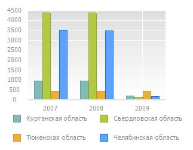
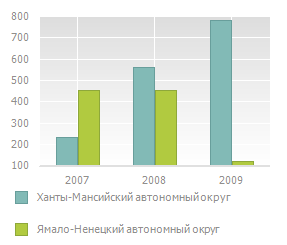

# Детализация и обобщение данных рядов

Детализация и обобщение данных рядов
-

# Детализация и обобщение данных рядов

Детализация и обобщение доступны в инструментах «[Аналитические
 запросы (OLAP)](UiExpress.chm::/purpose/UiExpress_Purpose.htm)», «[Аналитические панели](UiAdhoc.chm::/UiAdhoc_Purpose.htm)»
 и «[Отчёты](UiReport.chm::/UiReport_purpose.htm)».

Детализация данных - операция, позволяющая переходить по уровням данных:
 от общих до детализированных. Доступная глубина детализации определяется
 иерархией измерений источника данных.

Обобщение - операция обратная детализации, позволяющая переходить от
 детализированных данных к общим.

Примечание.
 Детализация недоступна для рядов диаграммы, соответствующих [вычисляемым
 значениям](Showing_Calculated_Values.htm).

Для детализации данных:

	- выполните команду «Детализировать»
	 в контекстном меню ряда данных;

	- дважды щёлкните по ряду.

Для обобщения данных:

	- выполните команду «Обобщить»
	 в контекстном меню ряда данных;

	- дважды щёлкните по ряду с удержанием клавиши SHIFT.

Примечание.
 В инструменте «Аналитические панели»
 команды для детализации и обобщения данных расположены в группе «Диаграмма» в контекстном меню ряда
 данных.

При выполнении детализации/обобщения данных отмечаются родительские/дочерние
 элементы соответствующего уровня измерения.

Для отображения исходной отметки, заданной на вкладке «Отметка»
 боковой панели или, например, с помощью элементов управления, после применения
 детализации/обобщения данных выполните команду «Вернуться
 в исходное состояние» в контекстном меню ряда данных.

Если детализация/обобщение данных выполняется несколько раз и на одной
 из итераций меняется отметка измерения, то при выполнении команды «Вернуться в исходное состояние»,
 после очередной детализации/обобщения данных, будет отображена не исходная,
 а последняя заданная отметка.

Если при детализации/обобщении попали на уровень, на котором нет данных,
 необходимо выполнить команду «Вернуться
 в исходное состояние» в контекстном меню ряда данных.

Примечание.
 Команда «Вернуться в исходное состояние»
 доступна в инструментах «[Аналитические запросы (OLAP)](UiExpress.chm::/purpose/UiExpress_Purpose.htm)», «[Аналитические
 панели](UiAdhoc.chm::/UiAdhoc_Purpose.htm)» при изменении отметки и последующей
 детализации/обобщения данных. Если детализация/обобщение данных не выполняется
 после изменения отметки, то команда будет недоступна.

## Пример детализации и обобщения рядов диаграммы

На рисунке представлена таблица, состоящая из 4 элементов измерения.
 У элемента «Тюменская область»
 имеются дочерние элементы. Данный элемент отображается в виде ссылки:

На основании данной таблицы построена диаграмма:

Выделите ряд «Тюменская область»
 и выполните для него команду «Детализировать»
 в контекстном меню. Будет осуществлен переход на дочерний уровень элемента
 «Тюменская область», диаграмма
 перестроится следующим образом:

Чтобы вернуться на уровень вверх, выполните команду «Обобщить»
 в контекстном меню одного из рядов. Диаграмма приобретет первоначальный
 вид.

См. также:

[Работа с данными диаграммы](Working_with_data.htm)

		Справочная
		 система на версию 10.9
		 от 18/08/2025,
		 © ООО «ФОРСАЙТ»,
