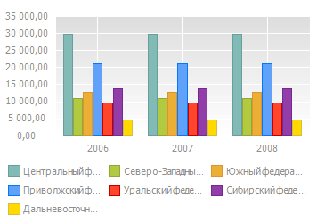
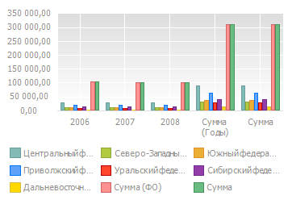

# Отображение вычисляемых значений

Отображение вычисляемых значений
-

# Отображение вычисляемых значений

На диаграмме доступно отображение вычисляемых значений, рассчитанных
 на основе исходных данных. К вычисляемым значениям относятся:

	- [итоги](UiAnalyticalArea.chm::/Totals/Calculate_totals.htm);

	- элемент «Прочие», полученный в результате [распределения](UiAnalyticalArea.chm::/Analysis/distribution.htm).

Для отображения вычисляемых значений:

	- В таблице настройте [расчёт итоговых
	 значений](UiAnalyticalArea.chm::/Totals/Calculate_totals.htm) или [распределение](UiAnalyticalArea.chm::/Analysis/distribution.htm)
	 данных.

	- Выберите диаграмму, построенную на данных таблицы, и выберите
	 вариант отображения в меню кнопки  «Вычисляемые значения» на вкладке
	 ленты инструментов «Диаграмма».

Для отображения исходных данных выключите вариант отображения через
 кнопку  «Вычисляемые
 значения».

## Пример отображения вычисляемых значений

Внешний вид диаграммы до (слева) и после (справа) включения отображения
 вычисляемых значений «Сумма» по
 уровням территориального и календарного измерениям:

В данном случае включены вычисляемые значения: «Сумма»
 по уровням территориального измерения и «Сумма»
 по уровням календарного измерения.

См. также:

[Работа с данными диаграммы](Working_with_data.htm)

		Справочная
		 система на версию 10.9
		 от 18/08/2025,
		 © ООО «ФОРСАЙТ»,
