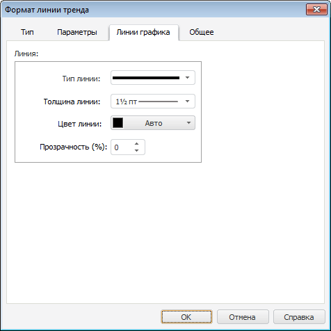

# Настройка линии тренда

Настройка линии тренда
-

# Настройка линии тренда

Для настройки параметров линии тренда используйте окно «Формат линии тренда».

Примечание.
 Настройка линии тренда с помощью окна доступна только в настольном
 приложении.

Совет. Для быстрой
 настройки линии тренда используйте вкладку «[Ряды данных](../../Series.htm)» боковой панели.

[Для вызова окна
 «Формат линии тренда»](javascript:TextPopup(this))

		- Выполните команду «Формат
		 линии тренда» в контекстном меню линии тренда.

	Примечание.
	 В инструменте «Аналитические панели»
	 выполните команду «Диаграмма >
	 Формат линии тренда» в контекстном меню линии тренда.

		- Дважды щелкните кнопкой мыши по линии тренда.

	Для настройки линии тренда в регламентном отчете выделите
	 [линию тренда](../../UiDiagrams_basic_concept.htm#select_component). В раскрывающемся списке «Выбор элемента диаграммы для форматирования», расположенном на вкладке «Диаграмма» ленты инструментов, выберите пункт «Линейный тренд (имя
	 ряда)» и нажмите кнопку «Стиль фрагмента».
	 Откроется окно «Формат
	 линии тренда».

При работе с линиями тренда из окна «Формат
 линии тренда» доступны следующие операции:

[Настройка
 типа линии тренда](javascript:TextPopup(this))

	Для настройки типа линии тренда выберите тип линии тренда на вкладке
	 «Тип» окна «Формат
	 линии тренда».

	Возможны следующие типы построения линий:

		- линейный;

		- логарифмический;

		- экспоненциальный;

		- степенной;

		- среднее;

		- пиковые значения.

[Настройка
 линии тренда](javascript:TextPopup(this))

	Для настройки параметров линии тренда перейдите на вкладку «Параметры» окна «Формат линии тренда»:

	

	Задайте настройки линии тренда:

		- Определите наименование линии тренда в группе «Наименование»,
		 установив один из переключателей:

		-

			- Автоматическое.
			 Имя линии тренда будет присвоено автоматически. По умолчанию
			 наименование формируется по следующей схеме: тип
			 тренда (имя ряда). Например: «Линейный
			 тренд (Брянская область)»;

			- Другое. С помощью клавиатуры
			 введите имя линии тренда.

		- Задайте количество прогнозных
		 точек назад и вперед в редакторах чисел «Прогноз
		 назад» и «Прогноз вперёд».

		- Задайте пиковый интервал, на котором вычисляются пиковые
		 значения ряда.

	Примечание.
	 Параметры «Прогноз вперёд/назад»
	 доступны для всех типов тренда, кроме трендов «Среднее»
	 и «Пиковые значения». Параметр
	 «Пиковый интервал» доступен
	 только для тренда типа «Пиковые
	 значения».

[Настройка
 оформления линии тренда](javascript:TextPopup(this))

	Настройте оформление линии диаграммы в группе «Линия»
	 на вкладке «Линии графика»
	 окна «Формат линии тренда»:

	

	Задайте параметры линии тренда:

		- В раскрывающемся списке «Тип линии»
 выберите тип линии.

		- В раскрывающемся списке «Толщина линии»
 выберите необходимую толщину линии. При выборе пункта «Пользовательский»
 будет открыто окно «Толщина линии»,
 в котором можно с помощью редактора чисел или вручную задать требуемую
 толщину линий.

Примечание.
 Доступен ввод значения [в разных единицах измерения](UiNav.Chm::/GUI/format/different_units.htm), однако значение в строке
 ввода будет всегда отображаться в единицах point (1/72 дюйма).

		- В раскрывающейся палитре выберите цвет линии либо выберите новый цвет в
 расширенной палитре цветов, вызываемой при нажатии на кнопку «Другой».

		- При необходимости [настройте
		 прозрачность](../../Tuning_format/UiDiagrams_tuning_border_and_filling.htm#transparency) линии тренда.

[Сглаживание
 линии тренда](javascript:TextPopup(this))

	Для сглаживания линии тренда установите флажок «Сглаживать
	 ряд (только для линейных типов)» на вкладке «Общее»
	 окна «Формат линии тренда».

	Примечание.
	 Вид вкладки аналогичен вкладке «[Общее](../../Tuning_format/Format_line/Settings_DataSeries.htm)»
	 окна «Формат ряда данных».

[Отображение
 в легенде](javascript:TextPopup(this))

	Для отображения линии тренда в легенде установите флажок «Отображать в легенде» на вкладке
	 «Общее» окна «Формат
	 линии тренда». По умолчанию флажок установлен и линия тренда
	 отображается в легенде.

	Примечание.
	 Вид вкладки аналогичен вкладке «[Общее](../../Tuning_format/Format_line/Settings_DataSeries.htm)»
	 окна «Формат ряда данных».

[Отображение
 тени](javascript:TextPopup(this))

	Для отображения тени линии тренда установите флажок «Отображать
	 тень» на вкладке «Общее»
	 окна «Формат линии тренда».

	Примечание.
	 Вид вкладки аналогичен вкладке «[Общее](../../Tuning_format/Format_line/Settings_DataSeries.htm)»
	 окна «Формат ряда данных».

Далее настройте смещение тени по оси категорий (Х) и смещение тени по
 оси значений (Y) с помощью числовых редакторов «dX»
 и «dY» соответственно. В раскрывающейся
 палитре выберите цвет тени либо выберите новый цвет в расширенной
 палитре цветов, вызываемой при нажатии на кнопку «Другой».

См. также:

[Линия
 тренда](Trend_Lines.htm) | [Настройка
 общих параметров диаграммы](../../Params_diagram/UiDiagrams_params_diagram.htm) | [Настройка компонентов диаграммы](../../UiDiagrams_basic_concept.htm)

		Справочная
		 система на версию 10.9
		 от 18/08/2025,
		 © ООО «ФОРСАЙТ»,
