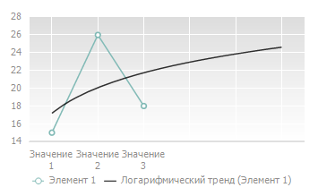
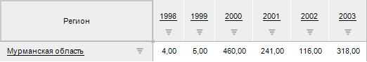
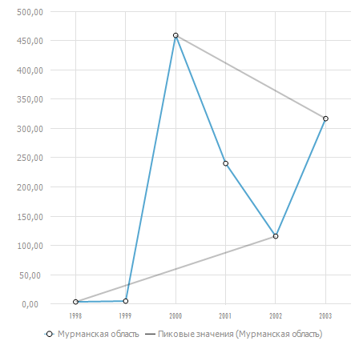

# Линия тренда

Линия тренда
-

# Линия тренда

Линия тренда позволяет графически
 отображать тенденции данных и прогнозировать их дальнейшие изменения.
 Подобный анализ называется регрессионным. Используя регрессионный анализ,
 можно продлить линию тренда в диаграмме за пределы реальных данных для
 предсказания будущих значений.

Работа с линией тренда доступна для всех типов диаграмм, кроме [лепестковой](../../Type_diagrams/UiDiagrams_petalous.htm),
 [круговой](../../Type_diagrams/UiDiagrams_round.htm), [кольцевой](../../Type_diagrams/Doughnut_chart.htm),
 [биржевой](../../Type_diagrams/UiDiagrams_birg.htm), [коробчатой](../../Type_diagrams/Box_chart.htm),
 [ступенчатой](../../Type_diagrams/Stepped_Chart.htm), [каскадной](../../Type_diagrams/WaterFall_chart.htm),
 [вторичных
 гистограмм](../../Type_diagrams/UiDiagrams_secondary_histogram.htm) и [вторичных
 круговых диаграмм](../../Type_diagrams/UiDiagrams_round_secondary.htm). При [изменении
 типа диаграммы](../../Type_diagrams/ChangingChartType.htm) на один из вышеперечисленных линии тренда, соответствующие
 данным, будут потеряны.

Пример линии тренда, построенной с прогнозом на 3 точки вперед:

Предусмотрены следующие подходы к настройке рядов данных:

[Быстрая настройка](javascript:TextPopup(this))

	Для быстрой настройки формата ряда данных используйте вкладку «Ряды данных» на боковой панели.

	Доступны следующие настройки линии тренда:

		- настройка типа линии тренда;

		- настройка отображения линии тренда в легенде;

		- настройки отображения линии тренда в области построения
		 диаграммы;

		- настройка прогнозирования значений линии тренда;

		- настройка пикового интервала.

[Расширенная
 настройка](javascript:TextPopup(this))

	Для расширенной настройки формата линии тренда используйте окно
	 «[Формат
	 линии тренда](TrendLines_Property.htm)».

## Быстрая настройка линии тренда

Для настройки линии тренда используйте группу «Линия
 тренда», расположенную на вкладке «[Ряды данных](../../Series.htm)» боковой панели.

[Для отображения
 вкладки](javascript:TextPopup(this))

		- Убедитесь, что боковая панель [отображается](GetStarted.chm::/Interface/Interface_Description.htm#side_panel).

		- В рабочей области выделите диаграмму.

		- Установите на боковой панели переключатель «Формат»
		 и перейдите на вкладку «Ряды
		 данных».

Для отображения линии тренда:

	- установите флажок «Линия тренда»,
	 расположенный на вкладке «[Ряды
	 данных](../../Series.htm)» боковой панели;

	- выполните команду контекстного меню «Добавить
	 линию тренда» ряда.

Примечание.
 Команда доступна только в настольном приложении.

После выполнения одного из действий на диаграмму будет добавлена линия
 тренда.

После включения отображения линии тренда доступны операции:

[Выбор типа линии
 тренда](javascript:TextPopup(this))

	В раскрывающемся списке «Тип»
	 выберите тип линии тренда:

		- линейный. Применяется
		 в самых простых случаях, когда точки ряда данных расположены близко
		 к прямой. Линейный тип линии тренда применим для величины, которая
		 увеличивается или убывает с постоянной скоростью;

		- логарифмический.
		 Логарифмическая линия тренда хорошо описывает величину, которая
		 вначале быстро растет или убывает, а затем постепенно стабилизируется.
		 Логарифмическая линия тренда может использоваться как для отрицательных,
		 так и для положительных значений данных;

		- экспоненциальный.
		 Экспоненциальная линия тренда -кривая линия, которую следует использовать,
		 если скорость изменения данных непрерывно возрастает. Однако для
		 данных, которые содержат нулевые или отрицательные значения, этот
		 тип линии тренда неприменим;

		- степенной. Степенная
		 линия тренда дает хорошие результаты, если зависимость, которая
		 содержится в данных, характеризуется постоянной скоростью роста.
		 Примером такой зависимости может служить ускорение гоночного автомобиля
		 за каждый интервал времени, равный одной секунде. Если в данных
		 есть нулевые или отрицательные значения, использование степенной
		 линии тренда невозможно;

		- среднее. Линия тренда
		 проходит через среднее значение ряда данных. Такая линия тренда
		 позволяет просмотреть динамику изменения рассматриваемой величины
		 в зависимости от среднего значения;

		- пиковые значения.
		 Строятся линии тренда: проходящая через максимальное значение
		 ряда данных и проходящая через минимальное значение ряда данных.
		 Точка считается пиком, если её значение является минимальным или
		 максимальным в интервале равном [пиковому](Trend_Lines.htm#peak)
		 справа и слева от неё. Например, для ряда данных по Мурманской
		 области:

	

	Для каждой точки сравниваются значения
	 точек с двух сторон. Количество точек, с которыми происходит сравнение
	 равно пиковому интервалу. Пиковые линии тренда при значении пикового
	 интервала равного двум будут отображаться следующим образом:

	

	Значение 460 является пиком, т.к. значения
	 двух точек слева и двух точек справа от этой точки меньше. Значение
	 318 также является пиком, т.к. значения двух точек слева от этой точки
	 меньше.

	Значение 116 является пиком, т.к. значения
	 двух точек слева и точки справа от этой точки больше. Значение 4 также
	 является пиком, т.к. значения двух точек справа от этой точки больше.

	Линия тренда получается наиболее точной, когда значение [коэффициента
	 детерминации](Lib.chm::/05_Statistics/UiModellind_DetermCoeff_R2.htm) (r2) близко к
	 единице.

[Настройка отображения
 линии тренда в области построения диаграммы](javascript:TextPopup(this))

	В
	 веб-приложении линия тренда всегда отображается. Для настройки
	 параметров линии тренда используйте группу параметров «Линия».

	Также отображением линии тренда на диаграмме можно управлять с помощью
	 [легенды
	 диаграммы](../../Property_diagramm/UiDiagrams_PropertyDiagramm_legend.htm):

		- для скрытия линии тренда в легенде щёлкните по значку линии
		 тренда. Линия тренда будет скрыта из области построения диаграммы,
		 значок в легенде будет подсвечен серым цветом;

		- для отображения на диаграмме ранее скрытой линии тренда
		 в легенде щёлкните по значку линии тренда. Линия тренда будет
		 отображена в области построения диаграммы.

	В настольном приложении
	 для отображения линии тренда в области диаграммы установите флажок
	 «Линиия». Значок линии тренда
	 будет добавлен в легенду диаграммы. При этом станет доступной настройка
	 параметров линии тренда (цвет, тип и толщина линии тренда).

[Настройка отображения
 в легенде](javascript:TextPopup(this))

	Для отображения маркера линии тренда в легенде диаграммы установите
	 флажок «Отображать в легенде».

	После установки флажка станет доступна настройка дополнительных
	 параметры маркера:

		- Переопределить имя в легенде.
		 При установленном флажке будет доступно изменение наименования
		 элемента легенды, соответствующего тренду. По умолчанию наименование
		 формируется по следующей схеме: тип
		 тренда (имя ряда). Например: «Линейный
		 тренд (Брянская область)».

[Настройка прогнозирования
 значений линии тренда](javascript:TextPopup(this))

	Параметры «Прогноз вперед/назад»
	 доступны для всех типов тренда, кроме трендов «Среднее»
	 и «Пиковые значения».

	С помощью редактора чисел или вручную задайте количество шагов прогнозирования
	 значений линии тренда.

[Задание
 пикового интервала](javascript:TextPopup(this))

	Параметр «Пиковый интервал»
	 доступен только для тренда типа «Пиковые
	 значения».

	С помощью редактора чисел или вручную задайте интервал, на котором
	 вычисляются пиковые значения ряда.

[Удаление линии
 тренда](javascript:TextPopup(this))

	Для удаления выбранной линии тренда:

		- снимите флажок «Линия тренда»,
		 расположенный на вкладке «[Ряды данных](../../Series.htm)» боковой панели;

		- выполните команду контекстного меню «Удалить
		 линию тренда» тренда.

	Примечание.
	 Команда доступна только в настольном приложении.

	После выполнения одного из действия с диаграммы будет удалена линия
	 тренда.

См. также:

[Ряд данных](../../Series.htm) |
 [Настройка
 общих параметров диаграммы](../../Params_diagram/UiDiagrams_params_diagram.htm) | [Настройка
 компонентов диаграммы](../../UiDiagrams_basic_concept.htm)

		Справочная
		 система на версию 10.9
		 от 18/08/2025,
		 © ООО «ФОРСАЙТ»,
