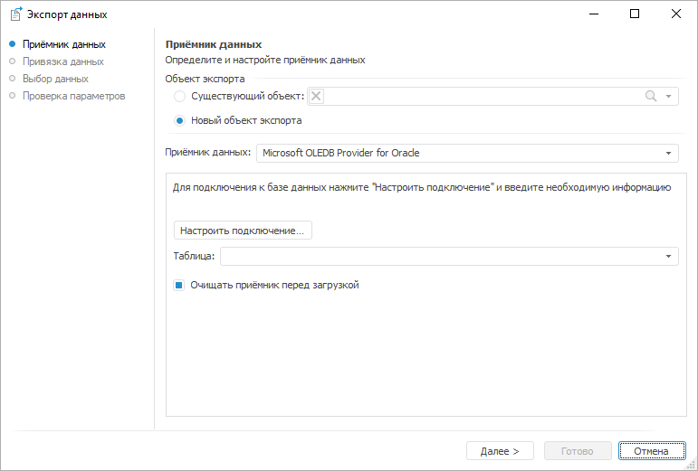
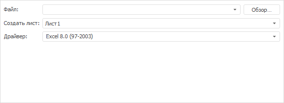
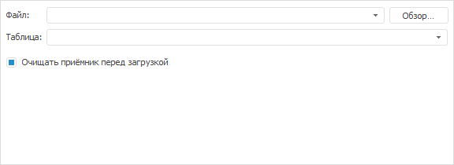
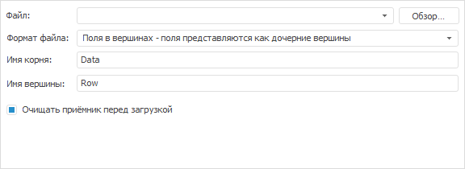
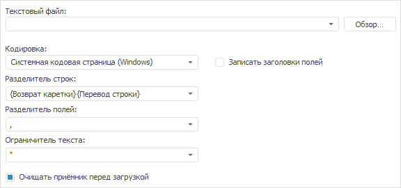

# Выбор приёмника данных

Выбор приёмника данных
-

# Выбор приёмника данных

На странице «Приёмник данных»
 выберите приёмник данных и укажите его параметры:

Общие параметры для всех типов источников данных:

	- Объект экспорта. Укажите,
	 использовать существующий объект экспорта или создать новый:

	-

		- Существующий запрос.
		 Выберите ранее созданный объект экспорта;

		- Создать новый запрос.
		 Будет создан новый объект экспорта;

	- Приёмник данных. Выберите
	 тип приёмника данных. После выбора типа будут отображены параметры
	 для его настройки. Набор параметров зависит от типа приёмника.

Укажите настройки приёмника и нажмите кнопку «Далее»
 для перехода на страницу «[Привязка
 данных](UiDw_Export3.htm)».

## Параметры для настройки приёмников различных типов

[Microsoft
 OLEDB Provider for Oracle](javascript:TextPopup(this))

	Вид страницы «Приёмник данных»
	 при выборе приёмника данного типа приведен выше.

	Задайте параметры:

		- Настроить подключение.
		 Нажмите кнопку. Будет открыт диалог для настройки подключения
		 к БД Oracle, в которую будут выгружены данные. За подробной информацией
		 по работе с диалогом обратитесь к документации Windows;

		- Таблица. Укажите
		 таблицу БД, в которую будут выгружены данные;

		- Очищать приёмник перед
		 загрузкой. Определяет, удалять ли всю информацию из приёмника
		 перед выполнением загрузки данных. По умолчанию флажок установлен
		 и приёмник очищается перед загрузкой данных.

[Microsoft OLEDB
 Provider for SQL Server](javascript:TextPopup(this))

	Параметры приёмника данных совпадают с параметрами для приёмника
	 типа «[Microsoft OLEDB Provider for Oracle](UiDw_Export2.htm#oledb_oracle)».

[Microsoft Excel
 (*.xls; *.xlsx)](javascript:TextPopup(this))

	Задайте параметры:

	

		- Файл. Укажите файл
		 Microsoft Excel, в который будут выгружены данные;

		- Создать лист. Укажите
		 лист, на который будут выгружены данные;

		- Драйвер. Укажите
		 драйвер Microsoft Excel, соответствующий выбранному файлу.

	Примечание.
	 Выбор драйвера доступен только для файлов в формате XLS.

[Microsoft Access
 (*mdb; *.accdb)](javascript:TextPopup(this))

	Задайте параметры:

	

		- Файл. Укажите файл
		 БД Microsoft Access, в который будут выгружены данные;

		- Таблица. Укажите
		 таблицу БД, в которую будут выгружены данные;

		- Очищать приёмник перед
		 загрузкой. Определяет, удалять ли всю информацию из приёмника
		 перед выполнением загрузки данных. По умолчанию флажок установлен
		 и приёмник очищается перед загрузкой данных.

[Microsoft XML
 (*.xml)](javascript:TextPopup(this))

	Задайте параметры:

	

		- Файл. Укажите XML-файл,
		 в который будут выгружены данные;

		- Формат файла. Укажите
		 формат данных, который будет использован для выгрузки данных в
		 XML-файл:

		-

			- Поля в вершинах.
			 Поля представлены как дочерние вершины;

			- Поля в атрибутах.
			 Поля представлены как атрибуты;

		- Имя корня. Укажите
		 наименование корневого элемента в XML-файле;

		- Имя вершины. Укажите
		 наименование элемента, в который будут выгружены данные;

		- Очищать приёмник перед
		 загрузкой. Определяет, удалять ли всю информацию из приёмника
		 перед выполнением загрузки данных. По умолчанию флажок установлен
		 и приёмник очищается перед загрузкой данных.

[Текстовый файл
 (*.txt; *.csv)](javascript:TextPopup(this))

	Задайте параметры:

	

		- Текстовый файл.
		 Укажите файл, в который будут выгружены данные.

		Каждая строка файла будет являться набором полей, отделяемых друг
		 от друга символом-разделителем. Начало и окончание текста каждого
		 поля обозначается символом-ограничителем;

		- Кодировка. Укажите
		 кодировку файла;

		- Записать заголовки полей.
		 Для выгрузки в файл наименований полей установите данный флажок.
		 По умолчанию флажок снят и в файл выгружаются только данные;

		- Разделитель строк.
		 Выберите или введите символ, разделяющий строки в файле;

		- Разделитель полей.
		 Выберите или введите символ, разделяющий поля в файле;

		- Ограничитель текста.
		 Выберите или введите символ, ограничивающий поля в файле;

		- Очищать приёмник перед
		 загрузкой. Определяет, удалять ли всю информацию из приёмника
		 перед выполнением загрузки данных. По умолчанию флажок установлен
		 и приёмник очищается перед загрузкой данных.

[Другой](javascript:TextPopup(this))

	Параметры приёмника данных совпадают с параметрами для приёмника
	 типа «[Microsoft OLEDB Provider for Oracle](UiDw_Export2.htm#oledb_oracle)».

См. также:

[Экспорт
 данных](UiDw_Export.htm)

		Справочная
		 система на версию 10.9
		 от 18/08/2025,
		 © ООО «ФОРСАЙТ»,
