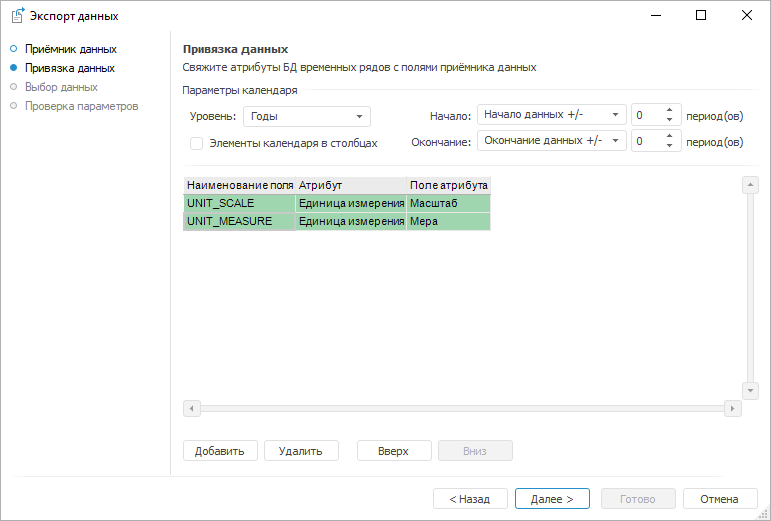
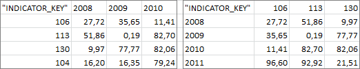

# Привязка данных

Привязка данных
-

# Привязка данных

На странице «Привязка данных»
 укажите соответствие между полями приёмника данных и атрибутами БД временных
 рядов.

Привязка данных состоит из следующих этапов:

	- Настройка параметров календаря.

	- Сопоставление атрибутов источника и приёмника данных.

Настройте привязку данных и нажмите кнопку «Далее»
 для перехода на страницу «[Выбор
 данных](UiDw_Export4.htm)».

## Настройка параметров календаря

Для настройки параметров календаря используйте группу «Параметры
 календаря». Задайте следующие настройки:

	- Уровень. Укажите календарную
	 динамику выгружаемых данных;

	- Элементы календаря в столбцах.
	 Укажите расположение элементов календаря в приёмнике данных. Элементы
	 могут быть расположены в строках или столбцах.

	Например, на изображении слева элементы календаря расположены в столбцах,
	 на изображении справа - в строках:

Если элементы календаря должны быть расположены
 в столбцах, то установите флажок «Элементы
 календаря в столбцах». По умолчанию флажок снят и элементы расположены
 в строках;

		- Начало/Окончание.
		 Задайте способ расчета даты начала и окончания периода выгрузки
		 данных:

		-

			- Начало/окончание
			 данных +/-. Используется по умолчанию. Дата равна первой/последней
			 фактической дате временного ряда плюс число периодов, указанных
			 в соответствующем редакторе чисел;

			- Определенная
			 дата. Дата указывается в соответствующем редакторе
			 дат;

			- Сегодня
			 +/-. Дата равна текущему числу плюс число периодов,
			 указанных в соответствующем редакторе чисел;

Примечание.
 Дата начала периода должна быть меньше даты окончания периода.

## Сопоставление атрибутов источника и приёмника данных

Для сопоставления атрибутов используйте таблицу. Для каждого экспортируемого
 атрибута выполните следующие действия:

	- Добавьте в таблицу новую строку. Нажмите кнопку «Добавить»
	 или выполните одноименную команду в контекстном меню;

	- Укажите экспортируемый атрибут текущей БД временных рядов. Используйте
	 ячейку в столбце «Атрибут».
	 Для выбора доступны только строковые атрибуты временных рядов или
	 атрибуты временных рядов, являющиеся ссылкой на справочник;

	- Укажите атрибут справочника НСИ, значения которого должны быть
	 экспортированы. Используйте ячейку в столбце «Поле».
	 Шаг актуален, если выбранный атрибут является ссылкой на справочник
	 НСИ;

	- Задайте наименование поля в приёмнике данных, в которое будет
	 выгружено значение атрибута. Используйте ячейку в столбце «Наименование
	 поля». По умолчанию наименование поля генерируется автоматически
	 после выполнения предыдущих шагов.

Атрибуты будут выгружены в приёмник в том порядке, в котором они следуют
 в таблице. Для изменения порядка следования атрибутов используйте кнопки
 «Вверх»/«Вниз» или
 одноименные команды в контекстном меню.

Для удаления привязки атрибута выделите его в таблице и нажмите кнопку
 «Удалить» или выполните одноименную
 команду в контекстном меню. Будет запрошено подтверждение выполняемого
 действия.

См. также:

[Экспорт
 данных](UiDw_Export.htm)

		Справочная
		 система на версию 10.9
		 от 18/08/2025,
		 © ООО «ФОРСАЙТ»,
