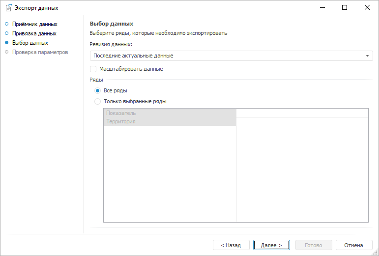

# Выбор данных

Выбор данных
-

# Выбор данных

На странице «Выбор данных» выберите
 данные, которые будут экспортированы:

Задайте параметры:

	- Ревизия данных. Укажите
	 [ревизию](../Revision/Revision_Work.htm) (версию) экспортируемых
	 данных. По умолчанию выгружаются последние актуальные данные;

Примечание.
 Выбор ревизии актуален, если экспортируемая БД временных рядов [версионная](../Revision/Revision_Work.htm).

	- Масштабировать данные.
	 Укажите, выполнять ли масштабирование данных. Масштабирование
	 - это приведение данных к одному масштабу единиц измерения (нормализация).

	По умолчанию флажок снят и масштабирование не выполняется. Данные каждого
	 временного ряда экспортируются с установленным для него масштабом
	 единиц измерения. В результате, выгруженные данные могут быть неоднородны.
	 При установленном флажке экспортируемые данные масштабируются;

	- Ряды. Укажите набор
	 экспортируемых временных рядов:

		- Все ряды. Экспортируются
		 все временные ряды, содержащиеся в БД;

		- Только выбранные ряды.
		 Набор экспортируемых рядов ограничивается: выгружаются только
		 ряды с определенными значениями атрибутов. Укажите значения для
		 требуемых атрибутов. Если значение атрибута не задано, то экспортированы
		 будут ряды со всеми значениями данного атрибута.

Укажите параметры данных, которые необходимо экспортировать, и нажмите
 кнопку «Далее» для перехода на
 страницу «[Проверка
 параметров](UiDw_Export5.htm)».

См. также:

[Экспорт
 данных](UiDw_Export.htm)

		Справочная
		 система на версию 10.9
		 от 18/08/2025,
		 © ООО «ФОРСАЙТ»,
