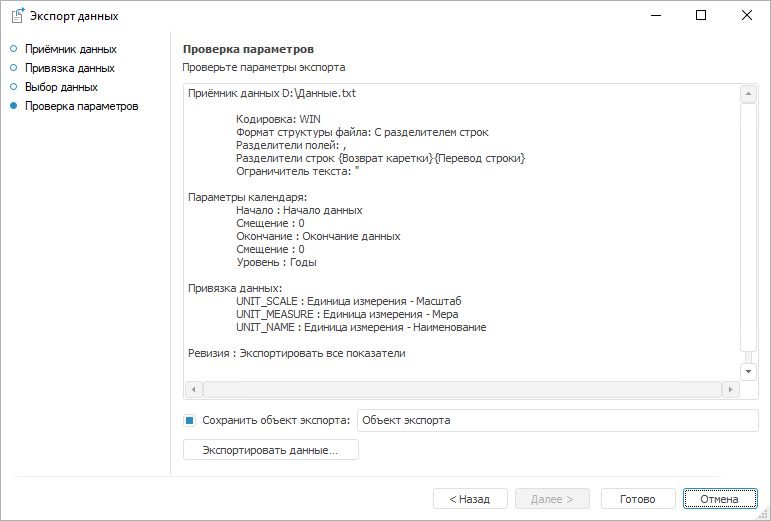

# Выполнение экспорта

Выполнение экспорта
-

# Выполнение экспорта

На странице «Проверка параметров» отображает
 заданные настройки и предназначена для выполнения экспорта данных.

Для сохранения текущего объекта экспорта установите флажок «Сохранить
 объект экспорта» и укажите его наименование в соответствующем поле.

Примечание.
 Если используется существующий объекта экспорта, то он будет перезаписан,
 а не создан заново.

Для запуска экспорта данных нажмите кнопку «Экспортировать
 данные». Если в процессе экспорта возникнут ошибки, то будет отображено
 соответствующее сообщение.

Закончите экспорт данных и нажмите кнопку «Готово»
 для закрытия объекта «Экспорт данных».

См. также:

[Экспорт
 данных](UiDw_Export.htm)

		Справочная
		 система на версию 10.9
		 от 18/08/2025,
		 © ООО «ФОРСАЙТ»,
