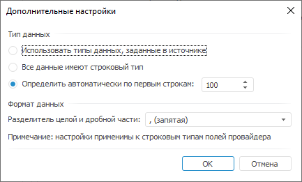

# Дополнительные настройки

Дополнительные настройки
-

# Дополнительные настройки

Диалог «Дополнительные настройки»
 предназначен для задания настроек типа и формата импортируемых данных.

Примечание.
 Дополнительные настройки типа и формата импортируемых данных доступны
 для всех источников данных, кроме базы данных временных рядов.

[Для открытия
 диалога](javascript:TextPopup(this))

		- Перейдите на страницу «[Источник данных](uidw.chm::/import/Data_Source.htm)»
		 в объекте импорта.

		- Нажмите кнопку «Настройки»/«Дополнительные настройки».

Задайте параметры:

	- Тип данных. Выберите
	 способ определения типа данных:

		- Использовать типы данных,
		 заданные в источнике. Типы данных будут получены из источника
		 и преобразованы к типам, используемым в «Форсайт. Аналитическая платформа»;

		Примечание.
		 Способ «Использовать типы данных,
		 заданные в источнике» доступен для источников данных: Microsoft
		 OLEDB Provider for Oracle, Microsoft OLEDB Provider for SQL Server,
		 Microsoft Access (*mdb), Другой.

		- Все данные имеют строковый
		 тип. Типы данных будут получены из источника и преобразованы
		 к строковому типу;

		- Определить автоматически
		 по первым строкам. Типы данных будут определяться по указанному
		 количеству строк n:

			- если в первых n ячейках содержатся
			 данные разных типов, то при импорте используется тип, который
			 чаще всего встречается. Значения всех других типов заменяются
			 пустыми значениями;

			- если в первых n ячейках содержатся
			 данные одного типа, то данный тип используется при импорте.
			 Значения всех других типов заменяются пустыми значениями;

	- Формат данных. Задайте
	 формат данных для преобразования данных строкового типа к вещественному
	 при выборе способа определения типа данных «Определить автоматически по первым строкам»:

		- Разделитель целой и дробной
		 части. Выберите разделитель целой и дробной части, который
		 будет использоваться для идентификации вещественных чисел:

			- , (запятая);

			- . (точка).

См. также:

[Настройка источника](Data_Source.htm)

		Справочная
		 система на версию 10.9
		 от 18/08/2025,
		 © ООО «ФОРСАЙТ»,
