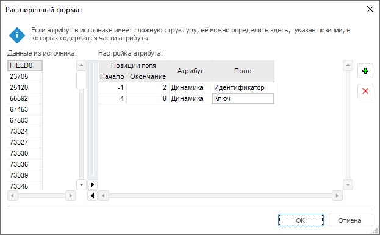

# Настройка формата атрибутов

Настройка формата атрибутов
-

# Настройка формата атрибутов

Настройка формата атрибутов выполняется с помощью диалога «Расширенный формат» и определяет
 параметры разбора составного атрибута, использованного в источнике данных.

Для отображения диалога укажите атрибут «Специальный»
 для столбца, содержащего составной атрибут, на странице «[Привязка данных](Data_Binding.htm)».

В таблице «Данные из источника»
 отображаются значения составного атрибута.

Для настройки формата составного атрибута используйте таблицу «Настройка атрибута». Сопоставьте
 атрибуты текущей БД временных рядов и части составного атрибута:

	- Добавьте в таблицу новую строку. Нажмите кнопку 
	 «Добавить» или выполните команду
	 «Добавить» в контекстном меню;

	- Укажите атрибут текущей БД временных рядов, соответствующий
	 части значения атрибута из источника данных. Используйте ячейку в
	 столбце «Атрибут». Для выбора
	 доступны только строковые атрибуты временных рядов или атрибуты временных
	 рядов, являющиеся ссылкой на справочник;

	- Укажите атрибут справочника НСИ, значения которого содержатся
	 в части составного атрибута. Используйте ячейку в столбце «Поле».
	 Шаг актуален, если выбранный атрибут является ссылкой на справочник
	 НСИ;

	- Укажите порядковый номер символа, с которого начинается значение
	 атрибута БД временных рядов и номер символа, в котором значение заканчивается.
	 Используйте ячейки «Начало»/«Окончание»
	 в столбце «Позиция поля» Нумерация
	 символов начинается с нуля. Если граница не определена, то укажите
	 значение «-1»;

	- Если требуется, то повторите шаги для сопоставления еще одного
	 атрибута временных рядов.

Для удаления настроек атрибута временных рядов выделите его в таблице
 «Настройка атрибута» и нажмите
 кнопку  «Удалить»
 или выполните команду «Удалить»
 в контекстном меню. Будет запрошено подтверждение выполняемого действия.

См. также:

[Привязка данных](Data_Binding.htm) | [Импорт
 данных](Import.htm)

		Справочная
		 система на версию 10.9
		 от 18/08/2025,
		 © ООО «ФОРСАЙТ»,
