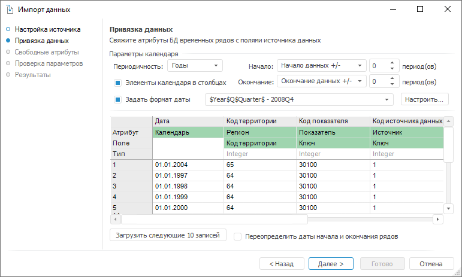

# Привязка данных

Привязка данных
-

# Привязка данных

На странице «Привязка данных»
 укажите соответствие между полями источника данных и атрибутами БД временных
 рядов.

Примечание.
 Если источник данных - БД временных рядов, то привязка данных выполняется
 аналогично [сопоставлению свободных
 атрибутов](Non-Binding_Attributes.htm).

Привязка данных состоит из следующих этапов:

	- Настройка параметров календаря.

	- Сопоставление атрибутов источника и приёмника данных.

Свяжите параметры БД временных рядов с полями источника данных и нажмите
 кнопку «Далее» для перехода на
 страницу «[Свободные
 атрибуты](Non-Binding_Attributes.htm)».

## Настройка параметров календаря

Для настройки параметров календаря используйте группу «Параметры
 календаря». Задайте следующие настройки:

	- Периодичность. Укажите
	 календарную динамику загружаемых данных;

	- Элементы календаря в столбцах.
	 Укажите расположение элементов календаря в источнике данных. Элементы
	 могут быть расположены в строках или столбцах.

	Например, на изображении слева элементы календаря расположены в столбцах,
	 на изображении справа - в строках:

Если элементы календаря расположены в строках,
 то снимите флажок «Элементы календаря
 в столбцах»; если элементы расположены в столбцах, то установите
 флажок и задайте дополнительные параметры:

	-

		- Начало/Окончание.
		 Задайте способ расчета даты начала и окончания периода загрузки
		 данных:

		-

			- Начало/окончание данных
			 +/-. Используется по умолчанию. Дата равна первой/последней
			 фактической дате временного ряда плюс число периодов, указанных
			 в соответствующем редакторе чисел;

			- Определённая дата.
			 Дата указывается в соответствующем редакторе дат;

			- Сегодня +/-.
			 Дата равна текущему числу плюс число периодов, указанных в
			 соответствующем редакторе чисел;

Примечание.
 Дата начала периода должна быть меньше даты окончания периода.

	-

		- Задать формат даты.
		 Для настройки параметров разбора формата даты, использованного
		 в источнике данных, установите флажок «Задать
		 формат даты». Выберите в списке один из использовавшихся
		 ранее форматов. Для настройки нового формата нажмите кнопку «Настроить». Будет открыт диалог
		 «[Формат
		 даты](Date_Format.htm)», в котором задайте требуемые настройки.

Для расширения границ календаря текущей БД временных рядов в соответствии
 с загружаемыми данными установите флажок «Переопределить
 даты начала и окончания рядов». По умолчанию флажок снят и данные,
 выходящие за границы календаря, не будут импортированы.

## Сопоставление атрибутов источника и приёмника данных

Сопоставление атрибутов источника и приёмника данных выполняется с помощью
 таблицы, содержащей записи из источника данных. Используйте строки шапки:

	- Атрибут. Выберите атрибут
	 БД временных рядов, значения которого содержатся в столбце. Список
	 содержит все пользовательские атрибуты временных рядов и наблюдений
	 и дополнительные атрибуты:

	-

		- Единица измерения.
		 Атрибут, определяющий единицу измерения данных;

		- Значение. Атрибут,
		 определяющий значения наблюдений временного ряда;

		- Специальный. Атрибут,
		 позволяющий настроить разбор формата составных данных. Например,
		 в источнике один атрибут определяет наименование и код страны:
		 «RUS.7» или «FRA.33».
		 В данном случае необходимо привязать атрибуты временных рядов
		 к частям атрибута источника. Используйте диалог «[Расширенный
		 формат](Attributes_Format.htm)», который будет открыт автоматически при выборе атрибута
		 «Специальный»;

		- Календарь. Атрибут,
		 определяющий значения календаря. Используется, если элементы календаря
		 расположены в строках;

	- Поле. Строка используется,
	 если выбранный атрибут является ссылкой на справочник НСИ. Укажите
	 атрибут справочника НСИ, значения которого содержатся в столбце;

	- Тип. Информационная
	 строка, отображающая тип данных выбранного атрибута.

По умолчанию в таблице содержатся первые 10 записей, загруженные из
 источника данных. Для загрузки следующих записей нажмите кнопку «Загрузить следующие 10 записей».
 Кнопка доступна, если в источнике остались незагруженные записи.

## Особенности привязки данных

	- Поле источника данных и атрибут временных рядов будут привязаны
	 автоматически, если в их наименованиях присутствуют вхождения одинаковых
	 слов;

	- Особенности привязки, если элементы календаря расположены в
	 столбцах источника данных:

	-

		- после привязки двух столбцов к атрибуту «Значение»
		 все последующие столбцы автоматически привязываются к данному
		 атрибуту;

		- если в источнике данных значения наблюдений следуют после
		 каждого столбца со значениями временных рядов, то после последовательной
		 привязки столбцов к атрибутам «Значение»,
		 атрибут наблюдения, «Значение»
		 все последующие столбцы будут автоматически привязаны к данным
		 атрибутам.

См. также:

[Импорт данных](Import.htm)

		Справочная
		 система на версию 10.9
		 от 18/08/2025,
		 © ООО «ФОРСАЙТ»,
