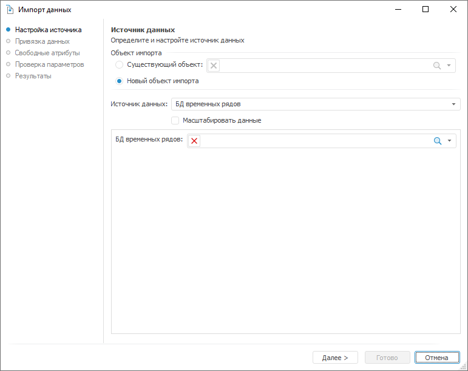
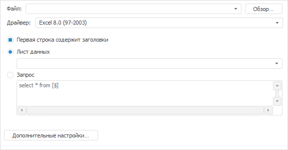
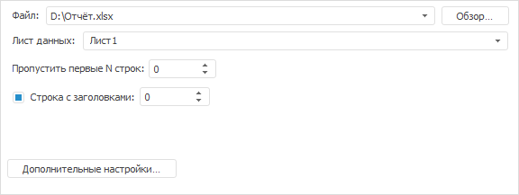
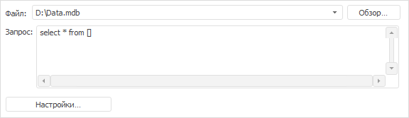
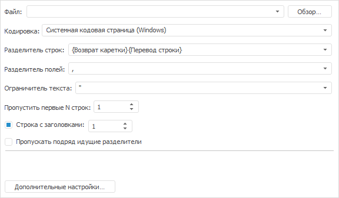

# Настройка источника

Настройка источника
-

# Настройка источника

На странице «Источник данных»
 выберите источник данных и укажите его параметры:

Общие параметры для всех типов источников данных:

	- Объект импорта. Укажите,
	 использовать существующий объект импорта или создать новый:

	-

		- Существующий объект.
		 Выберите ранее созданный объект импорта;

		- Новый объект импорта.
		 Будет создан новый объект импорта;

	- Источник данных. Выберите
	 тип источника данных. После выбора типа будут отображены параметры
	 для его настройки. Набор параметров зависит от типа источника;

	- Масштабировать данные.
	 Укажите, выполнять ли масштабирование данных. Масштабирование - это
	 приведение данных к одному масштабу единиц измерения (нормализация).

	По умолчанию флажок снят и масштабирование не выполняется. Данные каждого
	 временного ряда импортируются с установленным для него масштабом единиц
	 измерения. В результате, импортированные данные могут быть неоднородны.
	 При установленном флажке импортируемые данные масштабируются.

Укажите параметры источника данных и нажмите кнопку «Далее»
 для перехода на страницу «[Привязка
 данных](Data_Binding.htm)».

## Параметры для настройки источников различных типов

[БД временных
 рядов](javascript:TextPopup(this))

	Вид страницы «Источник данных»
	 при выборе источника данного типа приведен выше.

	В поле «БД временных рядов»
	 укажите БД временных рядов, из которой будут импортированы данные.

[Microsoft
 OLEDB Provider for Oracle](javascript:TextPopup(this))

	Задайте параметры:

	

		- Настроить подключение.
		 Нажмите кнопку. Будет открыт диалог для настройки подключения
		 к БД Oracle, из которой будут импортированы данные. За подробной
		 информацией по работе с диалогом обратитесь к документации Microsoft
		 Windows;

		- Запрос. Введите
		 запрос для выборки данных из подключенной БД;

		- Дополнительные настройки.
		 Нажмите кнопку. Будет открыт диалог «[Дополнительные настройки](Additional_Settings.htm)»,
		 в котором задайте настройки типа и формата импортируемых данных;

		- Просмотр данных.
		 Нажмите кнопку. Будет открыт диалог для предварительного просмотра
		 данных, загруженных по заданным настройкам.

[Microsoft OLEDB
 Provider for SQL Server](javascript:TextPopup(this))

	Параметры источника данных совпадают с параметрами для источника
	 типа «[Microsoft OLEDB Provider for Oracle](Data_Source.htm#oledb_oracle)».

[Microsoft Excel
 (*.xls; *.xlsx)](javascript:TextPopup(this))

	В поле «Файл» укажите файл
	 Microsoft Excel, из которого будут импортированы данные. Параметры
	 импорта зависят от версии Microsoft Excel, в которой был создан файл.

	Параметры импорта из файла Microsoft
	 Excel версий 3.0, 4.0, 5.0, 8.0 (97-2003):

	

	Укажите параметры импорта:

		- Драйвер. Укажите
		 драйвер, соответствующий версии выбранного файла;

	Примечание.
	 Параметры импорта для драйверов «Excel 3.0», «Excel 4.0», «Excel
	 5.0», «Excel 8.0 (97-2003) приведены ниже. Параметры импорта для драйвера
	 «ExcelEx» совпадают с параметрами импорта из файла Microsoft Excel
	 версии 2007 и выше.

		- Первая строка содержит
		 заголовки. Укажите, содержит ли первая строка листа заголовки
		 столбцов. Если на листе присутствуют заголовки, то установите
		 флажок. Это позволит исключить заголовки из данных для импорта.
		 Если на листе отсутствуют заголовки, то снимите флажок;

		- Способ получения данных:

			- Лист данных.
			 Укажите лист, содержащий данные для импорта. По умолчанию
			 выбран первый лист;

			- Запрос. Введите
			 запрос для выборки данных из файла;

		- Дополнительные настройки.
		 Нажмите кнопку. Будет открыт диалог «[Дополнительные настройки](Additional_Settings.htm)»,
		 в котором задайте настройки типа и формата импортируемых данных.

	Параметры импорта из файла Microsoft
	 Excel версии 2007 и выше:

	

	Укажите параметры импорта:

		- Лист данных. Укажите
		 лист, содержащий данные для импорта. По умолчанию выбран первый
		 лист;

		- Пропустить первые N строк.
		 Укажите количество строк, которые необходимо пропустить при импорте.
		 По умолчанию указан «0», то есть данные будут импортированы с
		 начала листа;

		- Строка с заголовками.
		 Укажите, содержит ли лист данных заголовки столбцов. Если на листе
		 присутствуют заголовки, то установите флажок и укажите номер строки,
		 содержащей заголовки. Это позволит исключить заголовки из данных
		 для импорта. Если на листе отсутствуют заголовки, то снимите флажок;

	Примечание.
	 Если флажок «Строка с заголовками»
	 установлен и указана нулевая строка, то считается, что заголовки отсутствуют.

		- Дополнительные настройки.
		 Нажмите кнопку. Будет открыт диалог «[Дополнительные настройки](Additional_Settings.htm)»,
		 в котором задайте настройки типа и формата импортируемых данных.

[Microsoft Access
 (*mdb; *.accdb)](javascript:TextPopup(this))

	Задайте параметры:

	

		- Файл. Укажите файл
		 БД Microsoft Access, из которого будут импортированы данные;

		- Запрос. Введите
		 запрос для выборки данных указанной БД;

		- Настройки. Нажмите
		 кнопку. Будет открыт диалог «[Дополнительные настройки](Additional_Settings.htm)»,
		 в котором задайте настройки типа и формата импортируемых данных;

		- Просмотр данных.
		 Нажмите кнопку. Будет открыт диалог для предварительного просмотра
		 данных, загруженных по заданным настройкам.

[Microsoft XML
 (*.xml)](javascript:TextPopup(this))

	Задайте параметры:

	

		- Файл. Укажите XML-файл
		 с данными, из которого будут импортированы данные;

		- Формат. Укажите
		 формат данных, используемый в XML-файле:

			- Поля в вершинах.
			 Поля представлены как дочерние вершины;

			- Поля в атрибутах.
			 Поля представлены как атрибуты;

		- Х-Path запрос. Введите
		 запрос для выборки данных указанного файла. Формат запроса зависит
		 от структуры файла. За более подробной информацией о формировании
		 XPath-запросов обратитесь к дополнительной документации, например
		 в MSDN;

		- Настройки. Нажмите
		 кнопку. Будет открыт диалог «[Дополнительные настройки](Additional_Settings.htm)»,
		 в котором задайте настройки типа и формата импортируемых данных;

		- Просмотр данных.
		 Нажмите кнопку. Будет открыт диалог для предварительного просмотра
		 данных, загруженных по заданным настройкам.

[Текстовый
 файл (*.txt; *.csv)](javascript:TextPopup(this))

	Задайте параметры:

	

		- Файл. Укажите текстовый
		 файл, из которого будут импортированы данные.

		Считается, что каждая строка файла является набором полей, отделяемых
		 друг от друга символом-разделителем. Начало и окончание текста
		 каждого поля обозначается символом-ограничителем;

		- Кодировка. Укажите
		 кодировку файла;

		- Разделитель строк.
		 Выберите или введите символ, разделяющий строки в файле;

		- Разделитель полей. Выберите
		 или введите символ, разделяющий поля в файле;

		- Ограничитель текста.
		 Выберите или введите символ, ограничивающий поля в файле;

		- Пропустить первые N строк.
		 Укажите количество строк, которые необходимо пропустить при импорте.
		 По умолчанию указана «1», то есть данные будут с первой строки;

		- Строка с заголовками.
		 Укажите, содержит ли файл заголовки. Если файл содержит заголовки,
		 то установите флажок и укажите строку, их содержащую. Это позволит
		 исключить заголовки из данных для импорта. Если в файле отсутствуют
		 заголовки, то снимите флажок.

	Примечание.
	 Если флажок установлен и указана нулевая строка, то считается, что
	 заголовки отсутствуют.

		- Пропускать подряд идущие
		 разделители. Если флажок установлен, то подряд идущие разделители
		 будут исключены из импорта;

		- Дополнительные настройки.
		 Нажмите кнопку. Будет открыт диалог «[Дополнительные настройки](Additional_Settings.htm)»,
		 в котором задайте настройки типа и формата импортируемых данных.

[Буфер обмена](javascript:TextPopup(this))

	Параметры источника данных совпадают с параметрами для источника
	 типа «[Текстовый
	 файл](Data_Source.htm#text)».

[Другой](javascript:TextPopup(this))

	Параметры источника данных совпадают с параметрами для источника
	 типа «[Microsoft OLEDB Provider for Oracle](Data_Source.htm#oledb_oracle)».

См. также:

[Импорт данных](Import.htm)

		Справочная
		 система на версию 10.9
		 от 18/08/2025,
		 © ООО «ФОРСАЙТ»,
