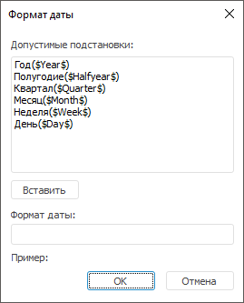

# Настройка формата даты

Настройка формата даты
-

# Настройка формата даты

Настройка формата даты выполняется с помощью диалога «Формат
 даты» и определяет параметры разбора даты, использованной в источнике
 данных.

Примечание.
 Настройка формата даты выполняется, если элементы календаря расположены
 в столбцах источника данных.

Для отображения диалога нажмите кнопку «Настроить»
 на странице «[Привязка
 данных](Data_Binding.htm)» в мастере [импорта данных](Import.htm).

Для формирования формата даты используйте поле «Формат
 даты». В формате допускается использование:

	- любых символов, вводимых с клавиатуры;

	- подстановок из списка «Допустимые
	 подстановки». Для вставки выбранной подстановки:

	-

		- нажмите кнопку «Вставить»;

		- дважды щелкните по подстановке.

Подстановка будет вставлена в конец формата
 даты.

Созданный формат даты отображается в поле «Пример».

Не допускаются следующие сочетания в шаблоне:

	- квартал и месяц;

	- полугодие и месяц;

	- полугодие и квартал;

	- полугодие и неделя;

	- неделя и день;

	- квартал и неделя;

	- месяц и неделя.

См. также:

[Привязка данных](Data_Binding.htm) | [Импорт
 данных](Import.htm)

		Справочная
		 система на версию 10.9
		 от 18/08/2025,
		 © ООО «ФОРСАЙТ»,
