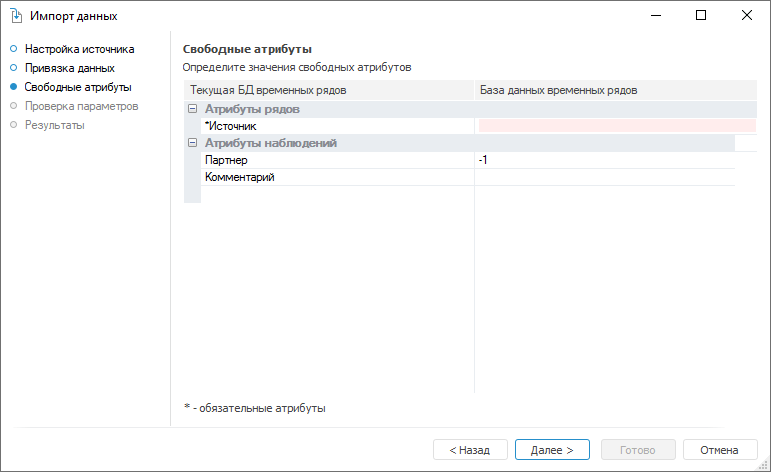

# Сопоставление свободных атрибутов

Сопоставление свободных атрибутов
-

# Сопоставление свободных атрибутов

На странице «Свободные атрибуты»
 укажите значения атрибутов, которым не было сопоставлено ни одно поле
 источника данных.

Атрибуты временных рядов и атрибуты наблюдений разделены по соответствующим
 группам. Обязательно должны быть указаны значения атрибутов, отмеченных
 звездочкой.

Определите значения свободных атрибутов и нажмите кнопку «Далее»
 для перехода на страницу «[Проверка
 параметров](Options_Review.htm)».

См. также:

[Импорт данных](Import.htm)

		Справочная
		 система на версию 10.9
		 от 18/08/2025,
		 © ООО «ФОРСАЙТ»,
