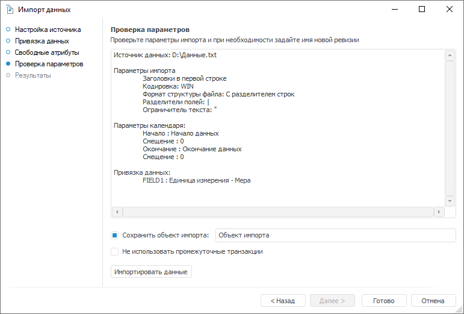

# Проверка параметров

Проверка параметров
-

# Выполнение импорта

Страница «Проверка параметров»
 отображает заданные настройки и предназначена для выполнения импорта данных.

Для сохранения текущего объекта импорта установите флажок «Сохранить
 объект импорта» и укажите его наименование в соответствующем поле.

Примечание.
 Если используется существующий объекта импорта, то он будет перезаписан,
 а не создан заново.

Для выполнения импорта в рамках одной транзакции установите флажок «Не использовать промежуточные транзакции».
 Это позволит избежать получения пользователями неполных данных, извлеченных
 из базы данных временных рядов во время выполнения импорта. Рекомендуется
 использовать, если с базой данных временных рядов одновременно работают
 несколько пользователей.

Для запуска импорта данных нажмите кнопку «Импортировать
 данные». После окончания импорта будет открыта страница «[Результаты](Results.htm)».

См. также:

[Импорт данных](Import.htm)

		Справочная
		 система на версию 10.9
		 от 18/08/2025,
		 © ООО «ФОРСАЙТ»,
