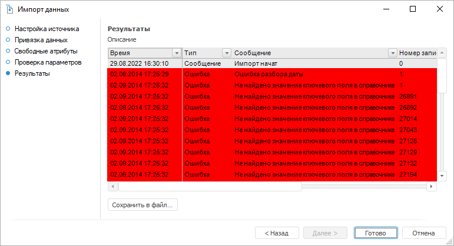

# Просмотр результатов

Просмотр результатов
-

# Просмотр результатов

На странице «Результаты» отображается
 отчет о результатах произведенного импорта данных.

Отчет представлен в виде таблицы:

	- Время;

	- Тип. Тип записи: предупреждение,
	 ошибка;

	- Сообщение. Текст сообщения;

	- Номер записи. Номер
	 записи в источнике данных;

	- Индекс поля. Номер записи
	 в отчете.

Если импорт не был произведен, то на странице будет отображен только
 текст ошибки.

Для сохранения отчёта об импорте в текстовый файл нажмите кнопку «Сохранить в файл». Будет открыт
 диалог сохранения объекта.

Закончите просмотр результатов импорта данных и нажмите кнопку «Готово» для закрытия объекта «Импорт данных».

См. также:

[Импорт данных](Import.htm)

		Справочная
		 система на версию 10.9
		 от 18/08/2025,
		 © ООО «ФОРСАЙТ»,
