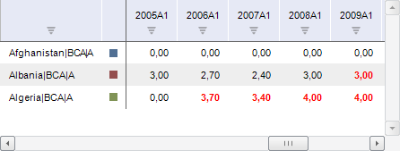

# Работа с временными рядами

Работа с временными рядами
-

# Создание и настройка временных
 рядов

Временной ряд - это совокупность наблюдений ряда, характеризующихся
 уникальным набором значений атрибутов. Каждое наблюдение, входящее в ряд,
 называется точкой ряда. Оно характеризуется временем наблюдения, его значением,
 а также рядом дополнительных характеристик.

Для начала работы с временными рядами требуется [создать
 новую](../Workbook/UiDw_Woorkbook.htm#new_wbk) рабочую книгу и указать для неё [источник
 данных](../Purpose/UiDw_Purpose_Object.htm), либо [открыть
 существующую](../Workbook/UiDw_Woorkbook.htm#open_wbk) рабочую книгу с заданным источником данных. В одной рабочей
 книге могут содержаться ряды из нескольких источников данных.

## Базовые операции с временными рядами

[Добавление
 ряда на лист рабочей книги](javascript:TextPopup(this))

	Для добавления ряда на лист рабочей книги:

		- дважды щелкните по ряду в [дереве
		 рядов](../Purpose/UiDw_Purpose_Object.htm);

		- перетащите ряд из дерева рядов на лист рабочей книги. Возможность
		 также доступна в веб-приложении на устройстве с touch-интерфейсом;

	Примечание.
	 Если в настольном приложении при перетаскивании зажата клавиша
	 CTRL, то для ряда, на который был брошен перетаскиваемый ряд, будет
	 создана иерархия.

		- выполните команду «Редактировать» в
		 контекстном меню ряда в [дереве
		 рядов](../Purpose/UiDw_Purpose_Object.htm). Возможность доступна только в настольном приложении.

	Временной ряд будет добавлен на текущий лист рабочей книги.

[Создание временного
 ряда](javascript:TextPopup(this))

	Для создания временного ряда нажмите кнопку  «Добавить ряд», расположенную в группе
	 «Ряды данных» на вкладке «Главная» или «Данные»
	 ленты инструментов. Пустой ряд будет добавлен на лист рабочей книги.

	Подробное описание приведено в разделе «[Создание
	 временного ряда](../Workbook/TimeSerie_Create.htm)».

[Удаление
 ряда с листа рабочей книги](javascript:TextPopup(this))

	Для удаления выделенных рядов с листа рабочей книги выполните команду
	 «Удалить выбранные ряды» в
	 контекстном меню ряда в таблице данных или нажмите клавишу DELETE.

	Также доступно удаление рядов с помощью ленты инструментов:

		- В веб-приложении.
		 Нажмите кнопку  «Удалить», расположенную в группе
		 «Ряды данных» на вкладке
		 «Главная» или «Данные»
		 ленты инструментов;

		- В настольном
		 приложении. Нажмите кнопку 
		 «Удалить», расположенную в
		 группе «Ряды данных» на
		 вкладке «Главная» или
		 «Данные» ленты инструментов,
		 и в раскрывающемся меню кнопки выберите пункт «Удалить
		 из рабочей книги».

	Будет отображен запрос подтверждения выполняемого действия.

[Удаление ряда
 из базы данных](javascript:TextPopup(this))

	Примечание.
	 Возможность доступна только в настольном приложении.

	Выполните команду:

		- «Удалить ряд» в
		 контекстном меню временного ряда в [дереве
		 рядов](../Purpose/UiDw_Purpose_Object.htm);

		- «Удалить из базы данных»
		 в раскрывающемся меню кнопки 
		 «Удалить», расположенную
		 в группе «Ряды данных»
		 на вкладке «Главная» ленты
		 инструментов.

	Будет отображен запрос подтверждения выполняемого действия.

[Перемещение/копирование
 временных рядов/наблюдений](javascript:TextPopup(this))

		- Выберите данные в таблице данных. Для перемещения/копирования:

			- временных рядов целиком.
			 Выделите заголовки рядов;

			- наблюдений.
			 Выделите наблюдения.

		- Выполните команду «Вырезать»/«Копировать» в контекстном меню.

		- Выберите место вставки данных. Для перемещения/копирования
		 данных:

			- в рамках текущего листа.
			 Выберите место вставки данных на текущем листе;

			- между листами.
			 Перейдите на требуемый лист рабочей книги и выберите место
			 вставки данных.

		- Выполните команду «Вставить»
		 в контекстном меню таблицы данных.

	Выделенные данные будут перемещен/скопированы.

	Примечание.
	 Перемещение/копирование листов между листами рабочей книги доступно
	 только в настольном приложении.

[Изменение порядка
 рядов](javascript:TextPopup(this))

	Для изменения порядка рядов, выделенных в таблице данных, нажмите
	 кнопку, расположенную в группе «Ряды
	 данных» на вкладке «Главная»
	 ленты инструментов:

		-  «Вверх»
		 для перемещения выделенных рядов вверх;

		- 
		 «Вниз» для перемещения
		 выделенных рядов вниз.

[Группировка/разгруппировка
 рядов](javascript:TextPopup(this))

	Для объединения в группу рядов, выделенных в таблице данных:

		- нажмите кнопку 
		 «Группировать», расположенную
		 в группе «Ряды данных»
		 на вкладке «Главная» или
		 «Данные» ленты инструментов;

		- выполните команду «Объединить
		 в группу» в контекстном меню выделенных рядов. Возможность
		 доступна только в настольном приложении.

	Выделенные ряды будут объединены в группу.

	Для изменения наименования группы дважды по нему щелкните. Наименование
	 будет переведено в режим редактирования. Задайте новое название группы
	 и нажмите клавишу ENTER.

	Для разъединения выделенной группы на отельные ряды:

		- нажмите кнопку 
		 «Разгруппировать», расположенную
		 в группе «Ряды данных»
		 на вкладке «Главная» или
		 «Данные» ленты инструментов;

		- выполните команду «Разъединить
		 группу» в контекстном меню выделенных рядов. Возможность
		 доступна только в настольном приложении.

	Группа будет разделена на исходные ряды.

[Настройка базовых
 параметров временного ряда](javascript:TextPopup(this))

	Для настройки базовых параметров временного ряда используйте вкладку
	 «[Основные](../Workbook/SidePanel/UiDw_sp_Primary.htm)»
	 на боковой панели.

[Настройка параметров
 нескольких временных рядов](javascript:TextPopup(this))

	При работе в настольном приложении доступна настройка параметров
	 нескольких временных рядов. Для этого:

		- Выделите в рабочей книге временные ряды, для которых требуется
		 задать параметры.

		- Перейдите в группу вкладок «Ряд»
		 на боковой панели.

	В данной группе вкладок будет отображаться вкладка «[Основные](../Workbook/SidePanel/UiDw_sp_Primary.htm)»
	 и вкладки, содержащие общие настройки рядов.

	Значения параметров на вкладках будут устанавливаться следующим
	 образом:

		- в поле «Наименование»
		 будет отображаться значение «Несколько
		 рядов»;

		- если для выделенных временных рядов были заданы разные настройки,
		 для которых предполагается установка флажка, например, «Изменить единицу измерения»
		 и «Применить преобразование»,
		 флажок сменит вид на , в полях будут отображаться
		 значения «Разные единицы»
		 и «Разные преобразования»
		 соответственно.

		При нажатии на флажок значение параметра сбрасывается.

		Для задания одинаковых параметров установите флажок и определите
		 необходимое значение параметра.

		Если для выделенных рядов не были заданы параметры, флажки напротив
		 наименований параметров будут сняты;

		- если для задания параметров не требуется устанавливать флажки,
		 то при несовпадении значений будет отображаться «Несколько
		 значений».

		Подобные значения могут отображаться на вкладке «[Атрибуты ряда](../Workbook/TimeSeries_Attr_Edit.htm)»
		 боковой панели напротив атрибутов рядов.

[Настройка параметров
 метода расчёта](javascript:TextPopup(this))

	Для настройки параметров метода расчёта используйте группу вкладок
	 «[Ряд](../Workbook/CalculatedSeries/UiDw_cs_common.htm)»
	 на боковой панели.

[Настройка периода
 отображения данных](javascript:TextPopup(this))

	Для настройки периода отображения данных используйте группу «Период отображения», расположенную
	 на вкладке «Главная» или «Вид» ленты инструментов:

		- Начало. Дата, начиная
		 с которой отображаются значения рядов;

		- Окончание. Дата,
		 до которой отображаются значения рядов.

	Дата окончания периода должна быть больше даты начала периода.

	Для отображения календаря в обратном порядке, т.е. от более
	 поздних дат к более ранним, нажмите кнопку  «Обратный календарь», расположенную
	 в группе «Период отображения»
	 на вкладке «Главная» или «Вид» ленты инструментов.

## Операции с данными ряда

[Редактирование
 данных ряда](javascript:TextPopup(this))

	Порядок редактирования значений наблюдений ряда:

		- В таблице данных измените значения требуемых наблюдений.

	Для редактирования значений используйте
	 команды в контекстном меню наблюдения или сочетания клавиш: «Копировать» (CTRL+C,
	 CTRL+INSERT), «Вырезать»
	 (CTRL+X, SHIFT+DELETE), «Вставить»
	 (CTRL+V, SHIFT+INSERT).

	Примечание.
	 Контекстное меню доступно только в настольном приложении.

	Ячейки, с измененными значениями, будут
	 подсвечены:

	

		- Сохраните изменения.

	Для изменения стиля оформления ячейки с измененными данными:

		- используйте вкладку «[Область данных](../Workbook/SidePanel/Panel_DataArea.htm)»
		 на боковой панели;

		- выполните команду «Оформление»
		 в контекстном меню ячейки с измененными данными. Будет открыт
		 [диалог
		 форматирования](UiNav.Chm::/GUI/Format.htm)
		 ячейки.

	Возможность изменить стиль оформления доступна только в настольном
	 приложении.

[Сохранение/отмена
 изменений](javascript:TextPopup(this))

	Доступно сохранение:

		- всех изменений.
		 Нажмите кнопку  «Сохранить изменения», расположенную
		 в группе «Редактирование»
		 на вкладке «Данные» ленты
		 инструментов.

		Если источник данных листа [версионный](UiNavObj.chm::/TimeSeriesDatabase/ChooseNSI.htm)[версионный](../../UiNavObj/TimeSeriesDatabase/ChooseNSI.htm),
		 то будет отображен диалог для ввода комментария к текущей версии
		 данных. Данный комментарий будет отображаться при просмотре [истории изменений](../Workbook/UiDw_SeriesHistory.htm)
		 ряда;

		- изменений только для выделенных
		 рядов. Выполните команду «Сохранить
		 выделенные ряды» в контекстном меню ряда. Возможность доступна
		 только в настольном приложении.

	При попытке закрыть рабочую книгу, содержащую несохраненные данные,
	 будет предложено сохранить изменения.

	Также доступно сохранение в рабочую книгу [пользовательских
	 временных рядов](../Workbook/TimeSerie_Create.htm), не имеющих привязки к измерениям базы данных
	 временных рядов.

	Для отмены выполненных изменений нажмите кнопку 
	 «Отменить изменения», расположенную
	 в группе «Редактирование»
	 на вкладке «Данные» ленты
	 инструментов.

[Редактирование
 значений атрибутов ряда](javascript:TextPopup(this))

	Для редактирования значений атрибутов ряда используйте:

		- вкладку «[Атрибуты
		 ряда](../Workbook/TimeSeries_Attr_Edit.htm)» на боковой панели;

		- диалог «[Атрибуты
		 ряда](../Workbook/TimeSeries_Attr_Edit.htm)», доступный только в настольном приложении.

[Редактирование
 значений атрибутов наблюдения](javascript:TextPopup(this))

	Используйте:

		- вкладку «[Атрибуты
		 наблюдения](../Workbook/UiDw_AttributePoint.htm)» на боковой панели;

		- диалог «[Атрибуты
		 наблюдения](../Workbook/UiDw_AttributePoint.htm)», доступный только в настольном приложении.

[Отвязка ряда
 от источника данных](javascript:TextPopup(this))

		- Нажмите кнопку 
		 «Отвязать», расположенную
		 в группе «Ряды данных»
		 на вкладке «Главная» или
		 «Данные» ленты инструментов.

		- Выполните команду «Отвязать
		 выбранные ряды» в контекстном меню ряда в таблице данных.
		 Возможность доступна только в настольном приложении.

	Ряд будет отвязан от источника данных, значения его обязательных
	 атрибутов будут сброшены, данные ряда будут очищены.

[Преобразование
 значений ряда](javascript:TextPopup(this))

	Для выбора [метода
	 преобразования](../Workbook/UiDw_Series_Inversion.htm) значений ряда используйте:

		- список «Применить преобразование»
		 на вкладке боковой панели «[Основные](../Workbook/SidePanel/UiDw_sp_Primary.htm)»;

		- раскрывающееся меню кнопки  «Отобразить
		 как», расположенной в группе «Данные»
		 на вкладке «Главная» или
		 «Данные» ленты инструментов;

		- раскрывающееся подменю пункта «Отобразить
		 как» в контекстном меню ряда. Возможность доступна только
		 в настольном приложении.

	Примечание.
	 Если выбрать метод «Другое преобразование»,
	 то будет открыт диалог «[Редактирование
	 преобразования](../Workbook/UiDw_Series_Inversion.htm#setup)», позволяющий настроить дополнительные параметры
	 преобразования.

	Результаты преобразования будут отображены в текущей рабочей книге.
	 Рассчитанные значения являются временными и недоступны для сохранения
	 в источник данных.

	В настольном приложении доступно преобразование значений ряда по
	 формуле, заданной пользователем:

		- Выполните команду «Применить
		 формулу» в контекстном меню ряда.

		- Будет открыт [редактор
		 выражения](UiNav.Chm::/GUI/ExpressionEditor.htm), в котором задайте формулу преобразования
		 значений ряда.

	Указанная формула будет применена к значениям ряда с учетом [масштабирования](../FAQ/UnitsScale.htm),
	 то есть к значениям, приведённым к одному масштабу единиц измерения.
	 Рассчитанные значения доступны для сохранения в источник данных.

[Настройка
 единиц измерения ряда](javascript:TextPopup(this))

	В источнике данных значения временных рядов могут храниться в различных
	 [единицах
	 изменения](uinavobj.chm::/Units/Units_dbts.htm).
	 Это приводит к неоднородности данных. Для получения однородных данных
	 на листе рабочей книги следует привести все ряды к одной единице измерения.

	Для изменения единиц измерения выделенного ряда:

		- установите флажок «Изменить
		 единицу измерения» на вкладке боковой панели «[Основные](../Workbook/SidePanel/UiDw_sp_Primary.htm)» и в раскрывающемся
		 списке укажите требуемую единицу измерения;

		- выберите пункт «Единицы
		 измерения» в контекстном меню ряда в таблице данных. Будет
		 отображено подменю, в котором отметьте необходимую единицу
		 измерения. Меню содержит только единицы измерения, доступные для
		 ряда. Возможность доступна только в настольном приложении.

	Примечание.
	 Изменение единиц измерения недоступно для групп рядов, вычисляемых
	 рядов и их дочерних рядов.

	Для сброса текущей единицы измерения ряда и отображения исходных
	 данных:

		- снимите флажок «Изменить
		 единицу измерения» на вкладке боковой панели «[Основные](../Workbook/SidePanel/UiDw_sp_Primary.htm)»;

		- выполните команду «Сбросить»
		 в контекстном меню ряда в таблице данных.

[Обновление
 данных ряда](javascript:TextPopup(this))

		- Нажмите кнопку 
		 «Обновить», расположенную
		 в группе «Отчет» на ленте
		 инструментов. Кнопка присутствует на каждой вкладке. Все данные
		 будут обновлены.

		- Выполните команду «Обновить»
		 в контекстном меню ряда. Будут обновлены данные только выделенного
		 ряда. Возможность доступна только в настольном приложении.

[Просмотр истории
 изменений временного ряда/наблюдения](javascript:TextPopup(this))

	Примечание.
	 Возможность доступна, если источник данных временного ряда является
	 [версионным](UiNavObj.chm::/TimeSeriesDatabase/TS_Attributes.htm).

	Для [просмотра истории
	 изменений](../Workbook/UiDw_SeriesHistory.htm):

		- временного ряда.
		 Используйте вкладку «Ревизии»
		 на боковой панели;

		- наблюдения. Используйте
		 диалог «История изменений».

[Фильтрация
 данных](javascript:TextPopup(this))

	Для [фильтрации](../Workbook/SidePanel/UiDw_sp_Data.htm)
	 пустых значений рядов, отображаемых в таблице, используйте:

		- флажок «Скрывать значения»
		 на вкладке «Вид» группы
		 вкладок «Данные» на боковой
		 панели;

		- кнопку  «Фильтрация», расположенную в
		 группе «Данные» на вкладке
		 «Главная» или «Данные»
		 ленты инструментов.

[Просмотр статистических
 характеристик временного ряда/наблюдений](javascript:TextPopup(this))

	Для просмотра статистических характеристик временного ряда/наблюдения
	 используйте панель статистик.

	Подробное описание приведено в разделе «[Панель
	 статистик](../Workbook/UiDw_Description.htm)».

## Настройка внешнего вида ряда

[Выбор отображаемых
 атрибутов](javascript:TextPopup(this))

	Для рядов на листе рабочей книги можно выбрать атрибуты, значения
	 которых будут отображаться наряду с данными.

	Для выбора отображаемых атрибутов используйте вкладку «[Вид](../Workbook/UiDw_Attribute.htm)» на боковой панели.

[Настройка форматирования](javascript:TextPopup(this))

	Примечание.
	 Возможность доступна только в настольном приложении.

	Для настройки форматирования выделенных наблюдений выполните команду
	 «Формат ячеек» в контекстном
	 меню. Будет отображен диалог «[Форматирование](UiNav.Chm::/GUI/Format.htm)»,
	 в котором задайте требуемые настройки.

[Настройка перевода
 наименований временных рядов на различные языки](javascript:TextPopup(this))

	Наименования временных рядов могут поддерживать несколько языков
	 пользовательского интерфейса, например, русский и английский. Подобные
	 ряды называются мультиязычными.

	Для перевода доступны только значения атрибутов, являющиеся ссылками
	 на справочник НСИ.

	Примечание.
	 Мультиязычные временные ряды доступны, если пользователь не изменял
	 [наименование
	 рядов](../Workbook/SidePanel/UiDw_sp_Primary.htm).

	Для использования мультиязычных временных рядов:

		- Отключите [мнемоники](UiNavObj.chm::/TimeSeriesDatabase/TS_Attributes.htm#mnemonics)
		 для генерации наименований временных рядов.

		- Задайте правила формирования наименований временных рядов
		 с помощью языка Fore. Используйте свойство [IMetaDictionary.AttributeMnemoNamings](KeRds.chm::/Interface/IMetaDictionary/IMetaDictionary.AttributeMnemoNamings.htm).

		- Настройте [перевод
		 используемых справочников НСИ](UiNav.chm::/Multilanguage/UiRds_Locale.htm) на другие языки.

	После выполнения данных действий все ряды, добавленные в рабочую
	 книгу, будут мультиязычными. Язык отображения данных будет совпадать
	 с [языком
	 репозитория](UiNav.chm::/02_Navigator/Repo_Default.htm).
	 Для ранее сохраненных рабочих книг мультиязычность не поддерживается.

	Совет. Для создания
	 мультиязычной рабочей книги настройте [перевод
	 наименований атрибутов](UiNavObj.chm::/TimeSeriesDatabase/TS_Attributes.htm#transl_attr) временных рядов на другие
	 языки.

См. также:

[Описание интерфейса
 анализа временных рядов](../Purpose/UiDw_Purpose_Basic_Window.htm) | [Операции
 с рабочей книгой и листами](../Workbook/UiDw_Woorkbook.htm)

		Справочная
		 система на версию 10.9
		 от 18/08/2025,
		 © ООО «ФОРСАЙТ»,
